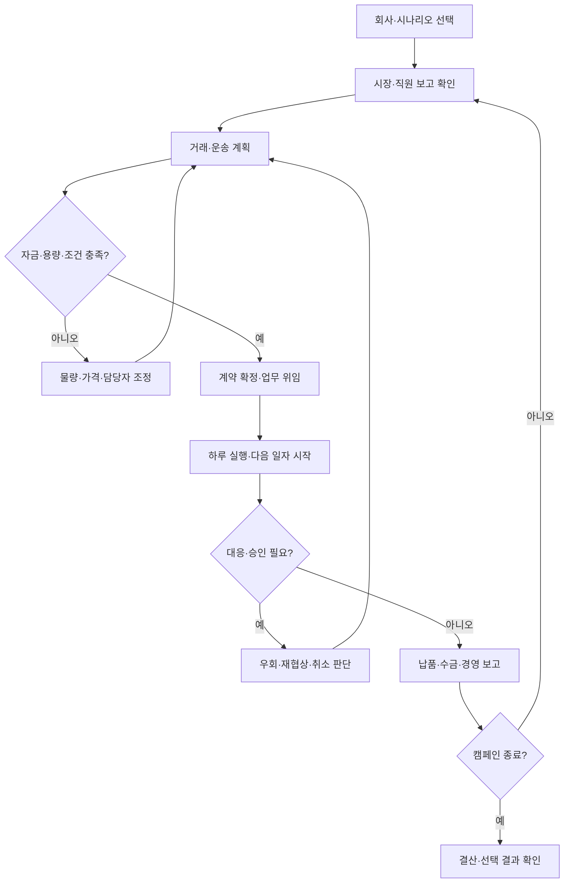
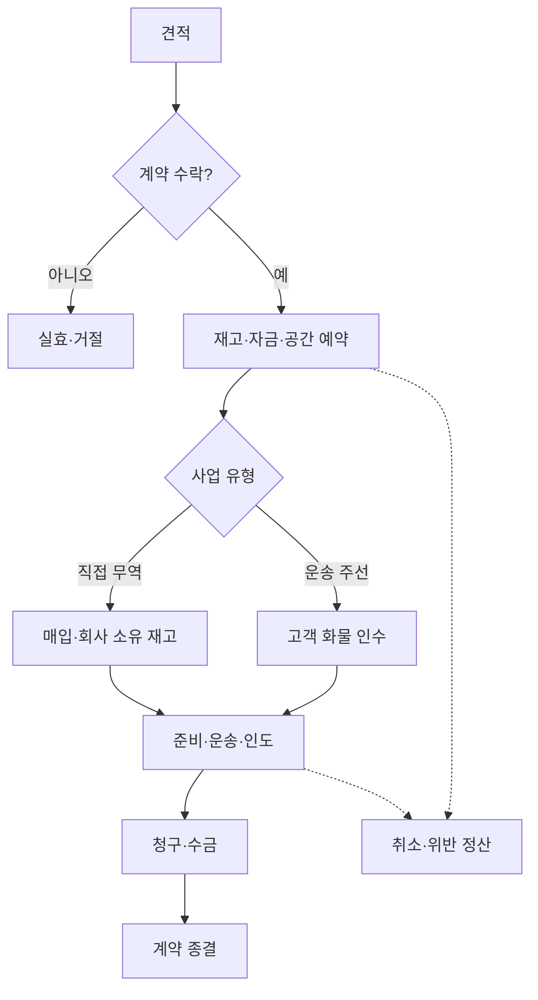
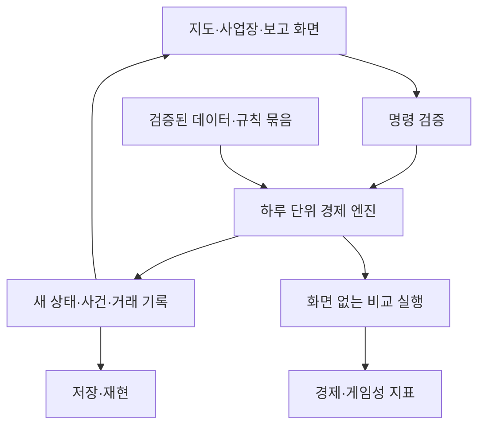
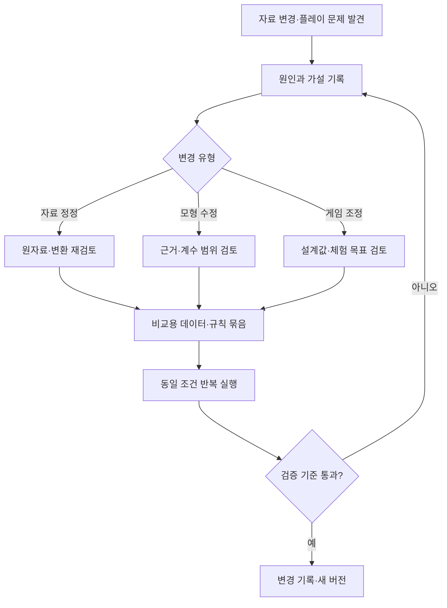
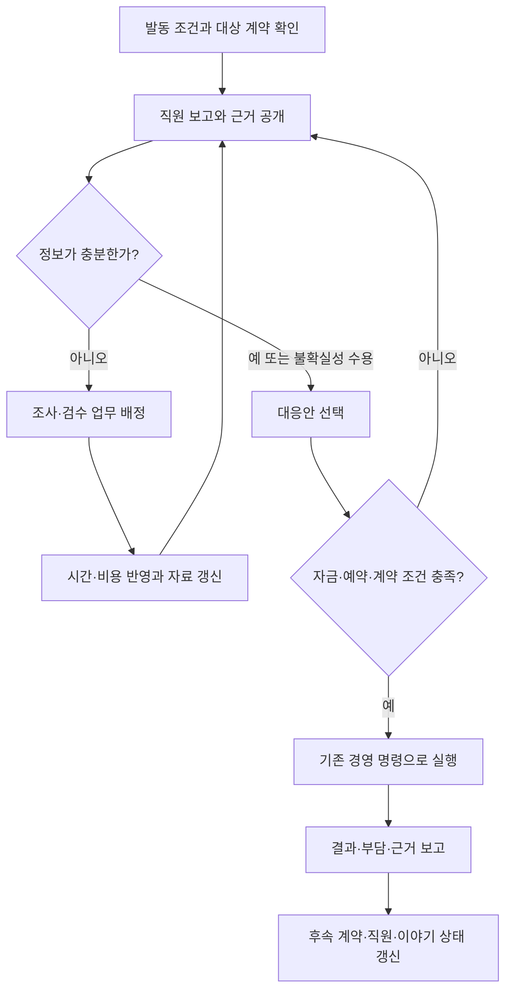
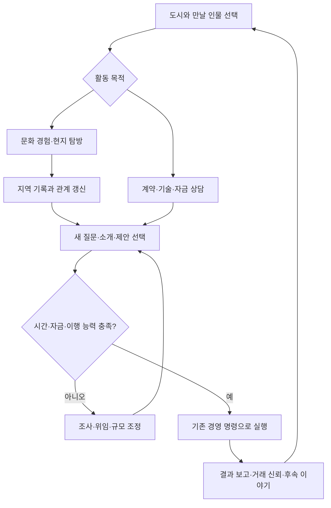

# 국제무역·물류경영 게임: 코딩 MVP 설계 v0.4

작성일: 2026-10-03, Asia/Seoul

개정일: 2026-10-04 — 동물·신수 직원 수집, 속성·직무·부서·팀, 레벨·교육·강화·시너지와 그래픽 방향 추가

문서 성격: 코딩 착수 전 범위·규칙·자료·흐름·완료 기준

선행 문서: 「국제무역_물류경영_게임기획_v0.1.md」

현재 상태: 공식 자료·연구의 설명과 주요 내용, 교육부 고시 제2022-33호 사회·과학·도덕과의 관련 내용 체계를 확인하고 설계에 연결함. 실제 데이터셋 일괄 수집, 계수 추정, 소프트웨어 구현, 플레이테스트는 아직 하지 않음.

## 1. 목표와 설계 원칙

대항해시대 4의 세계 교역망, 더 길드 3의 사업장·인물 운영을 결합한다.
중심은 회사 경영(B)과 국제 통상 전략(C)이며, 인물 요소(A)는 직원 채용·배치·업무 위임·성장으로 구현한다.

플레이어의 반복 질문:
“어떤 거래를 받고, 어디에 자금을 묶고, 누구에게 맡기며, 국제 환경이 바뀌면 무엇을 조정할 것인가?”

한 번에 완성품을 생성하지 않는다. 거래의 정합성 → 반복 가능한 경영 → 직원과 거점 → 통상·경쟁 → 근거 보정 → 플레이테스트의 순서로 개발한다.
연구·통계 검토와 출처 관리는 첫 단계부터 수행한다. 엔진을 완성한 뒤 근거를 붙이는 방식으로 진행하지 않는다.

교육과정 연결 원칙: 통합사회·통합과학은 평소 경영 판단의 바탕으로, 선택과목의 심화 개념은 계약·사건·직원 보고에 선택적으로 넣는다. 교과별 퀴즈를 기본 진행 조건으로 삼지 않는다. 교과 내용은 다룰 개념과 관점을 정하는 근거이며, 경제·물리 효과의 수치 근거를 대신하지 않는다. 상세 내용 요소와 구현 범위는 16~22절에 정리한다. 도시 활동·문화 이해·관계와 주식·상장 확장은 23~27절을 따른다.

세 가지 층을 구분한다.

| 층 | 내용 | 변경 원칙 |
|---|---|---|
| 관측 자료 | 품목별 무역액, 관측 환율, 측정된 물류 시간 | 판본·단위·관측기간을 보존하고 새 자료는 별도 버전으로 추가 |
| 연구·모형 | 비용 전가, 시간 민감도, 공급망 충격 전달 구조 | 표본·추정 방법·불확실성·적용 한계를 기록 |
| 게임 조정 | 시작 자금, 계약 수, 직원 처리량, 정보 공개 속도 | 설계 가정으로 표시하고 플레이테스트로 조정 |

검증된 수치가 없는 변수에 출처를 장식처럼 붙이지 않는다.
공식 통계라는 이유로 인과관계까지 검증되었다고 간주하지 않는다.
실제 자료에서 작은 게임 세계로 축소한 값에는 환산 규칙과 축소 비율을 남긴다.

## 2. 첫 공개 테스트용 MVP의 경계

아래 숫자는 개발 규모와 체험 목표에 대한 제안값이다. 산업 통계나 사용자 확정 수치가 아니다.

| 항목 | MVP 기본안 |
|---|---|
| 플레이 | 싱글플레이, PC 브라우저 우선 |
| 시간 | 1일 단위 경제 엔진, 정지·하루 진행·자동 진행·배속 |
| 캠페인 | 게임 내 90일, 실제 체험 30~45분 목표 |
| 지역 | 부산·상하이·요코하마·하이퐁·싱가포르·자카르타의 6개 거점 후보 |
| 사업장 | 본사 도시 1곳의 사무실·창고를 시각화, 다른 도시는 거래 거점 화면 |
| 도시 활동 | 무역회관·항만 물류단지·비즈니스 라운지·문화생활 및 탐방·금융센터의 5개 진입점. 서비스는 구현 단계에 따라 개방 |
| 지역·관계 성장 | 첫 문화 활동 3종, 지역 지식 기록, 인물·조직별 관계. 거래 신뢰는 계약 이행 기록과 구분 |
| 주식·상장 | 타사 주식투자는 첫 금융 확장(P1), 자사 IPO는 중장기 확장(P2). 최초 90일 기본 캠페인의 필수 완료 조건에서 분리 |
| 상품 | 커피·의류·화장품·냉동 수산물·가구·전자제품·자동차 부품·태양광 모듈의 8개 대표 품목 |
| 직원 | P0 동물·신수 원안 6종 중 초기 직원 2명·후보4명, 영업·운영 2직무부터. P1 후보6종 추가 |
| 사업 | 직접 무역과 운송 주선 2종 |
| 운송 | 외부 선사의 화물 공간 예약. 정기 출발, 용량, 비용, 운송시간 |
| 경쟁 | 자금·재고·운송 한도를 가진 경쟁사 2곳 |
| 통상 | 원산지, 관세 조건, KRW·USD 정산, 정책 발효일 |
| 사건 | 기존 3종을 포함한 총 6개 템플릿: 관세 변경, 기상에 따른 항만 지연, 공급 차질, 냉동 화물 설비 이상, 업무량 급증, 고객의 운송 배출자료 요청. 한 캠페인 약 3건 노출을 제안 |
| 이야기 | 첫 장기 고객 확보 → 공급·납기 위기 → 계약 갱신 심사. 선택에 따라 계약 조건·거래 관계·직원 보고가 달라짐 |
| 저장 | 로컬 저장·불러오기·파일 내보내기, 재현 가능한 시드와 버전 |
| 종료 | 90일 결산. 그 이전에는 필수 지급 불이행이 설정 유예기간을 넘으면 경영 실패 처리 |

본사 보고 통화는 KRW, 국제 거래는 USD를 우선 사용한다. 다른 국가의 현지 통화·세부 과세는 확장한다.
시장 조사와 거래처는 가상 기업으로 구성하고, 실제 국가·상품 통계는 배경 수요·공급의 근거로 쓴다.

초기 범위에서 제외:
자체 선박 운용, 항공·철도 복합 운송, 공장 생산, 전 세계 도시의 자유 이동, 멀티플레이, 실시간 시세 API, 파생상품, 가문·결혼·상속.
원유·LNG 등 전용 운송수단이 필요한 화물은 확장 단계로 둔다.
더 길드 3의 느낌은 사업장과 직원이 실제 일을 수행하는 모습에서 확보한다. 모든 건물·도로·차량을 세밀하게 시뮬레이션하는 것은 후순위다.

## 3. 핵심 플레이 흐름

하루가 지났다고 모든 계약이 끝나지는 않는다. 보고 화면에는 각 계약의 현재 단계와 남은 기한을 보여준다.
일자 시작에 사건을 공개한 뒤 의사결정을 기다린다. 같은 날짜의 승인·대응·계획 수정은 시간을 진행시키지 않고, 수정한 명령도 자금·용량·조건 검증을 거친다. 운행 결과 발생한 보고·승인 요청은 다음 의사결정 시점에 다룬다.
플레이어가 미리 정한 위임 범위 안에서는 직원이 자동 처리하고, 범위를 넘으면 보고한다.
국가 정책은 외부 조건으로 작동한다. 플레이어는 회사의 거래·거점·조달·운송 전략으로 대응한다.

첫 체험 순서:
1. 직원 보고를 읽고 두 거래 중 하나를 선택한다.
2. 매입 자금, 남는 현금, 예상 이익, 납기를 비교한다.
3. 직원에게 준비 업무를 맡기고 운송편을 예약한다.
4. 지연 예고를 받고 원안 유지와 대체편을 비교한다.
5. 인도 후 외상 대금이 아직 현금으로 들어오지 않았음을 확인한다.
6. 대금 회수와 급여 지급 후 다음 계약 또는 채용을 선택한다.

## 4. 화면 구성

| 화면 | 반드시 보이는 정보 | 핵심 행동 |
|---|---|---|
| 세계지도·도시 | 항구, 예약 노선, 화물 단계, 정책·사건, 방문 장소·인물의 새 소식 | 시장 비교, 운송 경로 선택, 현지 활동·면담 위임 |
| 본사·창고 | 직원 작업, 대기 업무, 공간·처리량, 입출고 | 채용·배치·임대 확장·우선순위 |
| 거래·계약 | 담당자, 가격, 직접비, 예상 이익, 현금 일정, 기한 | 견적, 수락, 거절, 재협상 |
| 경영 보고 | 현금, 이익, 재고, 외상 대금, 미지급금, 정시 인도율 | 자금·확장 판단 |
| 사건·근거 | 무엇이 바뀌었는지, 적용일, 영향을 받는 계약, 확인된 자료와 불확실성 | 대응 선택, 계산 근거·선택적 교과 연결 확인 |

2D 지도와 간단한 아이소메트릭 사업장을 기본안으로 삼는다.
직원 애니메이션은 엔진의 작업 진행 상태를 표현한다. 애니메이션 속도가 회계·물류 시간을 바꾸지 않는다.
정보를 모두 한 화면에 넣지 않고, 계약 카드에서 비용과 지연의 원인을 펼쳐 볼 수 있게 한다.

## 5. 실제 자료를 게임 변수로 바꾸는 방식

자료 기준기간은 2023~2024를 우선 후보로 검토한다.
국가·품목별 실제 가용성을 확인한 다음 데이터 묶음을 고정한다. 연도가 다른 값을 섞을 경우 각 변수의 관측기간을 그대로 표시하며 단일 시점의 현실을 재현한다고 설명하지 않는다.
자료를 바탕으로 새로운 사건을 발생시키는 기본 캠페인은 “연구·통계 기반 가상 시나리오”로 명시한다.

| 자료 | 확보할 변수와 단위 | MVP 적용 | 그대로 사용하면 안 되는 부분 |
|---|---|---|---|
| UN Comtrade [S1] | 국가×교역국×HS 품목×기간, USD·kg·보조수량 | 품목별 거래 방향과 상대적 시장 규모 | 국가 무역액은 항구 재고·기업 매출이 아님. 단위가액은 소매·도매가격과 다름 |
| WITS / UNCTAD TRAINS [S2] | HS6별 MFN·특혜관세, 종가세율 % | 품목·원산지·목적지에 따른 비용 조건 | HS6 평균과 실제 국내 세번의 세율 차이, 특혜 적용 요건 |
| World Bank Pink Sheet [S3] | 월·연별 원자재 가격, 품목별 USD/kg·USD/배럴 등 | 커피 등 직접 대응 품목과 원료 공통 충격 | 완제품 가격표가 아님. 원유 가격과 선박 연료 가격도 동일하지 않음 |
| ECB 참고환율 [S4] | 영업일별 EUR 기준 통화값 | KRW/USD 환산과 정산 시점의 환차손익 | 참고환율은 실제 체결가가 아님. 수수료·스프레드는 별도 설계값 |
| World Bank LPI 2.0 [S5] | 국가 단위 연결성, 수입 컨테이너 체류일수 등 | 운송 단계별 시간 범위와 국가 배경 보정 | 국가 평균을 특정 항만의 실측값으로 표시하지 않음 |
| World Bank CPPI [S6] | 항만별 컨테이너선 체류 성과 점수·순위 | 항만 효율 비교와 모형 결과의 검토 | 점수 1점을 지연 1일로 환산하지 않음. 화물 통관시간 지수도 아님 |
| UNCTAD PLSCI [S7, 확장 후보] | 항만 연결성 지수 | 대체 노선·거점 접근성의 참고 | 운임·항해시간·운항표가 아님. 직접 자료 접근은 추가 확인 필요 |

LPI 2.0의 2025 보고서는 2023~2024 운송 관측 자료를 활용한다. 과거 설문형 LPI와 변수 정의가 다르므로 하나의 연속 지수로 연결하지 않는다. [S5]
CPPI의 2020~2024 보고서는 2025년 판본이다. 관측연도와 발행연도를 분리한다. [S6]

데이터 확보 상태:
- S1~S6의 공식 설명·자료 제공 경로 확인.
- 인증 API 실행, 원자료 전체 다운로드, 선택한 6개국·8개 품목의 실제 결측률 검사는 아직 미수행.
- S7은 후속 후보이며 직접 다운로드 경로·사용 조건 확인이 남아 있음.
- 시작 단계에서 확인 가능한 공개 파일·소량 추출본으로 수집기를 검증한다.
- 자료 이용·재배포 조건을 기록하고, 원자료의 공개 저장 여부는 해당 조건에 맞춘다.

### 전처리에서 고정할 것

1. 국가 코드와 항구 코드를 분리한다. 6개 거점의 배후 국가와 연결한다.
2. 상품명 하나가 여러 HS 코드를 포함할 수 있으므로 대표 HS6 또는 코드 묶음을 정의한다.
3. HS 판본·원자료 분류·변환표를 고정한다. 판본 간 대응이 항상 1:1이라고 가정하지 않는다.
4. 무역 금액과 중량·수량의 결측, 추정 표시, 이상값을 검사한다.
5. 수입과 수출의 평가 기준 차이 및 보고 비대칭을 보존한다. 서로 다른 기준의 단위가액 차이를 차익 거래 기회로 생성하지 않는다.
6. 국가 자료를 항구에 배분하는 비율은 별도 근거가 없으면 설계 가정으로 표시한다.
7. 완제품의 검증된 거래가격을 확보하지 못하면 기준가격을 합성값으로 표시한다.
8. 월별 자료를 일별로 바꾼 변동은 관측값이 아니다. 보간·추가 변동 규칙을 모델값으로 기록한다.
9. 주요 해상 거리·출발 빈도·노선별 운임은 별도 운항 자료가 필요하다. 확보 전에는 합성 노선값으로 남긴다.

## 6. 논문·정책 연구에서 가져올 상호작용

| 연구 | 확인한 핵심 | 게임으로 옮길 구조 | 적용 한계 |
|---|---|---|---|
| Amiti·Redding·Weinstein, 2020 출판 / 2019 공개 토론본 [R1] | 미국 2018~2019 관세 부담과 품목별 가격 반응 차이 | 관세 → 도착원가 → 가격·마진 조정 → 조달처 전환 | 미국 당시 결과를 모든 국가·상품의 전가율로 고정하지 않음 |
| Hummels·Schaur, 2013 [R2] | 미국 1991~2005 수입 자료에서 운송시간의 경제적 가치, 부품 거래의 높은 시간 민감도 | 비용과 납기를 비교하는 주문·운송 선택 | 1일의 관세상당 가치 0.6~2.1%는 실제 일일 벌금이나 현금 손실률이 아님 |
| Schwellnus 외, OECD 2023 [R3] | 35개국·36개 산업, 2020.1~2021.9 자료를 활용한 공급망 충격 전달과 조달 다변화 모형 | 공동 충격, 대체 공급자, 전환 시간과 관리 부담 | 거시 생산 감소율을 개별 회사 손실률로 복제하지 않음. 일부 상호작용 추정은 상관관계 |
| Bloom 외, 2013, 연구기관 소개 확인 [R4] | 인도 직물기업의 복합 경영관리 개입 | 업무 표준화, 재고 관리, 검수, 정보 공유와 위임 | 제조업의 개입 효과를 직원 개인의 학습률·물류업 생산성 계수로 사용하지 않음 |

직원 성장·관계·이직의 수치는 현재 확보한 연구로 직접 보정할 수 없다.
초기에는 설계 가정으로 두고, 연구가 확보되면 적용 대상과 맥락이 맞는 경우에만 교체한다.
연구의 결과 방향과 계수의 크기는 별도로 판단한다.

## 7. 경제 모형의 최소 명세

아래 식은 게임용 모형 제안이다. 논문 원식이나 검증 완료된 추정식이 아니다.

### 7.1 가격과 시장

처음에는 공급자 매입 견적과 고객 판매 견적이 있고, 각 견적에 유효기간·최대 물량을 둔다.
전 세계 균형가격을 매일 풀지 않는다.
시장별 배경 가격과 거래 기회는 외부 통계로 보정하고, 플레이어는 제한된 지역 거래 물량 안에서 경쟁한다.
작은 회사의 판매 한 번이 세계가격을 크게 바꾸지 않게 한다.

후속 가격식의 기본 형태:
기준가격 × 원료·공급 충격 요인 × 지역 재고 요인 × 계절 요인.
요인의 단위·중복·상관관계를 정의한 뒤 적용한다.
수요 민감도는 거래처 유형별 계수로 관리하고, 실증 추정값이 없으면 설계 가정과 범위를 표시한다.
가격 변화는 다음 견적부터 적용한다. 이미 체결한 계약의 가격은 조정 조항이 있을 때만 바꾼다.

### 7.2 무역·물류 이익

직접 무역의 거래별 기여이익:
판매대금 - 매입원가 - 계약상 회사 부담 직접비.

운송 주선의 거래별 기여이익:
고객 서비스 대금 - 외부 운송·하역·보관 등 직접비.

직원 급여와 임차료 등 공통 고정비는 기간 결산에서 처리한다.
같은 비용을 거래별 비용과 회사 고정비에 중복 반영하지 않는다.
물류 고객의 상품값은 회사의 상품 매출로 잡지 않는다.
내부 운송·보관료를 회사 전체의 외부 매출로 더하지 않는다.

### 7.3 운송시간·품질·지연

운송 계획은 예약된 출발일, 구간 운항, 환적, 도착 후 반출 단계로 나눈다.
수입 컨테이너 체류일수에는 통관을 비롯한 여러 대기 원인이 들어갈 수 있으므로, 그 전체 값을 쓴다면 통관 지연을 다시 기본값으로 더하지 않는다.
해상 리드타임에 환적이 포함된 자료를 쓰는 경우에도 같은 주의를 적용한다.

- 관측 구간과 게임 구간의 시작·끝을 대조하는 표를 둔다.
- 지연 사건은 영향을 받는 구간과 사건 ID를 가진다.
- 같은 사건을 선박·항구·직원 페널티로 반복 과금하지 않는다.
- 사건의 발생과 추가 지연을 중복 추첨하지 않는다. 항만 폐쇄처럼 지속되는 사건은 종료일까지 출항 가능 여부나 처리능력을 계속 제한하며, 그 기간의 실제 대기는 정상적으로 누적한다. 사건 전체 지연을 미리 가산한 뒤 같은 기간의 폐쇄 대기를 다시 더하지 않는다.
- 품질 손실, 재고 자금 비용, 계약상 지연비용은 실제 발생한 서로 다른 항목으로 기록한다.
- 시간의 경제적 가치는 고객의 납기 선호에 활용하며 현금 비용으로 자동 차감하지 않는다.

### 7.4 관세·원산지·환율

MVP는 종가세 구조부터 구현한다.
관세액 = 해당 시나리오 규칙으로 정한 과세가격 × 적용세율.
과세가격에 어떤 항목을 포함하는지는 목적지·규칙 버전에서 정한다.
HS6 평균 세율을 쓰는 시나리오는 통계 기반의 단순화라는 표시를 둔다.
종량세·복합세·세부 세제는 후속이다.

관세 전가율은 공급·판매 가격 협상과 마진 흡수에 영향을 주며, 실제 납세액을 줄이는 계수가 아니다.
상품 원산지와 출발항·경유항을 분리한다.
특혜관세는 원산지와 증빙 조건을 충족하는 경우에만 적용한다.
정책에는 발표일·발효일·대상 품목·대상 원산지·적용 조건을 둔다.
통관을 마친 과거 거래를 나중의 관세로 다시 계산하지 않는다.

ECB 자료로 KRW/USD를 만들 때:
KRW/USD = (KRW/EUR) ÷ (USD/EUR).
게임은 계약 통화와 거래 인식일·청구일·결제일을 각각 기록하고 적용 환율을 보존한다. 매출·채권 인식 시점은 계약의 인도 조건에 따라 정하며, 단순히 청구서를 만든 날과 같다고 가정하지 않는다.
외화 현금·채권·채무는 기말 환율로 환산하고 미실현 환차손익을 표시하는 규칙을 기본안으로 둔다. 결제 시 이미 반영된 평가분과 실현 손익을 중복 계산하지 않는다. 이 규칙은 게임용 단순 회계 모형이며 동일한 기준을 모든 전략 비교에 적용한다.
휴장일 보간 방식과 환전 스프레드는 별도 설정값이다.

### 7.5 공급망 충격

국가·항만의 공통 충격과 공급자별 충격을 구분한다.
같은 국가·항만에 있는 공급자 세 곳은 독립적인 위험 세 개가 아니다.
공급자 전환에는 조사·검증·계약·운송의 시간이 들고 직원 업무가 늘어난다.
다변화는 위기 노출을 줄일 수 있지만, 가격·관리비·최소 주문량에서 부담이 생기게 한다.
다변화가 언제나 더 높은 이익을 보장하도록 만들지 않는다.

### 7.6 직원과 사업장

첫 모델은 직원당 하루 작업량과 직무 적합도, 급여로 시작한다.
작업량의 단위는 ‘업무 포인트/일’로 두고 게임 설계값임을 명시한다.
직원 숙련은 우선 처리시간에만 적용하고, 성공률·가격·오류율에 같은 보너스를 동시에 주지 않는다.
후속 검수·실수 모형을 추가할 때 기존 효과와 겹치지 않는지 확인한다.

창고는 보관 한도와 하루 처리 한도를 각각 갖는다.
작은 창고라도 입출고가 빠를 수 있고, 큰 창고라도 출하 인력이 부족할 수 있다.
냉동 화물은 필요한 설비를 갖춘 공간·운송편에만 배정한다.
국적이나 성별을 직원 능력의 대리 변수로 쓰지 않는다. 직무 경험과 실제 설정된 역량으로 구분한다.

## 8. 계약·화물·대금의 상태를 분리

하나의 계약에는 화물 진행 상태와 돈의 상태가 함께 존재한다.
운송 주선 계약은 고객 화물을 맡으므로 회사의 상품 매입 단계를 거치지 않을 수 있다.

청구와 지급은 계약 조건에 따라 다른 시점에도 발생할 수 있다. 위 그림은 첫 구현의 기본 흐름이다.
MVP에서는 기본 전액 청구·결제를 우선하고, 계약금·분할 결제는 이후 추가한다.
한 계약당 화물 1건부터 시작하되 계약과 화물 ID는 분리한다. 나중에 분할 출하를 추가할 때 구조를 바꾸지 않도록 한다.

필수 상태:
- 계약: 견적 / 체결 / 이행 중 / 완료 / 취소 / 위반 정산 완료.
- 화물: 준비 / 출발 대기 / 운송 / 환적 / 도착·반출 / 인도 / 손실.
- 청구: 미발행 / 미수·미지급 / 연체 / 결제 / 대손·정산.
- 직원 작업: 대기 / 실행 / 승인 대기 / 완료 / 중단.

인도 완료가 곧 수금 완료는 아니다.
취소는 기존 운송비·관세·상품 소유권을 자동으로 모두 되돌리지 않는다.
이행 단계별 환불·보상·재판매 가능 여부를 규칙으로 정하고 변경 기록을 남긴다.

## 9. 프로그램 구조와 하루 처리 순서

권장 기본안은 TypeScript 중심의 웹 시제품이다.
경제 엔진과 데이터는 화면 라이브러리에서 독립시켜 추후 PC 패키지나 다른 렌더러로 옮길 수 있게 한다.

| 모듈 | 책임 |
|---|---|
| core | 게임 시계, 명령 검증, 사건 순서, 시드 난수 |
| contracts | 견적, 계약 조건, 자원 예약, 납기·취소 |
| logistics | 운송편, 용량, 화물 위치, 도착·반출 |
| market | 공급자·고객, 가격·물량, 경쟁사 주문 |
| people | 채용, 업무 배치, 처리량, 위임·승인 |
| policy | 원산지·세율·발효 조건·공통 충격 |
| finance | 현금, 재고 원가, 채권·채무, 결산 |
| content | 항구·상품·사건·기준 자료·조정값·도시 장소·문화 활동·대화와 지역 지식 |
| persistence | 저장, 복구, 버전 확인·이관 |
| presentation | 세계지도·도시 장소, 회사 화면, 계약 카드, 보고 |

TypeScript로 화면과 엔진의 자료형을 공유하고, 2D 지도·직원 표현에는 Phaser를 후보로 둔다.
Phaser의 Scene 분리 기능은 지도·본사 등 표현을 나누는 데 활용할 수 있다. [T1]
React 기반 패널을 함께 쓸 경우 게임 상태의 소유자는 엔진 하나로 유지한다.
초기 엔진 검증 화면은 단순 HTML 또는 패널만으로도 충분하다.
패키지 버전은 첫 착수 시 호환성을 확인해 잠금 파일로 고정한다.

권장 인터페이스:
- `openDay(state, config, rngState) → {decisionState, announcements, rngState}`: 당일 사건을 한 번 적용·공개하고 의사결정을 기다림.
- `commitDay(decisionState, commands, config, rngState) → {nextState, events, rngState}`: 입력 검증부터 당일 실행·결산까지 처리.
- 일자의 OPEN / AWAITING_INPUT / COMMITTING / CLOSED 상태를 보존해 다시 화면을 열거나 불러왔을 때 사건을 중복 적용하지 않음.

엔진 안에서 현재 실제 시각, 네트워크 호출, 화면 프레임 속도, 비고정 난수를 사용하지 않는다.
명령에 고유 ID를 부여해 이중 클릭과 중복 처리에 대응한다.
동일 조건의 경쟁 주문은 한 번에 모은 뒤 가격·서비스·고정된 동률 처리 규칙으로 배분한다. 플레이어가 처리 순서 때문에 항상 유리하지 않게 한다.

하루 처리 순서를 고정한다. 아래 1번 뒤에 의사결정 정지 구간이 있으며, 2~8번은 확정한 명령으로 실행한다. 의사결정 중 여러 계약을 임시 배정할 때도 누적 예약을 미리 계산해 한도를 확인한다.

| 순서 | 처리 | 핵심 규칙 |
|---|---|---|
| 1 | 당일 정책·사건 적용, 관측 가능 정보 공개 | 발표일과 발효일 구분 |
| 2 | 플레이어·직원·경쟁사의 명령 검증 | 사용 가능 자금·재고·용량 계산 |
| 3 | 예약·직원 작업·준비 처리 | 하나의 자원을 여러 계약에 중복 배정하지 않음 |
| 4 | 출발·구간 이동·도착·반출 처리 | 새로 출발한 화물에 이동시간을 중복 부여하지 않음 |
| 5 | 인도·품질·납기 판정 | 당일 도착·인도 뒤 마감 판정 |
| 6 | 비용 발생·청구·결제·급여·미지급 처리 | 손익과 현금 분리 |
| 7 | 지역 수요·공급·다음 견적 갱신 | 확정 계약 가격 유지 |
| 8 | 보고·기록·불변 조건 검사·저장 | 다음 날 의사결정 상태 생성 |

동일 날짜의 마감은 ‘해당 일자 종료 시점’ 등으로 명확히 정한다.
불가피한 사건은 엔진 이벤트로 한 번 기록하고, 화면을 다시 열었다고 재추첨하지 않는다.
창업자 또는 기본 직원의 최소 업무 능력을 둬 인력을 모두 잃었다는 이유만으로 조작 불가능 상태에 빠지지 않게 한다.

### 돈과 화물의 무결성

- 통화별 금액은 정수 최소 단위로 저장하고, 환율과 반올림 규칙을 명시한다.
- 물량은 kg·개·m³ 등 원 단위를 보존하며, 운송 공간 단위로의 변환값을 별도로 둔다.
- kg·개·컨테이너 수를 그대로 더하지 않는다.
- 회사 소유 재고와 고객 위탁 화물을 분리한다.
- 보유량에서 예약량을 뺀 수량만 새 계약에 사용할 수 있다.
- 구매·판매·생산·소비·폐기·손실마다 화물 증감 이유를 기록한다.
- 구매 자금 부족은 계약 거절 또는 규모 조정으로 처리한다.
- 이미 발생한 필수 지급의 부족은 미지급 의무로 기록한다. 임의의 무제한 마이너스 현금은 허용하지 않는다.
- 지급 불이행 유예기간은 첫 규칙 확정 시 정하는 설계값이며, 미확정인 상태에서 임의 구현하지 않는다.

### 검산용 거래 예시

아래는 단위 없는 교육·검증용 수치이며 시장 가격이 아니다. 단일 통화, 회사 부담 직접비, 전액 외상 판매를 가정한다.

초기 현금 100 → 상품 매입 60 → 운송 5 → 관세 3 → 판매 90 → 급여 4 → 판매대금 90 회수.

회수 전:
- 현금 28.
- 매출채권 90.
- 상품은 인도 완료하여 재고 0.
- 거래 기여이익 22, 급여 반영 기간 이익 18.

회수 후:
- 현금 118, 매출채권 0.
- 수금으로 이미 인식한 매출과 이익을 다시 더하지 않는다.

이 예시와 취소·지연·고객 화물 사례를 사람이 먼저 계산하고 엔진 결과와 비교한다.

## 10. 데이터 구조와 버전

| 개체 | 핵심 필드 |
|---|---|
| Company | 현금 계정, 채권·채무, 평판, 직원·거점 ID |
| Port | 국가, 위치, 사용 시설, 시간 자료의 근거 수준 |
| Good | 품목명, HS 판본·코드, 원 단위, 공간 환산, 보관 조건 |
| MarketOffer | 공급자·고객, 항구, 물량, 가격·통화, 유효기간 |
| Contract | 사업 유형, 상대방, 상품 소유·책임, 납기, 청구·결제 조건 |
| CargoLot | 소유자, 상품, 수량, 원가, 원산지, 위치, 예약량 |
| Shipment | 연결 계약, 운송편, 출발·도착 계획, 실제 단계, 사건 ID |
| Employee / Task | 직무·처리량·급여, 작업량, 담당 계약, 승인 한도 |
| Facility | 보관·처리 용량, 설비, 임차료, 예약량 |
| Policy / Shock | 발표일·발효일·종료일, 적용 지역·상품, 변경 변수, 사건 템플릿·근거·교과 참조 |
| LedgerEntry | 고유 ID, 일자, 계약, 계정, 금액·통화, 발생 이유 |
| ParameterCard | 수치·단위, 근거 구분, 출처·범위·변환·버전 |
| CurriculumRef / EventTemplate | 교과 내용 요소의 출처와 분류 / 발동 조건·선택지·기존 명령·보고 문구. 정적 콘텐츠이며 경제 상태를 별도로 소유하지 않음 |

모든 균형 관련 계수의 기록 항목:
- ID, 설명, 단위, 기본값, 검토 범위.
- OBSERVED / ESTIMATED / DESIGN 중 하나.
- OBSERVED는 원자료 관측값과 단위만 변환한 값. ESTIMATED는 추정·보간·대리값·배분을 포함.
- 게임성을 위한 조정이 더해지면 원래 값과 DESIGN 조정값을 별도로 유지.
- 출처 URL·기관·논문 DOI·판본·표/변수명.
- 관측기간, 지리·산업 범위, 관측 단위.
- 취득일, 원자료 해시, 전처리 버전, 이용 조건.
- 결측 처리, 추정 범위·신뢰도, 적용 한계, 검증 상태.

MVP에서 확보하지 못한 실제 자료는 0으로 채우지 않는다. 결측으로 남기고 추정 또는 설계값을 명시한다.
API 비밀키는 클라이언트와 공개 파일에 넣지 않는다.
외부 자료는 개발 단계에서 수집·가공해 고정 데이터 묶음으로 제공한다. 플레이 도중 API 장애가 게임을 멈추지 않게 한다.

저장 파일:
게임 상태, 현재 난수 상태, 명령 기록, 엔진 버전, 데이터 버전, 규칙·밸런스 버전, 시나리오 ID.
새 패치가 기존 저장의 경제 규칙을 조용히 바꾸지 않게 한다.
기본은 기존 규칙을 유지하거나 호환 이관을 명시적으로 적용한다. 지원하지 않는 버전은 손상 없이 안내한다.

## 11. 구현 단계와 통과 기준

| 단계 | 작업 결과물 | 다음 단계로 넘어가는 조건 |
|---|---|---|
| M0 규칙·자료 설계 | 범위, 단위, 상태표, 근거표, 자료 수집 검증, 수동 계산 사례 | 화물·돈의 소유와 발생 시점, 모델 가정이 결정됨. 핵심 자료 소량 확보 또는 대체값 표시 완료 |
| M1 거래 한 건 | 항구 2곳·상품 1종·직원 1명·외부 운송편 1개, 직접 무역 전 과정 | 정상·지연·취소에서 수동 계산과 일치. 중복 수금·재고 복제 없음 |
| M2 회사 운영 | 복수 계약, 고객 화물, 영업·운영 직원, 창고·고정비·위임, 저장, 업무량 사건 | 자금·공간·업무량의 제약이 실제 선택을 만듦. 저장 전후 결과 일치 |
| M3 통상과 경쟁 | 6개 거점·8개 품목, 원산지·관세·환율, 총 6종 사건 템플릿, 경쟁사 | 정책 변화가 올바른 거래에 적용되고, 대체 조달·운송 선택을 할 수 있음 |
| M4 근거 보정 | 통계 적용, 연구 기반 민감도 범위, 비교 시나리오, 데이터·밸런스 묶음 | 관측·추정·설계값 구분. 운송시간·거래 규모 등 가능한 지표의 보정 결과와 남은 한계 기록 |
| M5 플레이 경험 | 지도·본사·도시 진입점, 첫 문화 활동 3종, 3막 이야기와 선택 결과·근거 설명, 90일 캠페인, 플레이테스트 | 정상 종료 가능, 주요 오류 해결, 이용자가 이익·현금·지연 원인을 설명 가능 |

M0부터 실제 자료를 다룬다. M4는 자료 수집을 처음 시작하는 단계가 아니라 통합 엔진에 대한 본격 보정·검증 단계이다.
M1~M3는 내부 검증용 빌드이고 M4~M5를 통과한 결과를 첫 공개 테스트용 MVP로 본다.
달력상의 소요 기간은 개발 인력·환경·자료 접근에 따라 달라지므로 아직 확정하지 않는다.

MVP 완료의 구체적 체크:
- 게임 내 90일을 계약과 경영 활동으로 진행하고 결산할 수 있음.
- 직접 무역과 운송 주선의 매출·자산·비용이 구분됨.
- 직원 채용·위임과 창고 한도가 계약 처리에 영향을 줌.
- 관세·지연 사건을 보고 거래를 조정할 수 있음.
- 사건 선택이 계약·업무·현금 상태를 바꾸며, 결과 보고에서 원인과 이해관계자 영향을 확인할 수 있음.
- 교과 내용 요소의 분류·원문 출처와 게임 설계 해석이 분리되어 있음.
- 저장·불러오기와 같은 조건 재현이 일치함.
- 모든 주요 계수에 근거 유형이 있고 자료가 없는 값이 표시됨.
- 처음 접하는 시험 사용자 5명 중 4명이 도움 없이 첫 계약을 종결하고, 현금과 이익이 다른 이유를 하나 설명하는 것을 초기 사용성 목표로 제안함. 표본 5명으로 일반 사용자 전체의 효과를 입증했다고 보지 않음.

## 12. 밸런스 패치를 연구 가능한 절차로 운영

패치 한 건의 기록:
문제 → 관측 지표 → 원인 가설 → 근거 → 변경 변수 → 변경 전후 결과 → 남은 한계 → 되돌리는 방법.

유형별 예:
- 자료 정정: kg와 ton 혼동을 수정. 재미 조정으로 포장하지 않음.
- 모형 수정: 한 항만을 공유하는 공급자들의 위험을 독립으로 취급한 오류 수정.
- 게임 조정: 첫 거래 안내를 늘리거나 후보 계약 수를 줄임. 이를 연구 결과로 설명하지 않음.

비교 실행:
- 평시 / 항만 지연 / 관세 변경 / 공급 차질의 기본 시나리오.
- 저비용 집중 / 납기 우선 / 공급자 분산 / 자산을 적게 보유하는 운영 등 비교 전략.
- 동일 난수 조건과 명령 정책으로 변경 전후 실행.
- 무작위 난수를 사용하는 횟수가 달라지면 같은 시드라도 직접 비교가 깨질 수 있으므로 사건·모듈별 난수 흐름을 분리하거나 사건 기록을 재사용.
- 처음 20개 고정 시드를 진단용으로 쓰고 불안정한 지표가 남을 때만 표본 확대. 이 수량은 개발 제안이며 통계적 충분성을 보장하지 않음.

기록 지표:
기말 순자산, 현금 부족·실패 비율, 계약 기여이익, 정시 인도율, 재고 회전, 직원 대기 작업, 시설 유휴·초과, 공급자 집중도.
사람의 플레이에서는 반복 클릭 수, 막힌 지점, 사건 원인 이해, 선택의 이유도 기록한다.
특정 전략이 모든 조건에서 우세하면 구조를 점검하되, 모든 전략의 승률을 억지로 동일하게 만들지 않는다.

수치 검증과 게임성 검증을 구분:
- 자료·모형 검증: 단위·집계 수준이 일치하고, 보정에 쓰지 않은 기간·노선에서 가능한 지표를 비교.
- 자료가 충분한 경우: 관측 분포의 중앙값·분위수·변동성 등을 기준으로 평가.
- 자료가 부족한 경우: 저·중·고 가정의 민감도만 제시하고 실증 검증 완료라고 표시하지 않음.
- 게임성 검증: 선택의 이해 가능성, 반복 업무 부담, 서로 다른 상황의 대응 차이.
- 같은 자료로 계수 보정과 검증을 모두 끝내지 않음.

## 13. 필수 검증과 구현 작업 단위

경제 엔진을 바꾸는 작업에는 다음 위험에 맞는 검증을 붙인다.
화면 문구나 단순 배치 수정마다 별도 테스트를 늘리지는 않는다.

| 위험 | 필수 확인 |
|---|---|
| 재고·공간 복제 | 동시에 수락한 계약들의 예약량이 한도를 넘지 않음 |
| 이중 지급·수금 | 동일 명령·사건 ID를 재처리해도 장부가 중복되지 않음 |
| 현금과 이익 혼동 | 외상 판매·수금 사례가 검산 예시와 일치 |
| 납기 경계 오류 | 마감일 도착은 정시, 그 이후는 조건에 맞는 지연 |
| 통상 계산 오류 | 원산지·발효일·과세가격과 세율, 부담 주체를 구분 |
| 지연 중복 | 체류시간과 통관시간, 공통 사건을 중복 가산하지 않음 |
| 화폐·단위 오류 | KRW와 USD, kg와 개와 공간을 명시적으로 환산 |
| 재현 실패 | 같은 상태·명령·난수·버전은 동일 결과 |
| 저장 손실 | 저장 후 복구하여 진행한 결과가 연속 실행과 일치 |
| 겉보기 현실성 | 합성 항구·가격·직원 값이 실측값으로 표시되지 않음 |

첫 작업 묶음 제안:
- SPEC-01: 상품·국가·항구·통화·시간·기한의 명세 고정.
- DATA-01: Comtrade·관세·환율·물류 시간의 소량 수집과 출처 카드.
- CORE-01: 상태·명령·시계·난수와 금액/수량 단위.
- FIN-01: 수동 사례를 통과하는 장부·재고·채권·채무.
- TRADE-01: 직접 무역 계약과 화물 예약.
- LOG-01: 출발·운송·도착·납기.
- UI-01: 첫 계약을 끝낼 수 있는 최소 화면.
- SAVE-01: 버전 포함 저장·복구.

진행 순서는 의존관계에 따른다. CORE·FIN·TRADE·LOG의 상태 변경을 한꺼번에 크게 바꾸지 않는다.
작업 하나마다 목표·입력·출력·완료 조건·검증 사례를 적고 작은 단위로 검토한다.
다음 단계는 이전 단계의 완료 기준을 확인한 뒤 착수한다.

## 14. 확인한 근거와 확인 수준

웹 확인일: 2026-10-03. 아래 링크는 자료 접근점이며 본 문서에 실제 원자료 수치가 적재되었다는 뜻은 아니다.

### 통계·자료

- [S1] UN Comtrade, Subscription Plans. 공식 접근 방식과 제한 확인.
  https://uncomtrade.org/docs/subscriptions/
  국가·교역국·품목 자료를 수집하는 출발점. 실제 API 호출은 미검증.
- [S1a] UN Comtrade, Bilateral asymmetries. 수입·수출 집계 차이 참고.
  https://uncomtrade.org/docs/bilateral-asymmetries/
- [S1b] UN Comtrade, Data Conversion. HS 판본 변환의 한계 참고.
  https://uncomtrade.org/docs/data-conversion/
- [S2] World Bank WITS REST API, UNCTAD TRAINS. HS6 MFN·특혜관세와 응답 변수 확인.
  https://wits.worldbank.org/witsapiintro.aspx?lang=en
- [S3] World Bank Commodity Markets, Pink Sheet. 월·연 자료 목록과 다운로드 경로 확인.
  https://www.worldbank.org/en/research/commodity-markets
- [S4] ECB Euro foreign exchange reference rates. EUR 기준과 시계열 다운로드 확인.
  https://www.ecb.europa.eu/stats/policy_and_exchange_rates/euro_reference_exchange_rates/html/index.en.html
- [S5] World Bank LPI 2.0, 2025 report 소개 및 방법론. 관측기간과 지표별 구간·단위 확인.
  https://lpi.worldbank.org/en/home
  https://lpi.worldbank.org/en/about/methodology
- [S6] World Bank, The Container Port Performance Index 2020 to 2024: Trends and Lessons Learned, 2025 판본.
  https://www.worldbank.org/en/topic/transport/publication/cppi-2024
  공식 개요 확인. 기반 선박 관측 원자료의 무료 확보 여부는 미확인.
- [S7] UNCTAD Port Liner Shipping Connectivity Index, 후속 후보.
  https://unctadstat.unctad.org/datacentre/dataviewer/US.PLSCI
  검색상 공식 표 확인. 직접 접근 제한으로 자료 다운로드와 현행 메타데이터 추가 확인 필요.

### 연구

- [R1] Amiti, Redding & Weinstein. Who’s Paying for the US Tariffs? A Longer-Term Perspective. AEA Papers and Proceedings, 2020, DOI 10.1257/pandp.20201018.
  확인한 공개 원문은 2019-12-20 토론본:
  https://deweinst.github.io/weinstein_website/Whos_Paying_Paper.pdf
  미국 관세와 가격 반응의 결과·부문 차이를 구조 설계에 활용. 정량 계수 이식 전 출판본 대조 필요.
- [R2] Hummels & Schaur. Time as a Trade Barrier. American Economic Review 103(7), 2935–2959, 2013.
  https://www.aeaweb.org/articles?id=10.1257/aer.103.7.2935
  DOI: 10.1257/aer.103.7.2935. 출판본 초록의 0.6~2.1% 범위 확인. 초기 작업논문 범위와 혼용하지 않음.
  표본 범위 확인에 참고한 저자 공개 원문: https://business.purdue.edu/faculty/hummelsd/papers/time%20as%20a%20trade%20barrier%20final.pdf
- [R3] Schwellnus, Haramboure & Samek. Policies to strengthen the resilience of global value chains. OECD Science, Technology and Industry Policy Papers, 2023.
  https://www.oecd.org/content/dam/oecd/en/publications/reports/2023/02/policies-to-strengthen-the-resilience-of-global-value-chains_e6dcc19a/fd82abd4-en.pdf
  공개 원문의 모형·다변화 결과·인과해석 제한을 확인. 국가·산업 연구의 회사 단위 이식 한계 기록.
- [R4] Bloom 외. Does Management Matter? Evidence from India, 2013.
  확인한 연구기관 설명:
  https://www.povertyactionlab.org/evaluation/increasing-firm-productivity-through-management-consulting-services-india
  직무·관리 구조의 참고. 논문 전체를 확인하거나 직원 성장 계수를 추정한 상태는 아님.

### 구현 참고

- [T1] Phaser 공식 문서, Scenes.
  https://docs.phaser.io/phaser/concepts/scenes
  화면 분리 참고. 이번 산출물에서 라이브러리 설치·구현을 하지는 않음.

## 15. 다음 작업의 출발점

첫 코딩 목표는 “항구 2곳·상품 1종·직원 1명으로 거래 한 건을 끝내고, 현금·재고·외상 대금의 이동을 설명할 수 있는 버전”이다.

착수 전에 M0에서 고정할 값:
대표 상품과 HS 판본, 항구 2곳, 원 단위와 운송 공간 환산, 최초 자료 기준기간, 과세 규칙의 단순화 범위, 납기·지급 유예 기준.
이 값들은 실제 수집 결과를 보고 문서와 데이터 파일에 함께 기록한다.

이후 단계는 본 문서의 M1~M5 순서와 완료 기준을 따른다. 현재는 개발 설계와 자료 검토 단계이며 구현·경제 보정·사용자 검증 완료를 의미하지 않는다.

## 16. 교육과정을 게임에 섞는 기준

### 16.1 근거와 적용 범위

2022 개정 교육과정의 **교육부 고시 제2022-33호 확정 원문**을 기준으로 관련성이 높은 내용을 선별했다. 사회과는 별책7, 과학과는 별책9, 사회 교과군의 윤리 과목은 도덕과 별책6에서 확인했다. 아래 표의 ‘원문 내용 요소’는 내용 체계의 **지식·이해** 항목이다. 게임 적용 열은 본 프로젝트의 설계 제안이다. 표에 든 개념을 모두 첫 버전에 구현하거나 해당 과목 전체를 학습한다는 뜻은 아니다.

후속 개정 고시 전체와의 대조는 아직 완료하지 않았다. 이 문서는 최초 확정 고시의 판본을 고정한 개발 설계안이다. 수업용 배포판에서 현행 교육과정과의 완전 일치를 표시하려면 이후 개정 대조를 별도 완료한다. 성취기준 코드를 추정해 붙이지 않는다.

분류상 주의할 과목:
- **경제**는 진로 선택이다. **사회와 문화, 세계시민과 지리, 현대사회와 윤리**는 일반 선택이다.
- **기후변화와 지속가능한 세계**는 사회과 융합 선택, **기후변화와 환경생태**는 과학과 융합 선택이다. 이번 요청의 공통·일반 선택·진로 선택 내용 추출에 섞지 않았다.
- 별책20의 과학계열 선택 과목은 이번 선별 범위에서 다루지 않았다. 아래 표는 별책9의 보통교과 공통·일반·진로 과목을 대상으로 한다.
- ‘내용 요소’, ‘성취기준’, ‘게임의 세부 규칙’을 구분한다. 관세 산식·단열계수·화물 품질 임계값 등은 교과 이름만으로 정당화하지 않는다.

### 16.2 게임에서 드러나는 세 층

| 층 | 플레이 중 표현 | 개발 원칙 |
|---|---|---|
| 평소 경영 | 가격·납기·단위·직원 업무·계약 책임·정보 출처 확인 | 교과 이름을 몰라도 의사결정 가능. 통합사회·통합과학 개념을 기본 규칙에 반영 |
| 이야기와 사건 | 담당 직원이 상황을 보고하고 플레이어가 조사·투자·계약 조정 | 같은 사건에 사회·과학 관점이 함께 작동. 선택 결과는 기존 경영 시스템으로 계산 |
| 선택적 깊이 읽기 | 왜 이런 일이 일어났는지, 어떤 자료를 썼는지, 관련 교과 개념 | 기본 화면의 설명을 펼쳐 읽는 방식. 퀴즈 통과를 거래의 조건으로 삼지 않음 |

지식·이해뿐 아니라 ‘자료를 비교하고 해석하기’, ‘대안을 검토하기’, ‘근거를 들어 설명하기’도 플레이 행동에 반영한다. 이들은 과정·기능에 대한 설계 해석이며 아래 지식·이해 표와 혼동하지 않는다. 가치·태도는 직원·거래처·지역사회에 생기는 결과를 살펴보는 데 연결하고, 특정 견해를 고르면 일괄 가산점을 주는 방식으로 구현하지 않는다.

P0는 첫 공개 MVP, P1은 MVP 검증 후 확장, P2는 별도 시나리오 후보를 뜻한다. ‘P0 보고’는 설명·자료 비교만 적용하며 별도 물리·사회 엔진을 만들지 않는다.

## 17. 사회과 내용 요소와 게임 연결

아래 쪽수는 별책7의 **인쇄쪽**이며, 확인한 316쪽 PDF에서 PDF 페이지는 인쇄쪽+6이다. 출처는 [C1], 쪽수 확인용 재게시본은 [C2]이다. 긴 항목 중 일부를 택한 경우 그 부분 명칭만 적었다.

| ID | 구분·과목 | 원문 내용 요소 | 인쇄쪽 | 게임 적용·우선순위 |
|---|---|---|---|---|
| SOC01 | 공통·한국사1 | 국제 관계와 대외 교류 / 국제 질서의 변동과 개항 | 94 | P1: 오래된 항구·창고의 거래 기록을 읽는 지사 이야기. 보존·개발·지역 관계를 함께 고려 |
| SOC02 | 공통·한국사2 | 산업화의 성과와 사회·환경 문제 / 외환 위기의 극복과 사회·문화 변동 | 95 | P1: 수출기업의 성장과 구조조정 기록. 외화 자금·고용·환경 투자에 얽힌 선택을 역사적 맥락에서 설명 |
| SOC03 | 공통·통합사회1 | 자연환경 / 환경문제 / 교통·통신과 과학기술의 발달 | 108 | P0: 기상에 따른 항만 지연과 정보 제공. P1: 물류 기술 도입이 비용·공간·업무를 바꾸는 이야기 |
| SOC04 | 공통·통합사회1 | 문화권 / 문화 상대주의와 보편윤리 / 다문화 사회 | 108 | P0: 현지 거래처의 요구를 확인하는 대화·직원 협업. 국적에 따라 정직성·능력을 고정하지 않음 |
| SOC05 | 공통·통합사회2 | 국제 분업과 무역 / 경제 주체의 역할 / 지속가능발전 | 115 | P0: 조달·운송·소비의 연결, 계약 비용과 환경 자료를 함께 보는 핵심 플레이 |
| SOC06 | 공통·통합사회2 | 정의의 실질적 기준 / 사회불평등 / 공간불평등 | 115 | P0 보고: 물류 접근성과 가격 차이, 업무·보상 배분. 회사의 이익과 타인의 영향을 나란히 표시 |
| SOC07 | 일반·세계시민과 지리 | 식량 자원의 생산과 소비 / 글로벌 경제와 공간적 불균등 / 다양한 기후와 인간 생활 | 131 | P0: 커피 공급 차질과 대체 공급자 탐색. 나라 전체를 동일한 생산·기후 조건으로 취급하지 않음 |
| SOC08 | 일반·세계사 | 세계적 상품 교역 / 산업 혁명과 제국주의 | 143 | P1: 커피·의류·항구에 얽힌 역사 기록. 과거의 교역을 피해와 권력관계까지 포함해 해석 |
| SOC09 | 일반·사회와 문화 | 사회 집단과 사회 조직의 유형 및 변화 / 미디어 메시지의 분석과 생산 | 153 | P0: 업무량 급증에 따른 채용·외주·조직 변화와 거래 정보 확인. P1: 기업 관련 보도 검증 |
| SOC10 | 진로·한국지리 탐구 | 식품과 상품사슬 / 산업구조의 전환과 지역 변화 | 169 | P1: 국내 공급업체·가공장·항구 연결과 창고 입지 선택 |
| SOC11 | 진로·도시의 미래 탐구 | 도시 체계와 도시 공간 구조 / 지속가능성과 회복력을 높이는 도시 계획과 도시 혁신 | 183 | P1: 도심·외곽 창고의 임대비·운송 접근성·침수 노출·주민 영향을 비교 |
| SOC12 | 진로·동아시아 역사 기행 | 동아시아 지역 내외 교류 양상의 다양화 / 지역 간 경제와 문화 교류 및 다문화 사회화 | 197 | P1: 항구별 현지 파트너 이야기와 교류 기록. 현재의 거래 관행을 민족적 고정관념으로 설명하지 않음 |
| SOC13 | 진로·정치 | 국제 사회의 갈등과 협력, 현실주의, 자유주의 / 국제 문제와 국제기구 | 209 | P1: 통상 협력·갈등 시나리오에 대한 여러 해석과 대응. 플레이어는 회사 수준에서 조달·운송을 조정 |
| SOC14 | 진로·법과 사회 | 계약, 불법행위 / 권리와 의무 / 근로자의 권리 | 221 | P0: 납기·품질·책임·고용 조건을 확인하고 이행. 실제 법률 판단과 게임의 단순 계약 규칙을 구분 |
| SOC15 | 진로·경제 | 합리적 선택 / 시장의 수요와 공급 / 자원 배분의 효율성과 형평성 | 232 | P0: 한정된 자금·공간·업무 시간을 계약에 배분. 공급 차질의 비용 부담을 고객·회사·공급자 사이에서 조정 |
| SOC16 | 진로·경제 | 국제 거래와 무역 원리 / 무역 정책 | 232 | P0: 조달처·거래비용·관세 발효일 비교. 기업의 싼 매입가만으로 국가의 비교우위를 판정하지 않음 |
| SOC17 | 진로·경제 | 외환 시장과 환율 / 경기 변동과 정책 | 232 | P0: 계약·인도·결제 시점의 환율 차이. P1: 경기 상황과 수요·신용 조건 변화 |
| SOC18 | 진로·국제 관계의 이해 | 공정 무역 / 팬데믹과 보건 / 지역 통합, 지역 기구 | 242 | P1: 공급망 증빙을 요구하는 장기 고객·필수재 운송·지역 협정의 변화. 인증 여부와 실제 노동·환경 성과는 구분 |

역사는 날짜를 맞히는 장치보다 항구·상품·기업의 배경을 읽는 이야기로 사용한다. 역사적 사건을 현재 기업의 성공·실패 보너스로 단순 환산하지 않는다.

### 17.1 도덕과에서 보완하는 윤리 내용

다음은 별책6의 고등학교 선택 과목이다. 초·중학교 공통 교육과정의 ‘도덕’을 고교 공통 과목으로 넣지 않는다. 공식 HWP와 요소를 대조했으며 쪽수 참고 자료는 [C6]이다.

| ID | 구분·과목 | 원문 지식·이해 내용 요소 | 인쇄쪽 | 게임 적용·우선순위 |
|---|---|---|---|---|
| ETH01 | 일반·현대사회와 윤리 | 직업윤리와 노동에 대한 존중 | 34 | P0: EV05에서 채용·외주·업무 배분·납기 조정을 비교. 직원의 권리와 처리 용량을 함께 고려 |
| ETH02 | 일반·현대사회와 윤리 | 분배 정의의 의미와 윤리적 쟁점들 | 34 | P1: 자동화 이익을 임금·재교육·유보 자금에 어떻게 배분할지 협의 |
| ETH03 | 일반·현대사회와 윤리 | 경제생활에서 발생하는 윤리적 갈등 | 34 | P1: 공급자의 노동 조건에 대한 자료를 확인하고 거래 유지·개선 요구·변경 판단 |
| ETH04 | 일반·현대사회와 윤리 | 과학기술의 사회적 책임 | 33 | P0 보고·P1 사건: 센서·자동화의 성능과 불확실성을 공개하고 도입 범위를 결정 |
| ETH05 | 일반·현대사회와 윤리 | 환경 문제에 대한 윤리적 쟁점 | 33 | P0 보고·P1 사건: 배출자료를 검토하거나 항만·창고 확장과 지역 환경의 영향을 살펴봄 |
| ETH06 | 진로·인문학과 윤리 | 기후위기와 지속가능한 삶 | 62 | P1: 직원의 선택적 독서 기록과 고전의 관점으로 장기 전환 계획을 재검토. 환경 사건만으로 과목 전체 연계를 주장하지 않음 |

‘기업의 사회적 책임·윤리 경영’은 독립된 지식·이해 요소명으로 쓰지 않았다. 별책6 인쇄38쪽의 현대사회와 윤리 성취기준 적용 시 고려 사항에 제시되는 보충 근거로 구분한다. ‘윤리와 사상’도 진로 선택이지만 이번에는 게임과 직접 연결할 내용만 선별하여 별도 행을 추가하지 않았다.

## 18. 과학과 내용 요소와 게임 연결

별책9의 과목 분류는 인쇄70쪽에서 확인했다. 아래 요소는 공식 HWP 본문과 대조했으며 쪽수는 동일 고시의 292쪽 PDF에서 확인했다. PDF 페이지는 인쇄쪽+6이다. 출처 [C1], 쪽수 참고 [C3].

| ID | 구분·과목 | 원문 내용 요소 | 인쇄쪽 | 게임 적용·우선순위 |
|---|---|---|---|---|
| SCI01 | 공통·통합과학1 | 기본량과 단위 | 76 | P0: 질량·길이·시간 및 유도량의 단위 일관성, kg·t·m³와 공간 환산. 회계의 화폐 단위 검증은 별도로 수행 |
| SCI02 | 공통·통합과학1 | 정보와 신호 | 76 | P0: 냉동 화물의 온도 기록과 누락 자료 확인. P1: 센서의 측정·전송·판독을 구분하는 장비 투자 |
| SCI03 | 공통·통합과학2 | 에너지 전환과 효율 | 82 | P0 보고: 냉장 공간 대체 시 에너지·비용 조건 비교. P1: 장비 효율 개선과 유지비 |
| SCI04 | 공통·통합과학2 | 온실기체와 지구온난화 | 82 | P0 보고: 운송 배출자료의 범위 확인. P1: 근거를 확보한 배출량 비교. 개별 기상이변을 자동으로 기후변화 탓으로 단정하지 않음 |
| SCI23 | 공통·통합과학2 | 인공지능과 과학 탐구 / 로봇 / 과학기술과 윤리 | 82 | P1: 예측 서비스·물류 자동화의 도입. 입력 자료와 오차, 작업 변화·재교육을 함께 검토하며 기술 도입의 수익을 보장하지 않음 |
| SCI05 | 공통·과학탐구실험1 | 탐구 과정과 절차 | 93 | P1: 같은 화물·외기 조건에서 포장재만 바꾸는 시험. 조건·측정 결과·불확실성을 기록 |
| SCI06 | 공통·과학탐구실험2 | 제품 속 과학 | 96 | P1: 단열재·포장·센서의 실제 기능을 시험한 뒤 구매. 제품 설명과 측정 결과 비교 |
| SCI07 | 일반·물리학 | 평형과 안정성 | 109 | P1: 하역·적재 계획에서 지지와 무게중심 검토. MVP의 총중량 제한과 구분하며 3D 적재 퍼즐은 후순위 |
| SCI08 | 일반·물리학 | 열과 에너지 전환 | 109 | P0 보고·P1 계산: 냉장 설비의 에너지 흐름과 전력 사용. 소비전력과 냉각 성능을 같은 양으로 취급하지 않음 |
| SCI09 | 일반·화학 | 화학 반응의 양적 관계 | 121 | P1: 연료의 성분·연소량에 따른 직접 CO₂ 배출 설명. CO₂ 질량과 모든 온실기체를 합친 CO₂e를 혼동하지 않음 |
| SCI10 | 일반·생명과학 | 생태계의 구조와 기능 | 133 | P1: 화물·포장에 동반된 생물과 생태계 영향을 조사하는 검역 이야기. 국가·생물종별 실제 수치는 별도 근거 필요 |
| SCI11 | 일반·지구과학 | 악기상 | 145 | P0: 예보와 실제 항만 상태를 구분해 대기·대체편·납기 협상. 예보를 확정 미래로 취급하지 않음 |
| SCI12 | 일반·지구과학 | 표층 순환 | 145 | P1: 해류가 항로·운항 조건에 미치는 영향 보고. 외부 선사 예약형 MVP에서는 선박 물리 운항을 직접 계산하지 않음 |
| SCI13 | 진로·역학과 에너지 | 열의 이동 | 161 | P0 설명·P1 계산: 외기와 화물 사이 열 이동, 단열·냉각 조건 비교. 단열재가 열 이동을 완전히 막는 것으로 처리하지 않음 |
| SCI14 | 진로·전자기와 양자 | 반도체 소자 | 173 | P2: 물류 센서 회로의 신호 처리와 고장 원인을 검토하는 기술 사건. 전자제품을 거래했다는 이유만으로 학습했다고 표시하지 않음 |
| SCI15 | 진로·물질과 에너지 | 반응 속도에 영향을 미치는 요인 | 185 | P1: 상품별 화학적 변질과 온도 이력. 자료를 확보한 반응에만 적용하고 식품 안전 판정과 구분 |
| SCI16 | 진로·물질과 에너지 | 이상 기체 방정식 | 185 | P2: 적합한 조건의 기체 화물·용기 사례. LNG와 고압 실재기체에 무조건 적용하지 않음 |
| SCI17 | 진로·화학 반응의 세계 | 화학 전지 | 197 | P1: 전동 하역장비의 충전·가동·교체를 산화·환원 및 화학·전기 에너지 전환과 연결해 설명. 배터리별 성능과 안전·운송 조건은 별도 자료 확보 |
| SCI18 | 진로·화학 반응의 세계 | 고분자 물질 | 197 | P1: 포장재의 보호 성능·질량·재사용·회수 비용 비교. 재질 이름 하나로 친환경 여부를 결정하지 않음 |
| SCI19 | 진로·세포와 물질대사 | 효소의 작용 | 208 | P2: 효소 제품이나 식품 가공 고객의 온도 조건. 효소 활성과 미생물 증식은 다른 모형으로 구분 |
| SCI20 | 진로·생물의 유전 | 유전자 변형 생물체의 개발과 이용 | 220 | P2: 품종·이용 목적·증빙을 확인하는 특수 계약. 표시·수입 조건은 검증된 별도 법령이나 명시적 가상 규칙 사용 |
| SCI21 | 진로·지구시스템과학 | 풍랑과 너울 | 231 | P0 설명·P1 상세: 항만 작업 제한의 이유를 설명. 구체적인 높이·주기별 운항 한계는 선박·항만 자료로 검증 |
| SCI22 | 진로·행성우주과학 | 태양 활동 | 243 | P2: 위치·통신 정보 이상과 대체 절차를 다루는 우주기상 사건. 영향의 크기·빈도는 후속 전문 근거 확보 |

과학기술은 이름만 붙인 ‘생산성 +10%’ 효과로 구현하지 않는다. 센서는 상태를 **알게 하는 기능**, 단열재는 **열 이동에 영향을 주는 기능**, 냉동 설비는 **에너지를 써서 조건을 유지하는 기능**으로 구분한다. 자료가 없을 때는 성능 수치를 연구 결과처럼 표시하지 않는다.

## 19. 메인 이야기와 사건 설계

### 19.1 90일 이야기 — ‘다음 계약을 맡길 수 있는 회사’

한 중소 무역·물류회사가 첫 장기 고객을 확보하려는 이야기다. 고객은 가격뿐 아니라 납기·화물 상태·자료의 신뢰성을 함께 확인한다. 회사는 변화하는 공급망에서 거래처와 직원이 신뢰할 수 있는 운영 방식을 만든다. 아래 날짜 구간은 연출 목표이며 실제 진행 상황에 따라 사건 발동을 조정한다.

| 막 | 이야기·플레이 목표 | 섞이는 교과 요소 | 경영에 남는 결과 |
|---|---|---|---|
| 1막·1~20일 | 첫 시험 계약. 영업 직원과 운영 직원이 서로 다른 견적을 제시 | 무역·합리적 선택·단위·계약 책임 | 선택한 계약, 현금 일정, 직원 업무 배분 |
| 2막·21~60일 | 항만 지연·공급 차질·화물 상태 중 적합한 사건 발생. 정보를 확보하고 약속을 조정 | 자연환경·악기상·열 이동·공급망·권리와 의무 | 대체 예약, 추가비, 검수 업무, 납기·거래 관계 |
| 3막·61~90일 | 장기 고객이 실제 이행 기록과 요청 자료로 갱신 심사. 해당 계약이 없으면 다른 거래 실적으로 회사 결산 | 지속가능발전·정보의 신뢰성·효율과 형평성 | 거래량·결제기일·납기 조건이 다른 갱신 제안 또는 독립 거래 노선의 결산 |

고객의 요구 조건은 계약 전에 보인다. 플레이어는 그 고객을 거절하고 다른 시장을 선택할 수도 있다. 주요 고객을 수락하지 않았거나 중도 종료한 경우에도 다른 거래 실적과 직원·자금 상태를 바탕으로 90일에 정상 결산한다. 성공 결말은 선택한 계약의 조건을 지키면서 운영 결과를 설명할 수 있는 데 연결한다. 90일 안에 세계 기후나 국제 질서를 바꾸는 서사는 넣지 않는다.

직원 보고 예시:
- 영업 담당: “새 공급자는 싸지만 실적 자료가 적습니다. 조사에 하루 업무를 배정할까요?”
- 운영 담당: “도착 예정은 빠르지만 항만 작업 중단 가능성이 남아 있습니다. 대체편의 남은 공간도 확인했습니다.”
- 외부 검사기관 보고: “온도 기록의 일부가 없습니다. 기록 부재와 실제 품질 불량은 같은 결론이 아닙니다.”

새 전문 직무를 여럿 추가하지 않는다. 초기 영업·운영 직원이 조사 업무를 수행하거나 외부 검사·자문을 구매하는 방식으로 처리한다. 인물의 성격은 보고 방식과 선호에 드러내되, 실제 성공률과 연구 근거를 혼동하지 않는다.

### 19.2 P0 사건 템플릿 6종

기존 3종 사건을 보강하고 3종을 추가한다. 첫 캠페인에서는 약 3건만 노출하며 첫 거래 이전에 복잡한 사건을 몰아넣지 않는다. 냉동 화물이 없는 캠페인에는 냉동 사건을 강제하지 않는 등 유효한 대상이 있을 때만 발동한다.

| ID·사건 | 발동과 선택 전 정보 | 선택·기존 명령 | 직접 결과와 교과 연결 |
|---|---|---|---|
| EV01 관세 변경 예고 | 적용 원산지·품목, 발표일·발효일, 대상 계약 | 비용 흡수 / 고객과 가격 재협상 / 다른 공급자 조사 | 도착원가·마진·준비 업무·현금 일정 변화. SOC05·14·16 |
| EV02 기상에 따른 항만 지연 | 항만 공지, 예보의 범위, 예약 화물과 납기 | 대기 / 이용 가능한 대체편 예약 / 고객과 납기 협상 | 운송 단계·추가비·납기 변화. SOC03·07, SCI11·21. 외부 기상 자료와 게임 사건은 구분 |
| EV03 커피 공급 차질 | 공급자의 물량 축소 통보, 원인 자료의 신뢰 수준 | 기존 공급자 유지·물량 조정 / 대체 공급자 조사 / 고객과 물량·납기 변경 협상 | 재고·가격·조사 업무·거래 관계 변화. SOC05·07·15. P0는 이미 발생한 공급 제약을 입력으로 사용하며 분할 출하는 후속 |
| EV04 냉동 화물 설비 이상 | 설비 상태·온도 기록·기록 누락·계약상 검수 조건 | 대체 냉장 공간 예약 / 검사 의뢰 / 인도 조건 재협상 또는 계약에 따른 처리 | 임대·검수비, 보관 상태, 인도 보류·해제. SCI02·03·08·13, SOC14. 안전성은 임의의 품질 점수 하나로 판정하지 않음 |
| EV05 업무량 급증 | 계약별 기한, 업무 대기열, 처리량, 급여·외주 조건 | 채용 / 외주 / 수주 축소·일정 조정 | 업무 완료일·인건비·납기 변화. SOC09·14·15와 노동 존중. 과로하면 무제한 처리되는 우회 규칙을 만들지 않음 |
| EV06 고객의 운송 배출자료 요청 | 고객이 요구한 구간·단위·증빙·마감일 | 선사 자료 확보 / 동일 범위의 대체편 자료 비교 / 조건 재협상 또는 계약 거절 | 자료 조사 업무·견적·계약 자격 변화. SCI04·09, SOC05. P0는 자료 확인이며 전 과정 배출 엔진을 추가하지 않음 |

예시 EV04의 실제 장면: 싱가포르행 냉동 화물의 보관 설비에 이상이 생겼다. 대체 공간은 추가비가 들고, 검사는 직원·외주 시간과 납기 여유를 사용한다. 고객에게 먼저 알리면 인도 일정·검수 조건을 협상할 수 있으나 수익을 보장하지 않는다. 결정 후 ‘추가비가 왜 발생했는지’, ‘열 이동을 줄인 것과 품질을 확인한 것이 어떻게 다른지’, ‘누가 비용과 지연을 부담했는지’를 한 보고서에서 본다.

### 19.3 기술 발전과 기후변화의 후속 콘텐츠

| 확장 사건 | 플레이어의 판단 | 효과를 구현할 위치 |
|---|---|---|
| 온도 센서·기록 서비스 도입 | 도입비·통신비·자료 누락·업무 교육을 비교 | 기록의 범위·정보 확인 시점·Task. 센서만 설치했다고 화물이 냉각되지는 않음 |
| 단열 포장·냉장 설비 개선 | 구입비·사용량·보호 성능·공간·유지비 비교 | Good 보관 조건·Facility 설비·Ledger 비용. 물리 성능은 검증된 범위에서 |
| 전동 하역장비·태양광 설비 제안 | 충전·전력 공급·교체·작업 중단·직원 교육 검토 | 우선 임대·위탁 사업자의 성능 계약으로 표현. 자체 발전·배터리 엔진은 이후 단계 |
| 물류 자동화 도입 | 반복 업무 감소, 초기 전환 비용, 재교육과 직무 변경 | Task 처리 방식·Employee 교육·Facility 유지비. 모두에게 동일 생산성 보너스를 주지 않음 |
| 기후 위험을 반영한 지사 입지 | 여러 해의 자료·시나리오를 보고 임대비·접근성·취약성 비교 | Port/Facility의 시나리오 조건. 90일 캠페인은 긴 기간의 위험 중 한 실현 경로로 표현 |
| 포장재 회수·재사용 계약 | 보호 성능·회수율·빈 포장 운송·세척·폐기 비용 비교 | 화물·계약·시설 흐름. 재사용을 무조건 저비용·저배출로 만들지 않음 |

기술은 며칠마다 발명되는 ‘문명 단계’보다 이미 상용화된 기술의 도입·검증·조직 적응으로 다룬다. 새로운 기술의 등장 자체를 다루고 싶다면 이후 다년 캠페인에 별도의 보급 시나리오를 둔다.

## 20. 사건 처리 흐름과 최소 데이터 확장

조사·검수는 무료 정보 버튼이 아니다. 기존 Task로 등록되어 게임 시간이 진행되어야 끝난다. 이미 확보한 자료를 읽거나 같은 날짜에 계획을 수정하는 일은 시간을 진행시키지 않는다. 긴급 마감이 있는 경우 충분히 조사하지 못한 상태의 판단도 가능하되, 인도 허용 등 계약·검수상 필수 조건은 충족해야 한다.

| 항목 | 최소 추가 필드·규칙 |
|---|---|
| CurriculumRef | 자체 ID, 교과군, 과목명, 공통/일반/진로 구분, 지식·이해 등 범주, 원문 요소, 고시번호·별책·쪽·URL. 성취기준 코드와 분리 |
| EventTemplate | ID, 발동 조건, 대상 ID, 선택지, 연결할 기존 명령, 근거 참조, 교과 참조, 결과 보고 문구, 후속 이야기 조건 |
| EventInstance | 템플릿 ID, 발생일, 대상 계약·화물, 공개된 정보, 선택·완료 상태, 효과 처리 ID. 같은 사건의 중복 비용·효과를 방지 |
| Task | 원인 사건 ID, 결과 자료 참조. 조사·검수·협상을 기존 작업 대기열로 처리 |
| EvidenceRecord | 자료 제공자, 관측·예측·추정·가정 구분, 시점, 범위·단위, 누락·불확실성. 선택 전에 알 수 없던 결과를 미리 보여주지 않음 |
| StoryState | 고객·직원·거래처가 실제로 경험한 계약 이행·선택 기록에 대한 최소 플래그. 경제 수치를 이중 저장하지 않음 |
| CargoLot | EV04에 필요한 보류/확인 완료 상태와 검사 자료 참조. 품질·안전·소유권·인도 상태를 같은 값으로 합치지 않음 |

선택지는 `CreateTask`, `ReserveCapacity`, `RequestRenegotiation` 등 기존 업무에 해당하는 명령으로 변환하는 구조를 목표로 한다. 위 명칭은 설계용 예시이며 구현 API가 완성되었다는 뜻은 아니다. 계약 취소·재협상·대체 예약에는 이미 발생한 비용과 상대방의 동의·기존 취소 조건을 적용한다.

교육과정 참조는 정적 콘텐츠다. 별도의 ‘교과 엔진’, 과목별 캐릭터 능력치, 학업 점수, 만능 ESG 점수를 만들지 않는다. 소프트웨어 구성은 기존 경제 엔진과 콘텐츠 계층을 유지한다.

## 21. 모델링·밸런스 원칙과 개발 순서 보완

### 21.1 잘못된 인과관계를 막는 기준

1. **기후와 기상:** 기후 변화가 여러 극한 현상의 가능성·강도에 미치는 영향과 특정 사건의 원인을 구분한다. 특정 태풍·집중호우의 기여도를 말하려면 해당 사건의 귀속 연구가 필요하다. 게임용 사건 빈도는 별도 DESIGN 값으로 둔다. [C4]
2. **회사와 세계:** 한 회사의 배출량은 회사의 보고·계약·비용에 반영한다. 90일 안에 전 지구 온도나 다음 태풍 빈도를 바꾸는 입력으로 사용하지 않는다.
3. **배출 경계:** 연료 사용 시 직접 배출, 연료 생산까지 포함한 배출, 상품 생산·폐기까지 포함한 전 과정은 서로 다른 범위다. 운송편 비교는 같은 경계·화물 단위·적재 가정에서만 한다. 자료가 없으면 0배출로 표시하지 않는다. [C5]
4. **품질과 안전:** 온도 기록, 화학적 변질, 미생물 위험, 검사 결과를 구분한다. 실제 품목의 안전 임계값을 교과 내용에서 만들어내지 않는다. P0는 계약의 보관 조건과 가상 검사 보고에 따른 상태를 다루며 실제 식품의 안전 지침으로 표시하지 않는다.
5. **효율과 총량:** 장비 단위당 에너지 사용이 줄어도 사용량·물동량이 늘면 총사용량이 늘 수 있다. 두 지표를 따로 보고한다.
6. **사회적 선택:** 비용 부담·노동 조건·지역사회 영향을 보이되 모든 가치 차이를 화폐나 평판 점수 하나로 합치지 않는다. 알려진 계약·권리 제약은 선택의 실제 한도로 작동한다.
7. **자료와 인과:** 항만별 과거 지연률은 기상 요인의 인과효과 그 자체가 아니다. 누락 변수·공통 충격·지역 수준 차이를 근거 카드에 남긴다.
8. **결과와 학습:** 특정 계약을 성공했다는 사실만으로 교과 역량 달성을 선언하지 않는다. 선택 이유와 자료 해석을 설명하는 선택적 회고로 확인할 수 있으며, 교육 효과 주장은 별도 평가가 필요하다.

### 21.2 단계별 추가 작업

| 단계 | 이번 개정에서 추가하는 일 | 통과 기준 |
|---|---|---|
| M0 | 교과 참조표·사건 6종의 범위, EV02 수동 사례, 자료의 관측/추정/설계 구분 | 사건 하나의 비용·시간·책임·공개 정보를 종이에 설명 가능 |
| M1 | 첫 거래 정합성 구현 유지 | 교과 콘텐츠 때문에 장부·화물·시간 기본 검증을 미루지 않음 |
| M2 | EV05 업무량 사건과 보고·선택·결과 공통 틀 | 선택이 기존 채용·외주·수주 명령과 업무 대기열로 처리됨 |
| M3 | EV01~04·06을 연결해 총 6종 구성, 조건에 맞는 캠페인 약 3건 | 해당 없는 화물에 사건이 생기지 않으며 비용·지연이 중복 적용되지 않음 |
| M4 | 기상·화물·배출 설명과 쓰인 계수의 근거 검토 | 근거 없는 수치를 실측처럼 보이지 않게 하고, 같은 조건의 선택 비교가 가능 |
| M5 | 3막 이야기·직원 대화·선택적 근거 보기 | 이용자가 비용·자연 조건·이해관계자 영향 중 두 가지 이상을 자기 선택과 연결해 설명하는지 탐색 |

구체적인 후속 작업 단위:
- **CURR-01:** 본 표를 콘텐츠 참조 데이터로 옮기고 고시·별책·쪽·원문 범주 대조. 후속 개정 대조 상태도 기록.
- **EVENT-01:** 발동 조건·대상·선택지·기존 명령·결과 보고로 구성된 공통 사건 명세.
- **EVENT-02:** EV02 한 사건의 정상 대기·대체편·협상 수동 사례. 알려진 자료와 예측 자료를 구분.
- **PEOPLE-02:** EV05의 채용·외주·수주 축소가 실제 업무 용량에 미치는 결과.
- **CARGO-02:** EV04의 설비 이상·인도 보류·검사·해제 상태와 계약 비용 정합성.
- **EVIDENCE-02:** EV06의 보고 범위·단위·누락 자료 비교. 정량 배출 산정은 P1로 분리.
- **STORY-01:** 시험 계약·위기 대응·갱신 심사의 세 장면과 실제 이행 기록 연결.

작업 완료 조건은 ‘교육적인 대사가 등장함’이 아니라 **정보를 보고 선택하고, 그 선택의 결과와 한계를 확인할 수 있음**이다. 신규 교육 콘텐츠에 대한 필수 검증은 사건 중복 처리, 조사 업무의 시간 소모, 선택 전 정보 누설, 자료 범위가 다른 수치의 비교, 과목 분류·쪽수의 오류에 집중한다.

## 22. 교육과정 및 추가 과학 근거

확인일: 2026-10-04. 교과 표는 고시 최초 확정본 기준이며, 원문 요소와 게임 적용 해석을 구분했다.

- **[C1] 교육부 고시 제2022-33호(2022-12-22), 초·중등학교 교육과정 총론 및 각론.** 별책6 도덕과, 별책7 사회과, 별책9 과학과의 관련 내용 체계 확인. 별책7의 과목 분류는 목차, 별책9는 인쇄70쪽과 목차 확인.
  - [공식 고시 게시물](https://www.moe.go.kr/boardCnts/viewRenew.do?boardID=141&boardSeq=93458&lev=0&m=040401&opType=N)
  - [교육부 원문 ZIP — 별책5~14](https://www.moe.go.kr/boardCnts/fileDown.do?fileSeq=1512facbda6c234a1641ac7e9c156ca2&m=040401&s=moe)
  - 교육과정의 내용 요소는 개념·관점의 출처이다. 고장확률·가격탄력성·열전도율·품질 손실률·직원 능력 계수의 실증 출처가 아니다.
- **[C2] 사회과 원문 PDF 재게시본.** 가톨릭관동대학교 사이트에 게시된 동일 고시번호의 316쪽 PDF. 별책7 인쇄쪽 확인에 사용. 재게시본의 동일 고시 표지와 내용 체계 확인.
  - [사회과 PDF](https://tour.cku.ac.kr/bbs/history/1083/70421/download.do)
- **[C3] 과학과 원문 PDF 재게시본.** 동일 고시번호의 292쪽 PDF. 원문 제공기관의 호스팅은 아니므로 과목·내용 요소는 교육부 공식 HWP와 다시 대조하고 쪽수 확인에 사용.
  - [과학과 PDF 재게시본](https://padlet-uploads.storage.googleapis.com/959036363/92d863a882003cbf6cf9181b89a29c01/2022___9__________.pdf)
- **[C4] IPCC AR6 WGI, Chapter 11, Weather and Climate Extreme Events in a Changing Climate, 2021.** 기상이변의 확률·강도 변화와 사건 귀속의 구분을 참고. 항구별 게임 사건 확률은 이 보고서에서 직접 추출하지 않았음.
  - [IPCC 원문](https://www.ipcc.ch/report/ar6/wg1/chapter/chapter-11/)
- **[C5] IMO, Framework on life cycle GHG intensity of marine fuels.** 연료 생산 단계부터 사용까지의 범위와 선박 사용 단계의 범위를 구분하는 근거. 현재 법정 부담액이나 개별 선사의 배출량을 확인한 것은 아님.
  - [IMO 원문](https://www.imo.org/en/ourwork/environment/pages/lifecycle-ghg---carbon-intensity-guidelines.aspx)
- **[C6] 도덕과 원문 PDF 재게시본.** 동일 고시번호의 별책6. 요소는 교육부 공식 HWP와 대조했고 인쇄33·34·62쪽을 확인했다. 기업 책임 관련 적용 고려 사항은 38쪽이다. PDF 페이지는 인쇄쪽+6.
  - [도덕과 PDF 재게시본](https://padlet-uploads.storage.googleapis.com/2380002185/e8463fbb001aa5d4356f053ee5ef659f/2022________.pdf)

v0.2 개정 결과: 기본 회사·통상·직원 경영 구조를 유지하면서, 교과 참조·3막 이야기·총 6종 사건·후속 기술 콘텐츠·근거 관리·개발 작업 단위를 추가했다. 코딩·계수 추정·플레이테스트는 아직 수행하지 않았다.

## 23. 도시 방문과 인물 상호작용

### 23.1 기본 경험

사용자 요청: 도시의 여관 같은 방문 장소에서 여러 상호작용을 경험하고, 주식투자·상장과 모험·문화생활을 회사 운영에 연결한다. 이를 **도시 방문 → 사람·장소 발견 → 조사·교류·협상 → 계약·인재·지역 지식 확보 → 경영 결과**의 흐름으로 설계한다.

메뉴를 여는 것과 실제 활동을 수행하는 것을 구분한다. 장소·보고·이미 아는 자료를 읽는 데에는 시간을 쓰지 않는다. 면담·조사·검사·탐방은 담당 인물과 소요 시간·경비를 가진 Task로 처리한다. 방문을 누른 횟수에 따라 정보를 무한 생성하지 않는다.

도시마다 모든 건물을 3D로 만들 필요는 없다. 장소 그림·NPC·진행 중인 이야기·선택 버튼으로 구성된 패널을 먼저 구현한다. 도시를 화면에서 선택하는 것은 회사가 그 지역에 연락하는 행동이며, 대표나 직원이 즉시 순간 이동한 것으로 처리하지 않는다. 현지 활동에는 그곳에 있는 직원·대리인을 배정한다. 초기에는 본사 도시 현지 활동부터 제공하고, 출장의 이동·경비·업무 공백은 이후 확장한다.

### 23.2 장소 후보와 재방문 이유

모든 행을 동시에 개발하지 않는다. 독립 장소가 되기 전에는 기존 장소 안의 상담·외주 서비스로 제공할 수 있다. 아래 장소명은 가상 게임의 기능 구분이며 실제 모든 항구에 동일 시설이 있다는 주장이 아니다.

| 장소 | 만나는 사람·즉시 선택 | 회사에 남는 결과 | 다시 방문할 이유 |
|---|---|---|---|
| 무역회관·상공회의소 | 중개인·구매 담당자에게 공급자 소개 요청, 입찰·상담 | 신규 견적·거래처·조사 업무 | 이행 실적과 지역 지식에 맞는 새 소개·주문 |
| 항만 운송대리점 | 선사·운영 담당자와 대기·대체편·공간 예약 비교 | 운임·출항일·용량·납기 변화 | 잔여 공간·혼잡·예약 취소에 따른 선택 변화 |
| 물류센터·창고 | 창고장과 공간·검사·작업 우선순위 협의 | 보관비·검수·화물 상태·업무 대기열 | 설비 이상, 인도 보류, 신규 공간 |
| 비즈니스 라운지·항구 카페 | 현지 영업인·직원 후보와 대화, 소개·면담 약속 | 확인할 단서·연락처·채용 후보 | 이전 대화·약속·거래 결과를 기억하는 인물 |
| 은행·보험 상담실 | 환전·지급 계획 확인, 후속 단계의 대출·보험 조건 비교 | 통화별 현금·상환·보상 조건 | 지급 일정 변화, 실제 사고·심사 결과 |
| 증권사·주식시장 | 기업자료·공시 확인, 매수·매도 주문, IPO 상담 | 투자자산·현금 배분·상장 준비 | 보유기업 실적과 시장 변화, 주주 요구 |
| 채용·교육센터 | 채용 면담·직무 교육·현지 언어 교육 | 급여·업무 배치·교육 기간 | 후보의 이동, 교육 결과, 직원의 진로 희망 |
| 기술 전시장·시험기관 | 센서·포장·자동화 비교, 시험·교육 의뢰 | 성능 자료·도입 견적·검증 업무 | 시험 결과, 실제 사용 경험, 새 전시 |
| 관세사·분쟁 조정 사무소 | 서류·원산지·책임 범위 확인, 보완·중재 의뢰 | 통관 업무·비용·분쟁 처리 | 정책 발효, 서류 보완, 상대방의 응답 |
| 산업지원센터·임대 중개소 | 지사·창고 후보 비교, 주민 요구 확인 | 입지·임대·채용 계획 | 공실·지역 사업·공고·환경 조건 변화 |
| 박물관·시장·공연장·축제 | 해설사·상인·주민과 지역 문화 경험 | 지역 지식·소비자 요구·개별 관계 | 계절 행사, 새 전시, 주민과의 후속 만남 |
| 산지·생산 현장·자연 탐방 | 생산자·가이드와 현장 관찰·인터뷰 | 공급망 이해·확인할 품질·환경 자료 | 계절 변화, 이전 조사에 남은 질문, 생산자의 새 제안 |

후속 후보: 재고·장비 경매장, 지역 언론사, 스타트업 교류회, 공공도서관·기록관. 경매는 싸게 살 기회와 보관비·상태 불확실성이 함께 있어야 하며 매번 확정 차익을 주지 않는다. 언론과의 관계는 정보 확인·공개 질의에 활용한다.

첫 MVP의 진입점은 5개로 묶는다.
1. **무역회관:** 계약·소개·서류 상담.
2. **항만 물류단지:** 운송대리점·창고·검사 외주.
3. **비즈니스 라운지:** 인물 대화·채용 소개·후속 약속.
4. **문화생활·현지 탐방:** 시장·박물관·교류 활동.
5. **금융센터:** 기존 환전·지급 계획, P1에서 주식 거래, P2에서 상장 자문.

첫 만남·중요 협상·이야기는 장소에서 경험하고, 이미 확보한 연락처의 정기 업무는 본사 화면·원격 연락·직원 위임으로 처리한다. 주식을 주문할 때마다 증권사 건물에 방문하게 하지 않는다. 도시별 주식 패널은 같은 시장·같은 종목 상태를 보여주며 중복 상장된 별도 가격을 자동 생성하지 않는다.

## 24. 문화생활·모험과 지역 이해·친밀도

### 24.1 서로 다른 세 가지 성장

사용자가 제안한 ‘해당 나라 이해도·친밀도 상승’을 다음처럼 구현한다. 화면에는 국가별 여행 기록과 이해도 요약을 제공하되, 실제 효과는 지역·주제와 만난 인물에 연결한다.

| 성장 | 축적하는 내용 | 실제 게임 효과 |
|---|---|---|
| 지역 이해도 | 도시·지역의 소비생활, 언어·소통, 역사·문화, 산업·유통, 자연환경에 대한 기록 | 계약 전 확인 질문·시장 조사·고객 요구 대응의 새 선택지 |
| 인물·조직 친밀도 | 함께한 활동, 대화, 소개, 지킨 약속 | 후속 면담·소개·개인 이야기·협의 기회 |
| 거래 신뢰 | 실제 계약의 납기·품질·결제·설명 이력 | 일정 범위의 거래 제안·협상 여지. 제안 조건은 시장 상황·용량도 함께 고려 |

박물관을 방문하면 그 지역의 배경지식을 얻을 수 있다. 동행한 인물과 대화하면 그 인물과의 관계가 달라질 수 있다. 계약을 잘 이행하면 거래 신뢰가 쌓인다. 세 결과를 동일한 ‘국가 호감도’로 합산하지 않는다. 화면의 국가 이해도는 탐색한 지역·주제의 요약이며 국민 전체를 이해했다는 판정이 아니다.

사업적 이익을 얻지 않아도 문화 기록·인물의 사연·풍경을 발견하는 경험 자체가 보상이다. 모든 문화생활이 영업 준비 과제로만 느껴지지 않게 선택적 짧은 이야기와 수집 기록을 둔다.

### 24.2 문화 활동 후보

아래 사례는 가상 고객·인물에 대한 콘텐츠 예시이다. 실제 국가 전체의 소비 성향을 단정하는 자료로 사용하지 않는다.

| 활동 | 무엇을 경험·확인하는가 | 열리는 행동과 결과 | 최초 범위 |
|---|---|---|---|
| 시장·미식 탐방 | 상인·고객 인터뷰, 실제 구매 단위·사용 장면·포장 요구 관찰 | 소포장 선호가 확인된 특정 고객에게 맞는 기존 규격·공급자를 제안 | P0 |
| 박물관·항구 역사 산책 | 항구와 상품 교류의 역사, 장소 이름과 현지 인물의 기억 | 파트너와 맥락 있는 대화, 옛 거래 기록에 대한 조사·소개 | P0 |
| 언어 교류·현지 인물과 대화 | 표현의 의미, 질문·확인 방식, 개별 상대방의 요구 | 모호한 주문 조건을 되묻는 대화, 후속 면담 약속 | P0 |
| 축제·공연·지역 행사 | 행사 주최자와 상인의 일정·준비·물류 요구 | 해당 행사 납품 문의·일정 조정. 관람만으로 계약을 보장하지 않음 | P1 |
| 산지·생산 현장·자연 탐방 | 원료·생산·선별·보관 과정과 환경 제약 | 공급자 설명을 검증할 질문, 현장 검사·운송 조건 제안 | P1 |
| 지역 프로젝트·문화 후원 | 참여자와 협의해 실제 필요·역할·완료 조건을 정함 | 함께 수행한 조직과의 관계·공개 활동 기록. 후원금만으로 모든 관계를 구매하지 않음 | P1 |

교과 연결은 기존 SOC03·04·07·08·10·12, SCI05·06·10 등을 활용한다. 통합사회1의 문화 이해, 지리의 식량·상품사슬, 역사의 교류, 과학의 관찰·탐구가 활동에 연결된다. 지식·관계 상승량은 현재 **DESIGN** 값이며 문화 체험 효과를 실증 추정한 계수가 아니다.

활동은 ‘퀴즈 정답 → 점수’에만 의존하지 않는다. 관찰 대상을 고르거나 주민에게 질문하고, 서로 다른 설명을 비교하고, 동행 직원과 대화하는 방식으로 진행한다. 현지의 관습을 존중하는 것과 모든 요구를 수용하는 것은 다르므로, 요청을 확인하고 대안을 협의하는 선택지도 둔다.

### 24.3 한 사건의 예시

가상 도시의 시장에서 특정 판매자가 “이 제품은 작은 가게에서 보관하기에 포장이 너무 큽니다”라고 말한다. 플레이어는 이를 **한 상인의 의견**으로 기록하고 직원에게 추가 인터뷰를 맡긴다. 비슷한 요구가 있는 고객이 확인되면, 무역회관에서 소포장 규격을 이미 공급하는 거래처를 소개받아 견적을 비교한다. 초기 버전은 직접 재포장·생산 엔진을 만들지 않는다.

이후 해당 상인에게 결과를 알려 주고 약속한 납기를 지키면 관계와 거래 신뢰가 각각 갱신된다. ‘지역 이해도 +5이므로 모든 거래 이익 +5%’ 같은 자동 효과 대신, **무엇을 알게 되어 어떤 제안을 할 수 있었는지** 보여준다. 낮은 이해도에서도 통역·시장 조사·현지 직원 채용 등 비용을 들여 필요한 정보를 확보할 수 있게 한다.

### 24.4 인물과 회사에 지식을 남기는 방식

- 직원은 직접 경험한 주제·활동 이력을 보유한다. 해당 직원이 면담·조사를 수행할 때 관련 대화가 열린다.
- 활동 결과 보고서는 회사의 지역 자료집에 남는다. 직원 퇴사 때 이미 작성된 회사 보고서까지 사라지지는 않는다.
- 개인 친분이 다른 직원에게 그대로 이전되지는 않는다. 공동 방문이나 인수인계를 통해 연결한다.
- 원자료의 관측 범위·시점·인터뷰 대상·확인 수준을 기록한다. 한 고객의 요구를 국가 전체의 특성으로 확대하지 않는다.
- 같은 직원의 같은 장소 출입·같은 대화 반복은 성장 보상이 없다. 회사 보고서는 회사·활동·도시·내용 판본별 1회, 직접 경험은 참여 직원별 1회, 관계 보상은 참여 직원과 해당 인물 쌍별 1회로 별도 판정한다. 다른 직원은 시간과 경비를 사용해 처음 참여할 수 있으며, 회사의 기존 보고서를 중복 생성하지 않는다. 새로운 주제·활동 단계·의미 있는 후속 약속은 별도 식별자를 갖는다.
- 누적 이해도는 새 주제의 발견으로 성장한다. 초기에는 이해도 감소·문화 점수 유지비를 넣지 않고, 영업시간·정책·시장 정보의 오래됨만 자료에 표시한다.
- 단일 호감도 만점으로 모든 계약을 열지 않는다. 면담 가능 여부, 상대의 요구, 회사의 이행 능력은 별도 조건이다.

초기 콘텐츠 규모 제안: 본사 도시 활동 3종, 연결 인물 2명, 후속 계약 이야기 1개. 기존 6종 공통 사건을 추가로 늘리는 대신, 문화 활동에서 기존 계약·직원·조사 Task로 이어지게 한다. 다른 도시의 고유 활동은 각 1~2개씩 검증하며 확장한다.

## 25. 주식투자와 자사 상장

### 25.1 기능의 위치와 도입 순서

주식투자는 운영을 통해 얻은 자금을 어디에 배분할지 결정하는 코너, 상장은 회사를 확장하기 위한 자금·지분·책임의 선택으로 둔다. 주식을 하지 않아도 무역·물류 캠페인을 정상 완료할 수 있다.

| 단계 | 제공 기능 | 범위와 완료 조건 |
|---|---|---|
| P0·기존 M0~M5 | 금융센터에서 환전·지급 계획, 기업 소식. 도시·문화 활동 3종 | 기존 거래·직원·90일 경영 검증 유지. 화면에 미구현 기능을 완료된 서비스처럼 표시하지 않음 |
| P1·첫 금융 확장 | 가상 타사 3~5곳의 현금 매매, 보유자산·평가손익·공개 뉴스 | 주문·현금·주식 수량·체결·저장 재현의 정합성 검증. 한 종류의 보통주·한 시장·한 결제통화부터 |
| P2·성장 확장 | 신주 투자 유치, 자사 IPO, 공모 규모·가격 협의, 지분·배당·주주 요구 | 회사 운영과 소유 구조를 연결한 다년 캠페인 또는 기존 기업을 맡는 별도 시나리오 |

90일의 창업 캠페인 안에 소규모 창업부터 대형 IPO까지 무리하게 압축하지 않는다. 짧은 플레이에서 상장을 경험하려면 장부·거래 실적이 이미 있는 중견회사의 ‘상장 준비 90일’ 시나리오를 별도로 제공할 수 있다. 이는 현실의 보편적 상장 소요 기간을 뜻하지 않는다.

### 25.2 타사 주식 코너의 플레이

투자 대상 후보: 가상 선사, 창고 운영사, 센서·물류장비 기업, 식품 유통사, 소재·포장 기업. 기업별 물동량·원가·설비·고객 집중의 차이를 설명한다. 소재·기술 유행 뉴스 하나로 확정 수익을 만들지 않는다.

화면에 나타낼 항목:
- 현재 공개 시세·시각, 최근 공개 실적·뉴스, 주요 사업과 관련 위험.
- 주문 수량·한도 가격·최대 필요 현금·수수료.
- 보유 수량·매입원가·평가액·실현/미실현 손익.
- 투자 후 남는 현금과 이미 약속한 매입·운송·급여 지급 일정.

초기 주식 계좌는 **회사 명의**다. 사용자가 회사 대표로서 다른 회사에 투자하며, 회사의 현금과 금융자산 사이 이동으로 기록한다. 대표의 개인 투자·생활 자산은 이후 별도 장부를 도입할 때 추가한다.

첫 매매 규칙은 하루 한 차례 일괄 체결, 지정가·체결 가능 물량 한도, 현금 범위 안의 매수로 제안한다. 화면을 여는 횟수로 가격이 바뀌지 않는다. 도시의 증권사와 본사 투자 패널이 같은 주문·보유 계좌를 사용한다. 자사주 매매·순환출자·신용거래는 초기 금융 구현에 포함하지 않는다.

무역 운영과 피투자기업은 같은 거시·산업 사건의 영향을 받되 민감도와 정보 공개 시점을 달리한다. 선사의 실적은 운임뿐 아니라 물동량·연료·운항 차질 등에 영향을 받게 설계하므로 ‘운임 상승 → 선사 주가 반드시 상승’으로 고정하지 않는다. 소수지분 보유만으로 선복 우선권·운송 할인이 자동 발생하지 않으며 별도 사업 협약이 필요하다.

가격 모형은 공개된 과거 실적·기대 변화·시장 및 산업 공통 충격·기업별 충격을 입력으로 받는 축약 모형부터 시작한다. 정확한 수식·계수는 아직 확정하지 않았다. 첫 주가 데이터는 합성값이며 실제 기업의 적정주가 예측이라고 표시하지 않는다. 뉴스의 방향·미래 실적이 주가 변화를 완전히 예고하지 않도록 정보와 결과를 구분한다.

### 25.3 IPO와 상장 후 회사 운영

IPO는 한 번 누르는 성장 보상 버튼으로 끝내지 않는다.

1. **준비:** 자금 사용 계획, 장부·내부 관리, 주요 계약과 위험을 정리한다.
2. **조달 비교:** 보유 현금·차입·비상장 투자·공모의 규모·비용·주주 조건을 비교한다. 구체 기능은 순차 구현한다.
3. **공모 설계:** 새로 발행할 주식 수와 공모 가격을 협의하고, 투자 수요가 부족하면 조건 조정·연기를 선택한다.
4. **상장 실행:** 발행 대금·비용·주식 수·지분율을 동시에 갱신한다.
5. **상장 후:** 실적 보고, 배당과 재투자, 확장 투자에 대한 주주의 요구를 다룬다. 투자자 성향은 국적 대신 계약·투자 목적·개별 설정으로 표현한다.

예시 갈등: 창고 확장과 직원 교육을 위해 이익을 유보할지, 현금 배당을 원하는 주주와 절충할지 결정한다. 단기 주가만 높이는 것이 유일한 성공 조건이 되지 않게 영업 현금·계약 이행·지급 능력을 함께 보고한다.

### 25.4 반드시 구분할 돈과 가치

주식이 소유 지분을 나타내며, 신규 발행 시장과 기존 주식 거래 시장이 다른 구조라는 기본 개념을 참고했다. [F1~F3] 다음 회계 처리는 구현을 위한 단순화이며 특정 국가의 회계기준 전체를 재현하는 것은 아니다.

| 행위 | 회사 현금·자산 변화 | 혼동하면 안 되는 것 |
|---|---|---|
| 타사 주식 매수 | 현금 감소, 타사 투자자산 증가, 수수료 별도 | 매수액 전체를 물류 영업비용으로 처리하지 않음 |
| 타사 주가 상승 | 평가액·평가손익 변화 | 미실현 평가이익만큼 즉시 현금이 생기지 않음 |
| 타사 주식 매도 | 주식 감소, 체결·결제 규칙에 따라 현금 유입 | 이전 평가손익과 실현 손익을 중복 계산하지 않음 |
| 자사 신주 발행 | 회사 현금·자본과 발행 주식 수 증가 | 매출·영업이익·대표 개인 현금 증가로 처리하지 않음 |
| 기존 주주의 구주 매각 | 매도한 주주에게 대금 귀속 | 회사의 조달 현금으로 더하지 않음 |
| 자사 주가 상승 | 시장 평가 변화 | 자사 현금·영업이익이 자동 증가하지 않음 |

검산 예시 — 세금·발행비용을 제외한 가상 값: 대표가 기존 100만 주를 모두 보유한 회사가 주당 2,000원에 신주 25만 주를 발행하면 회사 유입 자금은 5억 원, 총주식은 125만 주, 대표 지분율은 80%가 된다. 대표의 주식 수는 100만 주로 유지되며 대표 개인 현금은 늘지 않는다. 지분율 감소가 그 자체로 같은 비율의 보유가치 손실을 뜻하지는 않는다.

결산에는 영업손익·투자손익·회사 현금·순자산·시가총액을 구분해 보여준다. 발행으로 들어온 돈을 경영 성과와 구분하고, 회사 가치에 이미 포함한 현금·투자자산을 시가총액에 다시 합산하지 않는다. 장기 성장 평가에는 주주 납입·분배를 조정한 순자산 변화와 지분당 지표를 병행한다.

배당을 추가할 때에는 배당락·수령권·지급일을 한 규칙으로 정의하여 배당 직전에 사고 직후 같은 가격에 파는 확정 차익을 만들지 않는다. 세부 배당과 지배구조는 P2 명세에서 고정한다.

### 25.5 문화·정보 활동과 주식의 연결

문화 활동은 소비자·산업·지역의 맥락을 이해하는 데 도움을 주는 콘텐츠로 사용한다. 친밀도를 높이면 다음 날 급등할 주식의 정답을 알려 주는 기능으로 연결하지 않는다. 업계 사람에게 들은 말은 출처·확인 여부가 있는 단서이며 공시와 공개 자료를 비교할 수 있다.

피투자기업의 비공개 중요정보를 접하는 사건을 넣는다면 해당 종목 거래 제한·정보 공개 절차 등 가상 시나리오 규칙을 별도 정의한다. 특정 국가의 실제 위법 판단을 임의로 일반화하지 않는다. 기본 투자 모드의 판단 자료는 공개 정보로 한정한다.

## 26. 연결 흐름·개발 구조·검증

문화생활에서 얻은 특정 고객의 수요를 검증하고, 무역회관에서 공급자를 소개받고, 항만에서 운송편을 비교하고, 금융센터에서 지급 계획을 확인한다. 이후의 실제 인도 결과가 관계와 다음 계약에 남는다. 각 장소를 방문해야만 진행되는 필수 순회 퀘스트로 만들지는 않는다.

최소 데이터 확장:

| 개체 | 주요 내용 | 구현 단계 |
|---|---|---|
| CityVenue / Contact | 도시·서비스·등장 조건, 인물·조직·연락 가능 방식·약속 | P0 |
| CulturalActivity | 지역·주제, 관찰·대화 선택, 시간·비용·담당 인물, 후속 조건 | P0 |
| RegionalKnowledge | 경험한 직원·공유 보고서, 지역·주제·시점·자료·확인 범위 | P0 |
| Relationship | 인물/조직 쌍, 만남·소개·약속·이행 기록 | P0. 전 세계 하나의 친밀도 수치로 대체하지 않음 |
| Security / InvestmentAccount | 발행회사·총주식·거래통화·공시, 계좌 소유자·보유 수량·원가 | P1 |
| MarketOrder / Trade | 수량·가격 한도·현금 예약·체결량·체결 및 결제 상태 | P1 |
| ShareholderRegister / CapitalAction | 주주·주식 수·권리, 신주 발행·배당 등의 조건과 처리 ID | P2 |

계약 이행에 대한 신뢰는 기존 계약 기록에서 계산하고, 화면의 장소·대화가 재고·주가·회계를 각각 따로 소유하지 않는다. 회사에서 모은 정보와 NPC가 알고 있는 정보를 분리한다. 도시·문화 기능은 content·people·Task를 재사용하며, 주식은 P1에서 별도 securities 모듈을 추가하되 현금은 기존 finance 장부만 갱신한다.

P1 일일 처리: 일자 시작에 전일 확정 시세·당일까지 공개할 정보 표시 → 주문과 자금 예약 → 당일 경영 실행 → 정해진 시장 시점에 체결·결제 → 보유자산 평가·보고. 주식 주문과 상품 매입이 같은 돈을 동시에 예약하지 못하게 한다. 첫 버전은 체결 시 결제로 단순화할 수 있으며 실제 시장 결제 관행과 다른 게임 규칙임을 명시한다. 지급 마감에 쓸 수 있는 현금 여부를 해당 처리 순서에 맞춰 표시한다.

개발 작업:
- **CITY-01:** 5개 장소 진입점과 새 소식 표시. 단순 업무의 본사·원격 접근 보존.
- **CULTURE-01:** 활동 3종, 인물 2명, 지역 기록과 후속 계약 1개.
- **RELATION-01:** 친밀·약속·계약 신뢰를 구분하고 새 대화 조건 연결.
- **SEC-01:** 회사 계좌와 현금·주식 예약·체결·평가 검산.
- **SEC-02:** 공개 뉴스·시장 및 기업 충격·저장 재현, 운영과 투자 지표 분리.
- **CAPITAL-01:** 신주·구주·지분율·자금 유입 수동 검산 후 구현.
- **IPO-01:** 준비·수요 확인·조건 조정·실행·상장 후 보고의 상태표.

필수 검증: 반복 출입으로 지식·보상이 늘지 않음, 한 인물의 친밀도가 모든 국가 사람에게 전파되지 않음, 유효한 현지 인물만 활동 수행, 계약 정보와 주식 정보의 공개 시점 준수, 현금·주식 수량 중복 예약 방지, 신주 발행의 자금·지분 검산, 평가손익·배당 이중 반영 방지. 밸런스 비교에는 ‘투자하지 않고 영업에 집중’ 전략을 반드시 포함한다.

## 27. 주식·상장 출처와 v0.3 확인 수준

확인일 2026-10-04. 아래는 기본 구조 확인용 1차 자료이다. 실제 투자 추천·한국 상장요건·기업별 적정주가·주가 반응 계수를 조사한 문서는 아니다. 현실 거래소의 상장 기준이나 국가별 규정을 구현할 때 해당 시장의 공식 기준을 별도로 확인한다. 문화 성장·NPC 관계·주가 모형의 계수는 현재 설계 가정이며 실증 보정을 마치지 않았다.

- **[F1] Investor.gov, Stocks – FAQs:** 주식의 소유 지분, 배당·의결권과 가격 변동의 기본 개념.
  [공식 자료](https://www.investor.gov/introduction-investing/investing-basics/investment-products/stocks)
- **[F2] Investor.gov, Primary Market:** 신주 등 새로 발행한 증권의 판매와 발행인에게 귀속되는 조달 자금.
  [공식 자료](https://www.investor.gov/introduction-investing/investing-basics/glossary/primary-market)
- **[F3] Investor.gov, Secondary Market:** 기존 증권의 매매라는 구분.
  [공식 자료](https://www.investor.gov/introduction-investing/investing-basics/glossary/secondary-market)
- **[F4] SEC, Ready to Go Public?:** 상장 준비의 시간·비용, 내부 관리·보고 체계, 목표·시장 여건·상장 후 의무라는 구조 참고. 미국의 개별 규정을 가상 국제시장에 그대로 적용하지 않음.
  [공식 자료](https://www.sec.gov/resources-small-businesses/capital-raising-building-blocks/ready-go-public)

v0.3 개정 결과: 도시 장소 12종의 역할과 최초 진입점 5개, 문화 활동 6종과 최초 3종의 범위, 지역 이해·친밀·거래 신뢰의 구분, 주식투자·IPO의 단계와 자금·지분 규칙을 추가했다. 기존 과학·사회 교육과정 연결, 거래·물류 정합성, 90일 캠페인은 유지했다. 이번 작업은 설계 개정이며 소프트웨어 구현·자료 보정·플레이테스트 완료가 아니다.

## 28. 동물·신수 직원과 조직·성장 — v0.4 추가

사용자 결정: 사람 대신 동물·영물·괴물·신수를 직원과 동료로 수집한다. 첨부 영상처럼 귀여운 캐릭터와 카드 표현을 사용한다. 능력치·속성·덱 시너지·국가 요소·경험치·레벨·강화·부서와 팀별 역할을 포함한다. 이 문서의 인원·계수·가격·성장식은 개발 제안이며 모두 DESIGN 값이다.

### 세계관과 표현

실제 국가·항구·현대 상품이 있는 세계에서 동물과 신수들이 회사를 운영한다. 캐릭터의 초자연적 외형과 업무 특성은 창작이다. 신수의 스킬을 실제 과학 원리나 실증 경영 효과로 설명하지 않는다. 등장 종족이 특정 국가를 대표하거나 그 국가에서만 취업할 수 있는 규칙은 두지 않는다.

게임 정체성: 현대 무역·물류 경영에 동료 수집과 팀 구성이 결합된 게임. 회사 사무실·항구에서 일하는 작은 SD 캐릭터와, 도감·영입·개인 이야기에서 펼쳐 보는 큰 일러스트 카드가 같은 인물을 나타낸다.

### 직원·동료의 관계

도감에 발견 기록이 생긴 것과 실제 직원으로 합류한 것은 다르다. 탐방·소개·이야기·채용 면담으로 만나고 조건을 협의한 뒤 합류한다. 초기 직원은 2명, P0 후보를 포함한 6종, P1 콘텐츠 원안 6종을 더해 총 12종을 준비한다. 후속 후보가 초기 고용명부에 자동 추가되지는 않는다.

직원은 보수·소속·근무 위치·업무 일정을 가진다. 동료는 고정 고용 전에도 이야기·특정 의뢰에 함께할 수 있으나, 무급 무제한 노동 슬롯이 되지 않도록 활동별 비용과 시간을 정한다. 퇴사 후에는 도감과 이미 작성한 회사 보고서가 남고, 업무 배치 권한은 사라진다.

희귀도는 만남 조건과 이야기의 희소성을 뜻한다. 희귀도 배율로 기본 능력을 곱하지 않는다. 원안 12종의 레벨1 능력 합계는 모두 300으로 맞추고 특화 방향으로 차이를 낸다. 필수 업무는 기본 직원으로 완료할 수 있다. 랜덤 영입·중복 캐릭터 소모·강화 실패와 소멸은 최초 구현에 포함하지 않는다. 같은 동료의 다른 의상·빛깔은 같은 인물의 외형 변형이며 복제 인력이 아니다.

### 능력과 속성

6개 능력은 교섭·운영·분석·기술·탐사·협업이다. 각 값의 최종 범위는 0~100이며 실제 검사의 점수가 아니다. 지역 지식, 개인 친밀, 계약 이행 신뢰는 별도 기록이다. 높은 탐사 능력이 아직 방문하지 않은 나라의 문화를 이미 안다는 뜻은 아니다.

| 속성 | 어울리는 업무와 표현 | 직접 바꾸지 않는 조건 |
|---|---|---|
| 물 | 냉동 화물 준비·온도 기록 검토, 유연한 운영 | 냉동 설비의 실제 성능·에너지·품질 기준 |
| 불 | 기술 점검·설비 개선안 검토, 실행력 | 연료 소비·에너지 보존·화재 안전 조건 |
| 바람 | 예약·일정 조정·현지 탐방, 정보 전달 | 선박 속도·항로 거리·항만 폐쇄 |
| 대지 | 입출고 확인·재고 대조·공급자 점검, 안정감 | 창고·선박의 물리적 적재 용량 |
| 빛 | 고객 요구 확인·영업·협업, 명확한 설명 | 계약 성립·가격 할인·평판의 자동 보장 |
| 그림자 | 서류 비교·위험 탐지·법무 자료 조사, 세밀한 관찰 | 법적 요건 면제·내부정보·주가의 미래 정답 |

이 표는 프로젝트의 판타지 해석이며 신화의 전통 속성에 대한 설명이 아니다. 속성은 직업 자격이 아니다. 다른 속성도 교육과 경험으로 모든 기본 직무를 맡을 수 있다. 특정 자격·검수 권한이 필요한 게임 업무는 별도 훈련 태그로 표현한다.

### 레벨과 직원 투자

P0 레벨 범위는 1~10. 누적 경험치 문턱은 `50 × (레벨−1) × 레벨`로 제안한다. 레벨1~10의 문턱은 0, 100, 300, 600, 1000, 1500, 2100, 2800, 3600, 4500이다. 레벨업마다 주능력 +2, 보조능력 +1을 계산한다. 여러 문턱을 한 번에 넘으면 도달 레벨까지 갱신한다.

경험치 경로:
- 실질적인 산출물을 인도·검수한 업무 완료: 참여 직원별 10 XP. 화면 열기·저장·작업 재등록에는 지급하지 않는다.
- 일반 직무 교육: 1일·50,000 KRW·60 XP. 교육 시간에 같은 직원을 다른 업무에 예약할 수 없다.
- 문화 활동: 처음 완료한 유효 활동에 별도 경험 보상을 정의할 수 있다. 기본안에서는 기존 지식·관계 보상만 유지해 중복 지급을 막는다.

레벨은 자동 승진·팀장 임명·급여 인상의 명령이 아니다. 교육비와 근무 시간의 기회비용이 투자이며, 급여는 기존 일일 장부에서 한 번 정산한다. 일반 교육과 전문화 강화의 비용에 급여를 다시 포함하지 않는다. 지급 불능이면 새 유료 교육을 시작할 수 없다.

보상 중복 키: 직원ID + 완료이벤트ID + 보상종류. 같은 사건에 참여한 다른 직원은 자신의 유효 보상을 받을 수 있다. 동일 산출물을 쪼개서 경험치를 반복 수령하지 않도록 실제 업무의 부모 식별자·완료 조건을 보존한다.

### 강화: 직무 전문화

초기 강화는 직원의 전문화를 올리는 확정형 교육 투자다. 같은 동료를 재료로 없애거나 실패로 직원을 잃는 방식은 후속 검토 대상으로 남긴다.

| 다음 강화 등급 | 필요 레벨 | 교육비 | 전용 교육 시간 | 완료 효과 |
|---|---:|---:|---:|---|
| +1 | 3 | 100,000 KRW | 2일 | 주능력 +5 |
| +2 | 5 | 200,000 KRW | 3일 | 주능력 추가 +5 |
| +3 | 8 | 400,000 KRW | 5일 | 주능력 추가 +5 |

순서대로만 진행한다. +3까지 누적 700,000 KRW, 10일, 주능력 +15이다. 강화 교육에는 일반 교육의 60 XP를 추가하지 않는다. 강화 중에는 해당 직원이 다른 일을 맡지 못하며 완료 이벤트가 한 번만 등급을 갱신한다. 시작 전 비용·시간·현재 업무 충돌과 예상 효과를 보여준다.

`최종능력 = min(100, 초기능력 + 레벨 성장분 + 강화 성장분)`으로 원값에서 계산한다. 저장할 때마다 누적 능력에 같은 보너스를 다시 더하지 않는다. 강화 슬롯은 한 직원당 하나이며 이미 예약된 다음 강화는 중복 확정하지 못한다. 도구·장비 강화와 외형 각성은 P1 이후 별도 항목이다.

### 회사 조직과 덱

회사 아래 부서, 부서 아래 상설팀을 둔다. 계약 한 건이나 현지 활동을 맡는 프로젝트팀은 이 소속 조직과 별도다.

| 부서 | 상설팀 | 대표 업무 | 도입 |
|---|---|---|---|
| 영업사업부 | 영업팀 | 고객 발굴·요구 확인·견적·협상 | P0 |
| 영업사업부 | 구매조달팀 | 공급자 비교·매입·대체 조달 | P1 |
| 운영사업부 | 물류운영팀 | 예약·인도·일정·재고 대조 | P0 |
| 운영사업부 | 기술품질팀 | 설비·온도·품질 자료 검토 | P1 |
| 경영지원부 | 법무통상팀 | 계약 조항·원산지 증빙·통상 조건 확인 | P1 |
| 경영지원부 | 재무투자팀 | 지급 계획·환전·투자·자금 조달 | P1 |
| 경영지원부 | 인사교육팀 | 채용·교육·업무 부하·직무 성장 | P1 |

P0에서 아직 별도 팀이 없는 법무·회계 업무는 대표 승인·외부 전문가 서비스로 처리한다. 사용자에게 약속한 법무팀 등을 삭제하는 것이 아니라, 같은 계약 업무가 이후 내부 팀으로 이어지게 설계한다. 조직을 추가했다고 자동으로 처리 능력이나 비용이 생기지는 않으며 실제 직원·업무·예산이 연결되어야 한다.

상설팀의 팀장·전문 담당·지원 담당은 조직상의 역할이다. 프로젝트팀은 최대 3명으로 책임자 1명과 지원자 최대 2명을 둔다. 부서·직무가 다른 직원도 한 프로젝트팀에 참여할 수 있다. 책임자가 팀장일 필요는 없으며, 팀장 임명만으로 보이지 않는 전사 수익 보너스를 주지 않는다. 중요 계약 승인자는 금액·위임 한도에 따라 따로 정한다.

편성 저장은 인력 예약이 아니다. 업무 확정 시 실제 참여자의 위치·자격·일정·고용 상태·회사 자금을 검사하고 시간 구간을 예약한다. 서로 다른 편성안에 같은 캐릭터를 넣을 수 있지만 겹치는 업무 두 개에 실행 투입할 수 없다. 진행 중 팀 교체로 시너지를 순간 교체하지 못하도록 업무 시작 때 구성을 고정한다. 현장 업무는 같은 도시의 인력이 필요하고 원격 지원은 해당 업무에 허용된 경우만 가능하다.

### 시너지와 처리량

속성·직무·지역 경험을 서로 다른 태그로 관리한다. 같은 능력 보너스를 세 번 더하지 않는다.

- 속성 시너지: 같은 속성 2명 이상이 그 속성에 맞는 업무에 실제 참여하면 +5%. 같은 속성 3명도 +5%다.
- 직무 보완: 해당 업무가 지정한 서로 다른 직무 조합을 실제 참여자가 충족하면 +5%.
- 현지 인수인계: 해당 도시에서 확인된 업무 경험 기록이 있는 2명이 함께 일하면 +5%. 국적만으로 발동하지 않는다.
- 업무 하나의 합산 시너지는 최대 +10%. 팀 전체가 아닌 해당 업무에만 적용한다.

능력 효과 계수: `0.9 + 0.002 × 최종 관련능력`. 관련능력은 업무별 가중치의 합이 1이 되도록 계산한다. 직원별 업무 기여에 계수를 적용하고 실제 참여자의 기여를 합한 뒤 시너지 계수를 곱한다. 마지막으로 시설의 해당 일자 잔여 처리 한도를 적용한다. 공유 시설의 용량은 다른 팀과 중복 사용하지 않는다.

`일일 완료량 = min(시설 잔여 한도, 참여 직원별 기본 기여 × 능력 계수의 합 × (1+시너지))`.

이는 회사가 통제하는 준비·조사·확인 작업의 진행량이다. 관세·선박 용량·품질 기준·계약 가격·해상 운항일에 같은 계수를 곱하지 않는다. 관련능력100, 시너지10%일 때 직원 기여의 최대 배율은 1.21이다. 시설 한도로 실제 완료량은 더 작을 수 있다. 정수 업무량을 쓰면 규정된 고정소수점 잔여 진행량을 다음 날 보존해 반올림 이득을 막는다.

M1 거래 fixture의 고정 `work_units_per_day`는 유지한다. M2 캐릭터 시스템을 켠 시나리오에서만 새 처리식을 사용하며 고정 생산성 보너스와 중복 적용하지 않는다. 최초 시너지는 물류 준비의 물 속성 조합과 영업·운영 직무 보완을 구현하고, 나머지는 같은 규칙의 데이터 확장으로 검증한다.

### 국가·지역 경험

국가별 수집 페이지는 방문 도시·언어 학습·현지 인물·협업 기록을 모은 여행 수첩이다. 직원 종족이나 태생 속성이 국가 능력치가 되지 않는다. 모든 직원이 교육·방문·현지 업무로 지역 태그를 얻을 수 있다. 국가별 이벤트·거래 조건은 자료 확인을 통해 정하며, 실재 국가의 관습·국민성을 캐릭터 성격으로 자동 지정하지 않는다.

신화에서 영감을 받은 외형은 출전 조사와 프로젝트 창작 설정을 별도 기록한다. 현재 원안은 신화 이름의 전통적 의미를 검증한 도감이 아니며, 실제 출전 콘텐츠를 작성할 때 1차·전문 자료를 추가한다.

### 개발 순서와 완료 기준

M1: 기존 거래 한 건에 캐릭터 초상과 ID만 연결. M2a: 동료 6종·도감·영입·기본 팀 배치·레벨·교육. M2b: 강화 +1~+3·팀 시너지 2규칙·조직 화면. P1: 동료 6종 추가·나머지 전문팀·장비·상세 개인 이야기·확장 시너지.

부서가 화면에 있다는 이유만으로 미구현 서비스를 실행시키지 않는다. 잠긴 팀은 조건과 도입 단계를 보여준다. 새 시스템을 끈 M1의 정상·취소·지연 검산은 그대로 통과해야 한다. 데이터·명세 검사와 실제 게임 구현·플레이테스트 결과를 구분한다.

## 29. 그래픽과 첨부 영상 확인

근거: 사용자가 제공한 `1000026376.mp4`. 길이 약 13.02초의 세로 광고 화면을 1초 간격 13개 정지 프레임으로 확인했다. 음성·실제 게임의 조작·확률·과금 규칙을 검증하지 않았다. 화면에 광고 및 테스트 버전 안내가 있으므로 출시 게임 전체와 동일하다고 가정하지 않는다.

### 확인한 표현과 적용

| 영상의 대략적 구간 | 확인한 표현 | 우리 게임 제안 |
|---|---|---|
| 0~5초 | 머리·몸이 크고 팔다리가 짧은 둥근 괴물, 밝은 배경, 색이 다른 외형과 반짝임 | 사무실·창고에서 일하는 SD 동물·신수. 본래 업무가 보이는 소품과 동작 |
| 5~7초 | 여러 생물이 작은 카드 칸에 들어간 도감 | 발견·면담 가능·합류·근무·교육 중 상태를 구분하는 동료 도감 |
| 7~11초 | 크게 펼친 카드와 여러 장의 카드 목록, 무지개빛 장식 | 영입·레벨업·개인 이야기 화면의 수집 카드. 평상시에는 정적인 프레임 |
| 11~13초 | 큰 드래곤 카드와 능력 표시 | 공격·방어 대신 교섭·운영·분석·기술·탐사·협업 표시 |

외형 비율·부드러운 색감·수집 화면의 재미를 참고한다. 원작 캐릭터 이름·실루엣 조합·문장·프레임 장식·음원·로고는 새 게임의 자산으로 사용하지 않는다. 아래 미술 규칙은 영상의 픽셀을 정확히 측정한 값이 아니라 프로젝트 제안이다.

### 미술 지침

- 대략 2.5~3등신의 동물·신수. 둥근 외곽, 읽기 쉬운 얼굴, 큰 특징 1~2개와 업무 소품 1개.
- 기본은 부드러운 셀풍 2D 일러스트와 작은 스프라이트. 사무실은 단순한 아이소메트릭 장면으로 구성한다.
- 선택된 카드만 기울기·레이어 시차·빛 효과를 적용해 입체감을 준다. 모든 카드에 실시간 3D 모델을 요구하지 않는다.
- 기본 배경은 크림·연한 민트·하늘색. 경영 수치와 본문은 네이비 계열로 충분한 대비를 확보한다. 각 색의 실제 코드와 대비 검증은 UI 제작 단계에서 고정한다.
- 속성은 색+형태 아이콘+문자로 표시한다. 희귀도, 직무, 지역 경험의 모양과 위치를 분리한다.
- 조직 화면은 부서별 열, 팀별 묶음, 직원 카드로 구성한다. 프로젝트 편성은 별도 최대3슬롯 영역으로 보여준다.
- 카드 상단: 이름·속성·직무. 중앙: 일러스트. 하단: 레벨·강화·현재 일정·핵심 능력. 전체6능력은 상세에서 펼친다.
- 국가 표시는 국적 능력 배율 대신 경험한 지역 배지·여행 수첩 링크다. 긴급 지급·납기 표시를 카드 반짝임보다 우선한다.
- 움직임 줄이기 설정에서는 반짝임·기울기·폭죽을 끄고 동일한 정보와 완료 결과를 텍스트로 제공한다.

### 최초 제작할 자산

P0 동료6종 각각 카드 일러스트1·작은업무표현1·초상1. 직원 동작은 대기·이동·업무·대화·휴식 상태로 같은 그림 일부를 재사용할 수 있다. 공통 카드 프레임1종, 속성 아이콘6종, 직무 아이콘6종, 강화 표시4단계, 본사 장면1개, 도시 진입점5개를 우선한다. 실제 이미지·애니메이션 파일 제작은 이번 설계 개정에 포함하지 않았다.

v0.4 캐릭터 원안의 고유 특성에 적힌 평가점수 후보는 P1 검토용이며, P0에서는 레벨·강화에 따른 능력과 업무별 시너지만 적용한다. P0의 물 속성 조합 검증을 위해 물보리와 돌몽을 물 속성으로 배치했다. 창작 외형과 속성이 직업을 강제하지 않는다.
