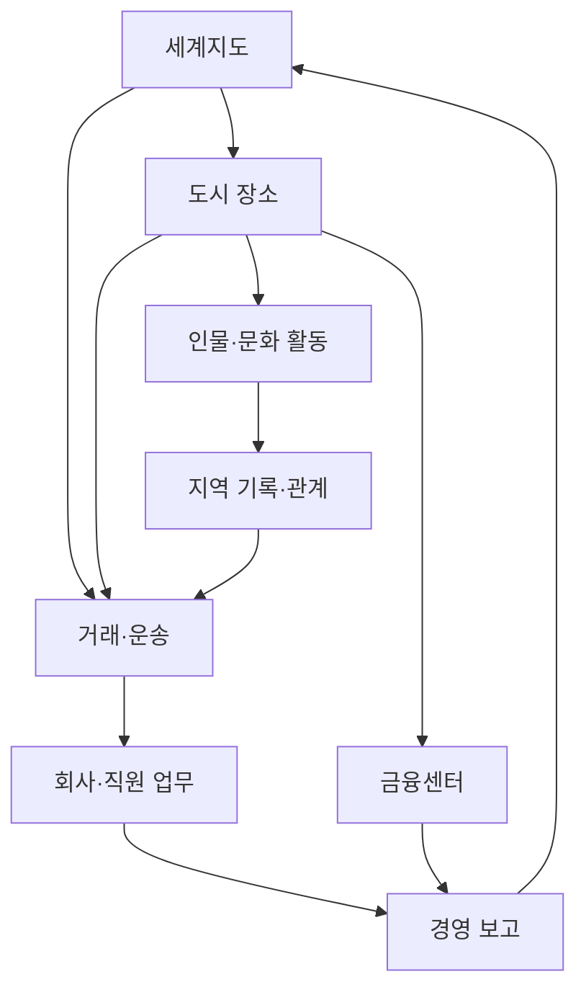
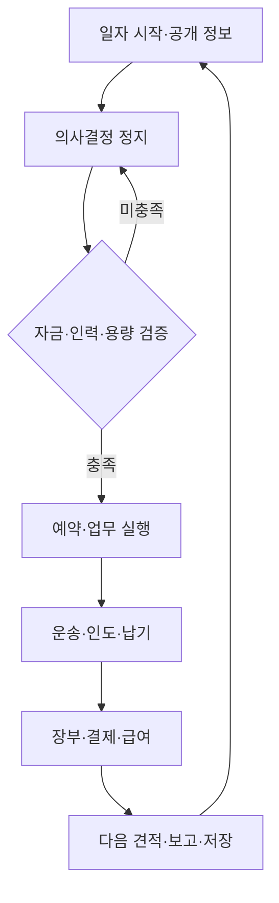
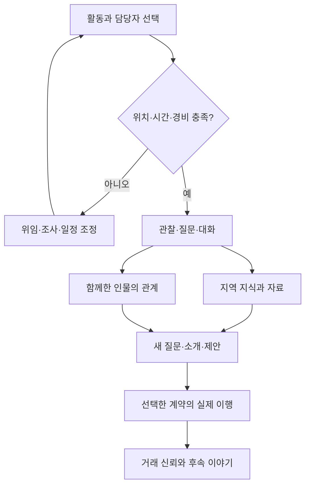
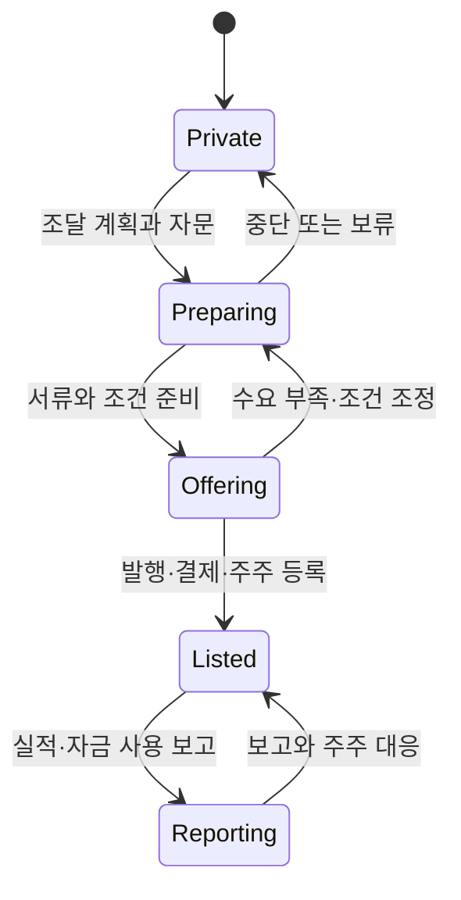
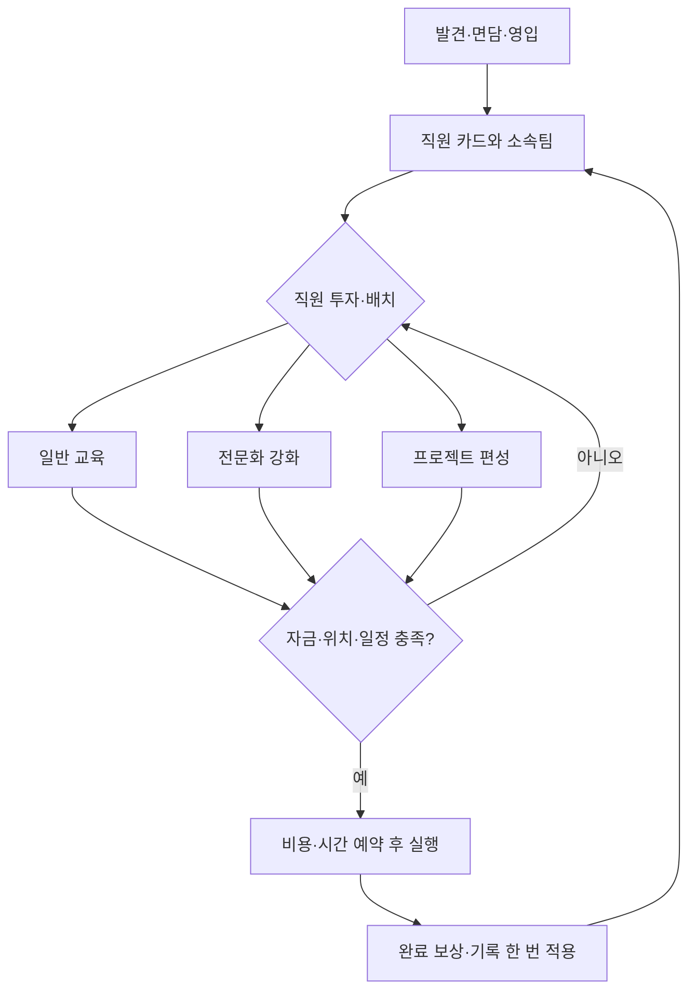

# 화면·상태·명령 흐름

## 화면 이동

## 일일 처리

문화 활동의 열람은 I에 머문다. 실제 활동은 Q에서 Task로 진행한다. 주식 기능은 P1에서 명령·현금 예약 및 일일 체결·평가 시점을 추가하며 장부를 따로 복제하지 않는다.

## 문화 경험의 결과

## 자사 상장 상태 — P2 설계

IPO의 발행 대금은 신주 수·발행 가격·발행비용으로 검산한다. 구주 매각 대금은 매도 주주의 자금이다. 이 상태도는 가상 게임의 간략화이며 특정 거래소의 법정 절차가 아니다.

## 동료 투자와 배치

업무에는 참여자별 경험치, 일반 교육에는60 XP, 강화에는등급 보너스를 적용한다. 같은 효과를 중복 지급하지 않는다.
