# 배치 시안 비교: ‘오늘 할 일’ 위치 · 동료 상세 · 하루 진행 뒤 읽던 자리

- 날짜: 2026-10-09. 기준 커밋 `3b60314`(TASK-0012 반영 뒤 개발 브랜치).
- 다루는 항목: 백로그 B53 — UX-04(‘오늘 할 일’이 T1 직후 화면 밖), UX-05·PPL-11(면담·성장 상세가 300px 칸에 길게 쌓임, 카드를 누르면 화면이 튐, 훈련 칸을 가져오지 않음 P14-05), UX-23·PPL-35의 2·3(현지 패널을 연 채 하루 진행할 때 오른쪽 칸·K1 밀림, ‘마지막 조작 열’ 검토).
- 지위: **선택 근거용 시안이다.** 이 폴더의 `proto-*.patch`는 개발 브랜치에 합치지 않는다. 사용자가 고른 뒤 Claude가 Sol 지시서를 쓰고, 그때 `docs/DECISIONS.md`를 고친다.
- 한눈에 보기: 같은 폴더의 [`index.html`](index.html)(도식·스크린숏·표, 외부 자원 없음).
- 측정 스크립트와 원자료는 저장소 밖 `scratchpad/accept22/s1c/`(`t1.js`·`t5.js`·`iv2.js`·`ec.js`·`m1.js`·`ord.js`·`pane.js`, `out/*.jsonl`)에 있다.

## 1. 지금 빌드에서 잰 문제

- **UX-04:** T1(화장품 수락 → 준비 배정 → 2일 편 예약) 뒤 ‘오늘 할 일’ 제목이 보이는 띠(고정 막대 아래 ~ 아래쪽 알림 위)보다 1366×657에서 182~215px, 한 열 1000×700에서 133px 아래에 있다. 1180×820·1024×768·1133×744에서는 제목만 띠 끝에 걸리고 항목은 밖이다. 거래 칸과 동료 칸의 길이가 우연히 맞아떨어지는지에 달렸다(DECISIONS ‘내용 길이에 따라 흔들린다’).
- **UX-05·PPL-11:** 귀솔 카드를 막대 아래 40px에 두고 누르면 화면이 운영표 아래의 ‘성장·훈련 상세’ 단추로 굴러, 카드가 124~458px 위로 밀린다(1366×657에서 카드 16px만 남음). 상세를 펼쳐도 훈련 단추는 띠보다 526~645px 아래다(P14-05). 300px 칸에서 상세 높이는 641px다.
- **UX-23·PPL-35:** 부산 현지 패널을 연 채 오른쪽 ‘오늘 할 일’을 읽다 하루를 진행하면 그 제목이 −75~−82px(미리 보기를 띄운 상태면 −469px), ‘자원 예약’이면 −55~−62px 움직인다(세 열 6개 프로필). 하루 진행이 주 열의 후보 제목 하나로 창 전체를 굴리기 때문이다. K1(늦은 날 미리 보기 아래 계약을 읽던 중)은 −414~−421px.

## 2. 시안

### 세 시안의 공통 부분

1. **상세는 누른 곳 바로 아래.** 동료 카드로 고르면 성장·훈련 상세를 그 카드 바로 아래(카드 칸 전체 폭)에 둔다. 운영표 줄로 고르면 지금처럼 운영표 바로 아래에 둔다. 필터 때문에 고른 카드가 보이지 않으면 운영표 아래에 둔다.
2. **펼치면 실행 단추를 띠 안으로.** 상세를 펼치면 ‘일반 훈련’ 단추를, 면담을 펼치면 고용 단추를 띠 안으로 최소 거리만 굴린다. 칸 제목(‘일반 훈련’·‘면담 — ○○’)은 막대 아래에 남긴다. 누른 뒤 생길 아래쪽 알림 자리 72px을 미리 비운다(부산 현지 미리 보기와 같은 규칙).
3. **훈련 단추에도 ‘누른 자리 유지’(F1).** 훈련 단추를 감싼 칸을 두어, 위쪽 ‘오늘 할 일’이 자라도(한 열, 시안 B) ‘일반 훈련 예정’ 표시가 누른 자리에 남는다(`growth.ts` 한 줄과 CSS 한 줄).
4. **M1은 그대로.** 모든 변경은 부산 현지가 있는 M2 시나리오에만 적용한다. M1의 화면 HTML 전체와 패널 위치가 `3b60314`와 같다(아래 표).

### A — 제자리 고치기 (배치 격자는 그대로)

- 고정 막대의 ‘하루 진행’ 왼쪽에 **‘오늘 할 일 N건’** 단추를 둔다. 누르면 ‘오늘 할 일’ 칸으로 가고 그 제목에 초점을 둔다.
- **하루 진행 뒤 읽던 자리를 마지막으로 조작한 열에서 고른다.** 마지막으로 누르거나(pointerdown), 굴리거나(wheel·touchstart), 초점을 둔(focusin) 곳이 오른쪽 칸(동료·자원 예약·오늘 할 일)이면, 오른쪽 칸에서 띠에 걸친 첫 후보(제목·카드·운영표 줄·목록 줄)를 그 높이에 붙잡는다. 주 열이면 지금 규칙 그대로다. 세 열일 때만 쓴다(한 열은 창이 하나라 지금 규칙).
- 바뀌는 파일: `src/ui/main.ts`, `src/ui/style.css`, `src/ui/growth.ts`(공통의 훈련 단추 칸).

### B — 순서 바꾸기

- **진행 중 계약을 견적판 위로** 올린다. 수락하면 새 계약이 거래 칸 맨 위에 생긴다. 이때 거래 칸 제목을 막대 아래에 둔다(새 계약 제목은 막대 아래 72px).
- **오른쪽 칸 순서: 오늘 할 일 → 동료 → 자원 예약.** 오른쪽 칸을 한 묶음으로 감싸, 화면 코드 순서가 보이는 순서와 같아진다(거래 → 오른쪽 칸 → 지도·보고·기록). DECISIONS의 ‘Tab 순서’ 미룬 항목도 함께 풀린다.
- 하루 진행 뒤 읽던 자리: A와 같은 ‘마지막 조작 열’ 규칙.
- 한 열(1000px 이하)은 지금 순서 그대로다. 다만 거래 칸 안에서는 계약이 견적판 위다.
- 바뀌는 파일: `src/ui/main.ts`, `src/ui/style.css`, `src/ui/growth.ts`(공통의 훈련 단추 칸).

### C — 오른쪽 창

- 세 열에서 오른쪽 칸(오늘 할 일 → 동료 → 자원 예약)이 **고정 막대 아래에 붙은 창**이 되어, 안에서 따로 굴러간다(`position: sticky`, `overflow-y: auto`, `overscroll-behavior: contain`).
- 다시 그릴 때마다(모든 누름) 창의 굴림 위치와 창 안에서 보이던 첫 후보의 높이를 되살린다. 하루 진행의 창 전체 굴림은 주 열에만 작용하므로, 오른쪽 칸은 구조적으로 따로 지켜진다.
- ‘누른 자리 유지’(F1)와 실행 단추 띠 계산은 대상이 창 안이면 창을 굴린다.
- 거래 칸 순서와 한 열 배치는 지금과 같다. 화면 코드 순서는 B와 같다.
- 바뀌는 파일: `src/ui/main.ts`, `src/ui/style.css`, `src/ui/growth.ts`(공통의 훈련 단추 칸).

## 3. 측정 방법

- Chromium(`/opt/pw-browsers/chromium`) 에뮬레이션, 7개 프로필: 1366×657 마우스, 1366×657 터치, 1180×820 터치, 1024×768 터치, 1133×744 터치, 1920×969 마우스, 1000×700 한 열 터치. 글꼴은 로컬 캐시, 빌드는 각 시안 작업 트리에서 `npx vite build`. 기준 빌드는 `3b60314` 빌드(`accept22/dist-base`, 다시 빌드해 바이트까지 같음을 확인).
- 측정한 조작은 좌표로 누른다(마우스 클릭, 터치 프로필은 터치 탭). 누를 때마다 500ms 막기를 넘긴다. 준비 단계만 요소의 `click()`을 쓴다.
- **띠:** 고정 막대 아래 끝 ~ 아래쪽 알림 위 끝(알림이 없으면 화면 끝). 시안 C의 창 안 요소는 창의 상자로 한 번 더 자른다. ‘보임’은 요소 전체가 띠 안.
- **T1:** 1일, 화장품 견적 ‘견적만 수락’ → CT001 준비 업무 귀솔 → ROUTE02-D002 예약.
- **T5:** 귀솔 카드(또는 운영표 줄)의 위 끝을 막대 아래 40px에 두고 누름 → ‘귀솔 성장·훈련 상세’ → ‘일반 훈련’. 불리한 자리도 쟀다: 카드 위 끝을 띠 아래 끝 −200px에 두고 누름. 면담은 1일 현장 조사·2일 영입 의뢰 뒤 4일에 면담 단추를 막대 아래 120px 또는 띠 아래 끝 −80px에 두고 누름.
- **하루 진행(현지 패널을 연 채):** 2일에 CA01·귀솔을 넣은 상태(RQ), 거기에 CA02를 골라 미리 보기를 띄운 상태(RQB), 오른쪽 ‘자원 예약’(RR), 대조로 주 열 셋째 견적(MQ). K1은 4일, 계약 하나, CA01·귀솔을 넣고 CA02·물보리 미리 보기를 띄운 채 ② 제목을 막대 아래 10px에 둔 경우(accept20 `cr1.js` K1). 읽는 요소를 목표보다 120px 아래에 둔 뒤 **그 칸 위에서 실제 굴림 동작**(마우스 휠, 터치 프로필은 CDP 터치 끌기)으로 120px을 굴리고, 문서·창 끝에 막혀 덜 갔으면 마지막에 프로그램으로 맞춘다. 굴림 동작은 ‘마지막 조작 열’을 알리는 역할이다. 터치 프로필에서는 합성 터치 끌기가 창 전체를 굴리지 않은 경우가 있어 위치는 대부분 프로그램 보정으로 맞췄다(터치 시작은 그 칸에서 일어났다).
- **M1 보존:** M1 시나리오로 바꾼 1일, 수락·배정·예약·카드 선택 뒤, 2일의 `#app` HTML 전체(대기 명령 ID만 지움)와 `.layout` 아래 패널 위치를 기준 빌드와 비교.
- **자동 시험:** 각 시안 작업 트리에서 `npx vitest run src/ui`, `npx tsc --noEmit`.

## 4. 결과

각 칸은 한 번 잰 값이다(에뮬레이션은 같은 조건이면 같은 값을 낸다. 기준 빌드의 1366×657 ‘RQ −82px’와 ‘카드 −436px’는 따로 두 번 재어 같았다). 위치 변화의 음수는 화면 위쪽으로 움직임이다. 시안 A·B·C의 T5·면담·카드 아래쪽·M1·순서·창 값은 마지막 빌드(공통 훈련 F1 칸 포함, `proto-*.patch`와 같음)로 잰 값이다. T1·하루 진행 값은 일부 프로필이 그 직전 빌드 값이다. 두 빌드의 차이는 상세 안 훈련 단추를 감싼 칸뿐이고, T1·하루 진행 경로는 상세를 열지 않으므로 값에 나타나지 않는다.

### 4.1 UX-04 — ‘오늘 할 일’과 첫 화면

**T1 뒤 ‘오늘 할 일’ 제목 (띠 = 고정 막대 아래 ~ 아래쪽 알림 위)**

| 시안 | 1366×657 마우스 | 1366×657 터치 | 1180×820 터치 | 1024×768 터치 | 1133×744 터치 | 1920×969 마우스 | 1000×700 한 열 터치 |
|---|---|---|---|---|---|---|---|
| 지금(3b60314) | 215px 아래 | 182px 아래 | 제목만 보임 | 제목만 보임 | 제목만 보임 | 아래 끝에 걸침 | 133px 아래 |
| A 제자리 | 215px 아래 · 단추 보임 | 182px 아래 · 단추 보임 | 제목만 보임 · 단추 보임 | 제목만 보임 · 단추 보임 | 제목만 보임 · 단추 보임 | 아래 끝에 걸침 · 단추 보임 | 133px 아래 · 단추 보임 |
| B 순서 | 보임 | 보임 | 보임 | 보임 | 보임 | 보임 | 2280px 아래 |
| C 오른쪽 창 | 보임 | 보임 | 보임 | 보임 | 보임 | 보임 | 133px 아래 |

**시안 A: T1 뒤 ‘오늘 할 일 N건’ 단추를 한 번 누른 뒤**

| 시안 | 1366×657 마우스 | 1366×657 터치 | 1180×820 터치 | 1024×768 터치 | 1133×744 터치 | 1920×969 마우스 | 1000×700 한 열 터치 |
|---|---|---|---|---|---|---|---|
| A 제자리 | 제목·첫 항목 보임 | 제목·첫 항목 보임 | 제목·첫 항목 보임 | 제목·첫 항목 보임 | 제목·첫 항목 보임 | 제목·첫 항목 보임 | 제목·첫 항목 보임 |

**T1 뒤 새 계약 제목: 막대 아래 px (TASK-0014 기준 0~60)**

| 시안 | 1366×657 마우스 | 1366×657 터치 | 1180×820 터치 | 1024×768 터치 | 1133×744 터치 | 1920×969 마우스 | 1000×700 한 열 터치 |
|---|---|---|---|---|---|---|---|
| 지금(3b60314) | 3 | 3 | 3 | 3 | 2 | 3 | 3 |
| A 제자리 | 3 | 3 | 3 | 3 | 2 | 3 | 3 |
| B 순서 | 72 | 72 | 72 | 73 | 72 | 72 | 73 |
| C 오른쪽 창 | 3 | 3 | 3 | 3 | 2 | 3 | 3 |

**고정 막대 높이 px**

| 시안 | 1366×657 마우스 | 1366×657 터치 | 1180×820 터치 | 1024×768 터치 | 1133×744 터치 | 1920×969 마우스 | 1000×700 한 열 터치 |
|---|---|---|---|---|---|---|---|
| 지금(3b60314) | 72 | 79 | 79 | 79 | 79 | 72 | 79 |
| A 제자리 | 72 | 79 | 79 | 79 | 79 | 72 | 79 |
| B 순서 | 72 | 79 | 79 | 79 | 79 | 72 | 79 |
| C 오른쪽 창 | 72 | 79 | 79 | 79 | 79 | 72 | 79 |

**1일 첫 화면: 거래 제목 위치 px / 첫 견적이 첫 화면에 있나**

| 시안 | 1366×657 마우스 | 1366×657 터치 | 1180×820 터치 | 1024×768 터치 | 1133×744 터치 | 1920×969 마우스 | 1000×700 한 열 터치 |
|---|---|---|---|---|---|---|---|
| 지금(3b60314) | 183 / 예 | 199 / 예 | 199 / 예 | 252 / 예 | 199 / 예 | 183 / 예 | 252 / 예 |
| A 제자리 | 183 / 예 | 199 / 예 | 199 / 예 | 252 / 예 | 199 / 예 | 183 / 예 | 252 / 예 |
| B 순서 | 183 / 예 | 199 / 예 | 199 / 예 | 252 / 예 | 199 / 예 | 183 / 예 | 252 / 예 |
| C 오른쪽 창 | 183 / 예 | 199 / 예 | 199 / 예 | 252 / 예 | 199 / 예 | 183 / 예 | 252 / 예 |

### 4.2 UX-05·PPL-11 — 동료 카드·상세·면담

**동료 카드 누름: 카드 위치 변화 px (막대+40에 두고 누름)**

| 시안 | 1366×657 마우스 | 1366×657 터치 | 1180×820 터치 | 1024×768 터치 | 1133×744 터치 | 1920×969 마우스 | 1000×700 한 열 터치 |
|---|---|---|---|---|---|---|---|
| 지금(3b60314) | −436 | −458 | −295 | −401 | −371 | −124 | −163 |
| A 제자리 | −1 | −1 | −1 | −1 | −1 | −1 | 0 |
| B 순서 | −1 | −1 | −1 | −1 | −1 | −1 | 0 |
| C 오른쪽 창 | 0 | 0 | 0 | 0 | 0 | 0 | 0 |

**운영표 줄 누름: 줄 위치 변화 px**

| 시안 | 1366×657 마우스 | 1366×657 터치 | 1180×820 터치 | 1024×768 터치 | 1133×744 터치 | 1920×969 마우스 | 1000×700 한 열 터치 |
|---|---|---|---|---|---|---|---|
| 지금(3b60314) | 0 | 0 | 0 | 0 | 0 | 0 | 0 |
| A 제자리 | 0 | 0 | 0 | 0 | 0 | 0 | 0 |
| B 순서 | 0 | 0 | 0 | 0 | 0 | 0 | 0 |
| C 오른쪽 창 | 0 | 0 | 0 | 0 | 0 | 0 | 0 |

**카드 → 상세 펼침: 훈련 단추 / 훈련을 넣은 뒤 예정 표시**

| 시안 | 1366×657 마우스 | 1366×657 터치 | 1180×820 터치 | 1024×768 터치 | 1133×744 터치 | 1920×969 마우스 | 1000×700 한 열 터치 |
|---|---|---|---|---|---|---|---|
| 지금(3b60314) | 637px 아래 | 645px 아래 | 645px 아래 | 644px 아래 | 645px 아래 | 637px 아래 | 526px 아래 |
| A 제자리 | 보임 | 보임 | 보임 | 보임 | 보임 | 보임 | 보임 |
| B 순서 | 보임 | 보임 | 보임 | 보임 | 보임 | 보임 | 보임 |
| C 오른쪽 창 | 보임 | 보임 | 보임 | 보임 | 보임 | 보임 | 보임 |

**운영표 줄 → 상세 펼침: 훈련 단추**

| 시안 | 1366×657 마우스 | 1366×657 터치 | 1180×820 터치 | 1024×768 터치 | 1133×744 터치 | 1920×969 마우스 | 1000×700 한 열 터치 |
|---|---|---|---|---|---|---|---|
| 지금(3b60314) | 352px 아래 | 382px 아래 | 219px 아래 | 324px 아래 | 295px 아래 | 40px 아래 | 274px 아래 |
| A 제자리 | 보임 | 보임 | 보임 | 보임 | 보임 | 보임 | 보임 |
| B 순서 | 보임 | 보임 | 보임 | 보임 | 보임 | 보임 | 보임 |
| C 오른쪽 창 | 보임 | 보임 | 보임 | 보임 | 보임 | 보임 | 보임 |

**카드를 띠 아래쪽(목표: 위 끝이 띠 아래 끝 −200px)에 두고 누름: 누르기 전 카드 위 끝 px에서 위치 변화 / 상세 펼친 뒤 훈련 단추**

| 시안 | 1366×657 마우스 | 1366×657 터치 | 1180×820 터치 | 1024×768 터치 | 1133×744 터치 | 1920×969 마우스 | 1000×700 한 열 터치 |
|---|---|---|---|---|---|---|---|
| 지금(3b60314) | 279에서 −525 / 훈련 637px 아래 | 311에서 −563 / 훈련 645px 아래 | 311에서 −400 / 훈련 645px 아래 | 365에서 −506 / 훈련 644px 아래 | 311에서 −476 / 훈련 645px 아래 | 279에서 −213 / 훈련 637px 아래 | 500에서 −403 / 훈련 526px 아래 |
| A 제자리 | 279에서 −2 / 훈련 보임 | 311에서 −41 / 훈련 보임 | 311에서 −1 / 훈련 보임 | 365에서 −1 / 훈련 보임 | 311에서 −1 / 훈련 보임 | 279에서 −1 / 훈련 보임 | 500에서 −204 / 훈련 보임 |
| B 순서 | 451에서 −174 / 훈련 보임 | 457에서 −187 / 훈련 보임 | 483에서 −50 / 훈련 보임 | 537에서 −156 / 훈련 보임 | 483에서 −126 / 훈련 보임 | 451에서 −1 / 훈련 보임 | 500에서 −204 / 훈련 보임 |
| C 오른쪽 창 | 451에서 −174 / 훈련 보임 | 457에서 −187 / 훈련 보임 | 483에서 −50 / 훈련 보임 | 537에서 −155 · 상세 단추 가림 / 훈련 보임 | 483에서 −126 / 훈련 보임 | 451에서 −1 / 훈련 보임 | 500에서 −204 / 훈련 보임 |

**4일 면담 펼침(면담 단추를 막대+120): 고용 단추 / 면담 칸 높이**

| 시안 | 1366×657 마우스 | 1366×657 터치 | 1180×820 터치 | 1024×768 터치 | 1133×744 터치 | 1920×969 마우스 | 1000×700 한 열 터치 |
|---|---|---|---|---|---|---|---|
| 지금(3b60314) | 보임 · 352px | 보임 · 358px | 보임 · 358px | 보임 · 358px | 보임 · 358px | 보임 · 352px | 보임 · 207px |
| A 제자리 | 보임 · 352px | 보임 · 358px | 보임 · 358px | 보임 · 358px | 보임 · 358px | 보임 · 352px | 보임 · 207px |
| B 순서 | 보임 · 352px | 보임 · 358px | 보임 · 358px | 보임 · 358px | 보임 · 358px | 보임 · 352px | 보임 · 207px |
| C 오른쪽 창 | 보임 · 352px | 보임 · 358px | 보임 · 358px | 보임 · 358px | 보임 · 358px | 보임 · 352px | 보임 · 207px |

**4일 면담 펼침(면담 단추를 띠 아래 끝 −80px): 고용 단추 / 면담 칸 높이**

| 시안 | 1366×657 마우스 | 1366×657 터치 | 1180×820 터치 | 1024×768 터치 | 1133×744 터치 | 1920×969 마우스 | 1000×700 한 열 터치 |
|---|---|---|---|---|---|---|---|
| 지금(3b60314) | 272px 아래 · 352px | 283px 아래 · 358px | 283px 아래 · 358px | 283px 아래 · 358px | 283px 아래 · 358px | 272px 아래 · 352px | 151px 아래 · 207px |
| A 제자리 | 보임 · 352px | 보임 · 358px | 보임 · 358px | 보임 · 358px | 보임 · 358px | 보임 · 352px | 보임 · 207px |
| B 순서 | 보임 · 352px | 보임 · 358px | 보임 · 358px | 보임 · 358px | 보임 · 358px | 보임 · 352px | 보임 · 207px |
| C 오른쪽 창 | 보임 · 352px | 보임 · 358px | 보임 · 358px | 보임 · 358px | 보임 · 358px | 보임 · 352px | 보임 · 207px |

### 4.3 UX-23·PPL-35 — 현지 패널을 연 채 하루 진행

**현지 패널 연 채 하루 진행 — 오른쪽 ‘오늘 할 일’을 읽던 중(RQ): 그 제목의 이동 px**

| 시안 | 1366×657 마우스 | 1366×657 터치 | 1180×820 터치 | 1024×768 터치 | 1133×744 터치 | 1920×969 마우스 | 1000×700 한 열 터치 |
|---|---|---|---|---|---|---|---|
| 지금(3b60314) | −82 | −75 | −75 | −75 | −75 | −82 | 0 |
| A 제자리 | 0 | 0 | 0 | 0 | 0 | 0 | 0 |
| B 순서 | 0 | 0 | 0 | 0 | 0 | 0 | 0 |
| C 오른쪽 창 | 0 | 0 | 0 | 0 | 0 | 0 | 0 |

**같은 경우, 미리 보기를 띄운 상태(RQB): ‘오늘 할 일’ 제목 이동 px**

| 시안 | 1366×657 마우스 | 1366×657 터치 | 1180×820 터치 | 1024×768 터치 | 1133×744 터치 | 1920×969 마우스 | 1000×700 한 열 터치 |
|---|---|---|---|---|---|---|---|
| 지금(3b60314) | −469 | −469 | −469 | −469 | −469 | −469 | 0 |
| A 제자리 | 0 | 0 | 0 | 0 | 0 | 0 | 0 |
| B 순서 | 0 | 0 | 0 | 0 | 0 | 0 | 0 |
| C 오른쪽 창 | 0 | 0 | 0 | 0 | 0 | 0 | 0 |

**RQB에서 주 열(셋째 견적 제목) 이동 px — 오른쪽을 지킨 대가**

| 시안 | 1366×657 마우스 | 1366×657 터치 | 1180×820 터치 | 1024×768 터치 | 1133×744 터치 | 1920×969 마우스 | 1000×700 한 열 터치 |
|---|---|---|---|---|---|---|---|
| 지금(3b60314) | 0 | 0 | 0 | 0 | 0 | 0 | 0 |
| A 제자리 | +469 | +469 | +469 | +469 | +469 | +469 | 0 |
| B 순서 | +423 | +423 | +423 | +423 | +423 | +423 | 0 |
| C 오른쪽 창 | 0 | 0 | 0 | 0 | 0 | 0 | 0 |

**오른쪽 ‘자원 예약’을 읽던 중(RR): 그 제목의 이동 px**

| 시안 | 1366×657 마우스 | 1366×657 터치 | 1180×820 터치 | 1024×768 터치 | 1133×744 터치 | 1920×969 마우스 | 1000×700 한 열 터치 |
|---|---|---|---|---|---|---|---|
| 지금(3b60314) | −62 | −55 | −55 | −55 | −55 | −62 | +20 |
| A 제자리 | 0 | 0 | 0 | 0 | 0 | 0 | +20 |
| B 순서 | 0 | 0 | 0 | 0 | 0 | 0 | +20 |
| C 오른쪽 창 | 0 | 0 | 0 | 0 | 0 | 0 | +20 |

**대조 — 주 열 셋째 견적을 읽던 중(MQ): 그 제목의 이동 px**

| 시안 | 1366×657 마우스 | 1366×657 터치 | 1180×820 터치 | 1024×768 터치 | 1133×744 터치 | 1920×969 마우스 | 1000×700 한 열 터치 |
|---|---|---|---|---|---|---|---|
| 지금(3b60314) | 0 | 0 | 0 | 0 | 0 | 0 | 0 |
| A 제자리 | 0 | 0 | 0 | 0 | 0 | 0 | 0 |
| B 순서 | 0 | 0 | 0 | 0 | 0 | 0 | 0 |
| C 오른쪽 창 | 0 | 0 | 0 | 0 | 0 | 0 | 0 |

**K1 — 4일, 미리 보기를 띄운 채 아래 계약을 읽던 중: 계약 제목 이동 px**

| 시안 | 1366×657 마우스 | 1366×657 터치 | 1180×820 터치 | 1024×768 터치 | 1133×744 터치 | 1920×969 마우스 | 1000×700 한 열 터치 |
|---|---|---|---|---|---|---|---|
| 지금(3b60314) | −414 | −421 | −421 | −421 | −421 | −414 | −421 |
| A 제자리 | −414 | −421 | −421 | −421 | −421 | −414 | −421 |
| B 순서 | −414 | −421 | −421 | −421 | −421 | −414 | −421 |
| C 오른쪽 창 | −414 | −421 | −421 | −421 | −421 | −414 | −421 |

‘마지막 조작 열’(A·B)은 측정에서 읽는 칸 위의 굴림 동작으로 정해졌다. 한 열(1000×700)에는 오른쪽 칸이 없어 A·B·C 모두 지금과 같다.

### 4.4 M1·넘침·순서·창·자동 시험

**M1 화면(1일·수락 뒤·2일 전체 HTML과 패널 위치)**

| 시안 | 1366×657 마우스 | 1366×657 터치 | 1180×820 터치 | 1024×768 터치 | 1133×744 터치 | 1920×969 마우스 | 1000×700 한 열 터치 |
|---|---|---|---|---|---|---|---|
| 지금(3b60314) | 기준 | 기준 | 기준 | 기준 | 기준 | 기준 | 기준 |
| A 제자리 | 같음 | 같음 | 같음 | 같음 | 같음 | 같음 | 같음 |
| B 순서 | 같음 | 같음 | 같음 | 같음 | 같음 | 같음 | 같음 |
| C 오른쪽 창 | 같음 | 같음 | 같음 | 같음 | 같음 | 같음 | 같음 |

**가로 넘침·칸 넘침 요소 수(1일·T1·T5 상태 합)**

| 시안 | 1366×657 마우스 | 1366×657 터치 | 1180×820 터치 | 1024×768 터치 | 1133×744 터치 | 1920×969 마우스 | 1000×700 한 열 터치 |
|---|---|---|---|---|---|---|---|
| 지금(3b60314) | 0 | 0 | 0 | 0 | 0 | 0 | 0 |
| A 제자리 | 0 | 0 | 0 | 0 | 0 | 0 | 0 |
| B 순서 | 0 | 0 | 0 | 0 | 0 | 0 | 0 |
| C 오른쪽 창 | 0 | 0 | 0 | 0 | 0 | 0 | 0 |

**패널 순서** (`ord.js`, 1일):

| 시안 | 세 열(1366×657) 보이는 순서 | 화면 코드 순서(Tab·화면 읽기) | 한 열(1000×700) 보이는 순서 |
|---|---|---|---|
| 지금 | 거래 → 동료 → 자원 → 오늘 할 일 → 지도 → 보고 → 기록 | 지도 → 동료 → 거래 → 자원 → 오늘 할 일 → 보고 → 기록 | 거래 → 오늘 할 일 → 동료 → 자원 → 보고 → 지도 → 기록 |
| A | 지금과 같음 | 지금과 같음 | 지금과 같음 |
| B | 거래 → 오늘 할 일 → 동료 → 자원 → 지도 → 보고 → 기록 | 거래 → 오늘 할 일 → 동료 → 자원 → 지도 → 보고 → 기록 | 지금과 같음(거래 칸 안은 계약 → 견적판) |
| C | B와 같음(오른쪽 셋은 창 안) | B와 같음 | 지금과 같음 |

> **2026-10-09 단서(TASK-0023 뒤):** 경영 보고 칸에 계약 링크가, 오늘 할 일 칸에 일정 단추가 생겨 두 칸에도 Tab 정지점이 있다. 그래서 한 열(1000×700)에서 화면 코드 순서와 보이는 순서의 차이(오늘 할 일·보고가 동료·지도보다 위에 보임)가 Tab이 거꾸로 튀는 곳으로 드러난다. 실측(t1000): 1일 첫 화면 0→1, 수락 뒤 2일 0→2, 알림 상태 1→3, 90일 끝 2건. 세 열 6개 프로필은 0이다. A·B·C 어느 안을 고르든, 한 열 격자를 화면 코드 순서와 맞추거나(격자 문자열 조정) 화면 코드에서 보고를 지도 앞에 두는 일을 함께 정해야 한다. 후자는 세 열 격자 시험의 순서 단언을 고쳐야 한다.

**시안 C 창의 크기** (`pane.js`, 1일 페이지 맨 위):

| 프로필 | 창 높이 px | 창 안 내용 높이 px | 페이지 맨 위에서 창 아래 끝이 화면 밖 px |
|---|---|---|---|
| 1366×657 마우스 | 569 | 2,834 | 78 |
| 1366×657 터치 | 562 | 2,895 | 87 |
| 1180×820 터치 | 725 | 2,895 | 87 |
| 1024×768 터치 | 673 | 2,895 | 140 |
| 1133×744 터치 | 649 | 2,895 | 87 |
| 1920×969 마우스 | 881 | 2,834 | 78 |
| 1000×700 한 열 | 창 아님 | – | – |

- 창 끝까지 내린 뒤 창 위에서 휠을 300px 굴려도 페이지는 0px 움직였다(마우스 프로필 둘).
- 1024×768에서 카드를 띠 아래쪽에 두고 누르면, 창은 상세 단추를 창 아래 끝으로 가져오지만 그 끝이 화면 밖(140px)이라 단추가 가린다(4.2의 ‘상세 단추 가림’).

**자동 시험** (각 시안 작업 트리):

| 시안 | `npx tsc --noEmit` | `npx vitest run src/ui` |
|---|---|---|
| A | 통과 | 265/266 — 실패 1: TASK-0013 ‘금액 기준 안내는 위쪽 막대에 한 번 나오고 오늘 대기 명령을 금액에 반영하지 않는다’(막대 HTML 전체를 고정. 단추의 건수가 바뀜) |
| B | 통과 | 266/266 |
| C | 통과 | 266/266 |

이름에 ‘M1’이 든 화면 시험 10개(`npx vitest run src/ui -t M1`: ‘TASK-0012 M1 동작 보존’, ‘M1 전체 화면에는 문화 탭·패널·비용·감싸는 칸이 없다’, ‘M1 전체 화면에는 훈련·경험치가 없다’, ‘M1도 견적 수락·배정·예약에서 수금·종결까지 진행한다’, 카드·성장·문화 단위 시험 등)는 세 시안 모두 통과했다.

## 5. 그림 (1366×657 마우스, T1·T5 경로)

| | 지금 | A | B | C |
|---|---|---|---|---|
| T1 뒤 | 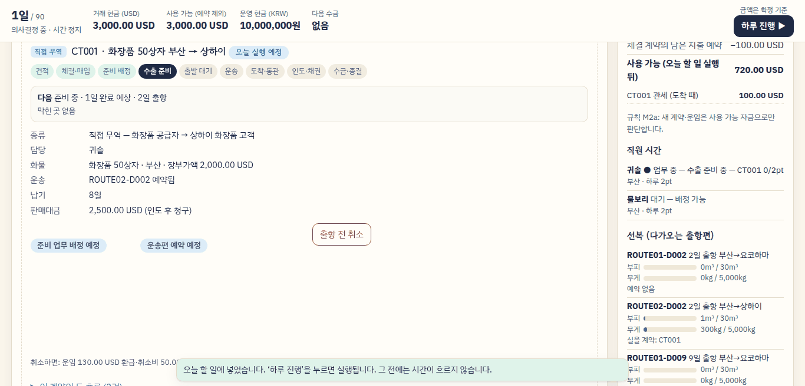 | 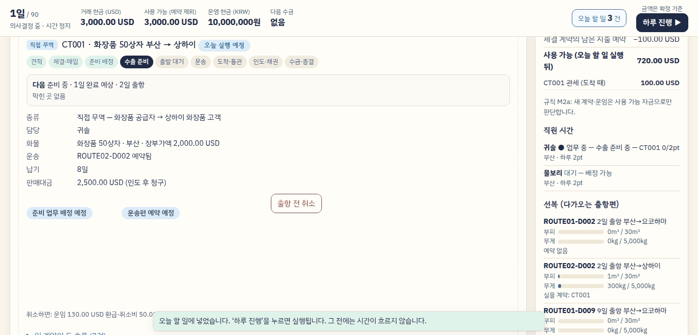 | 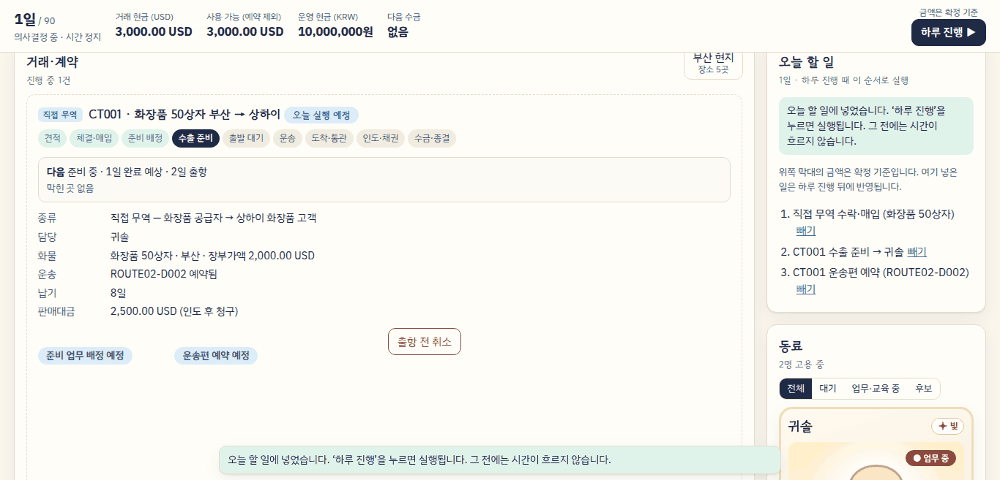 | 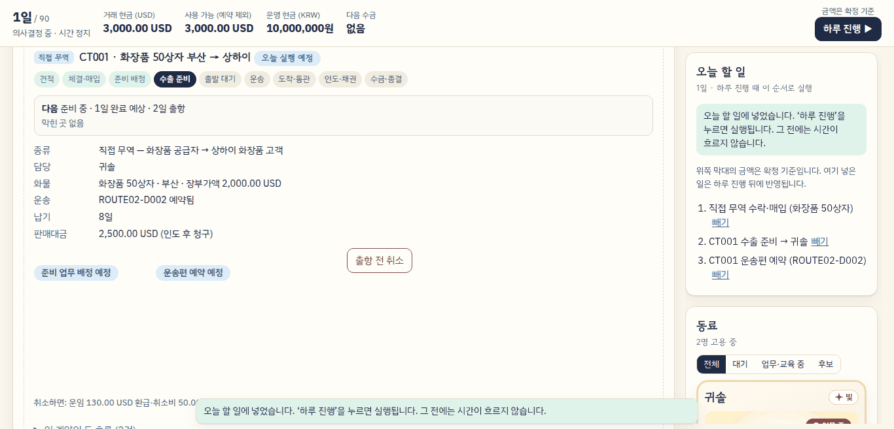 |
| 카드를 누른 뒤 |  | 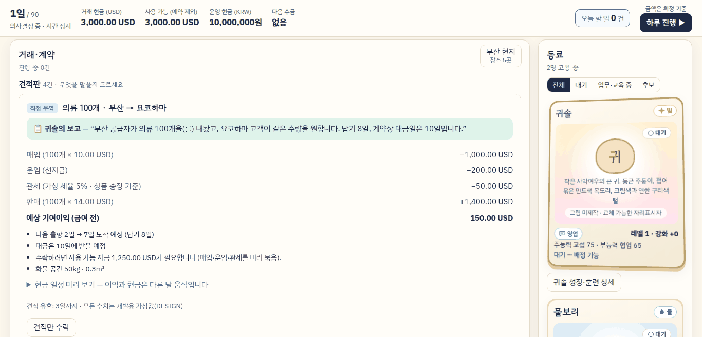 | (A와 같음) | (A와 같음, 창 안) |
| 상세를 펼친 뒤 | 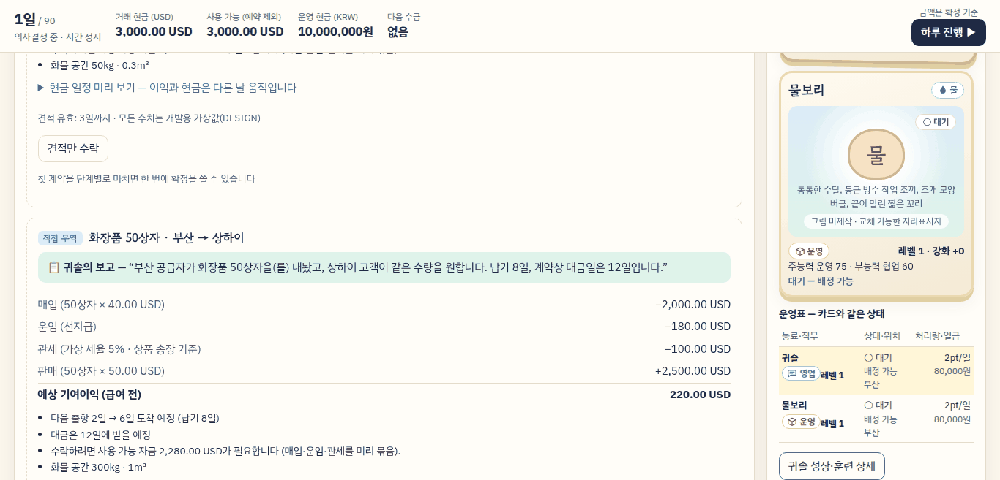 | 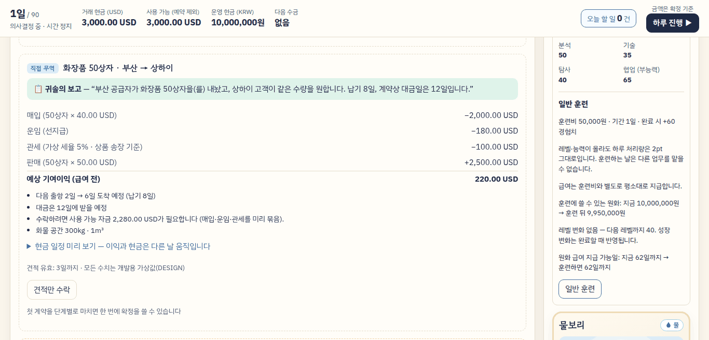 | (A와 같음) | 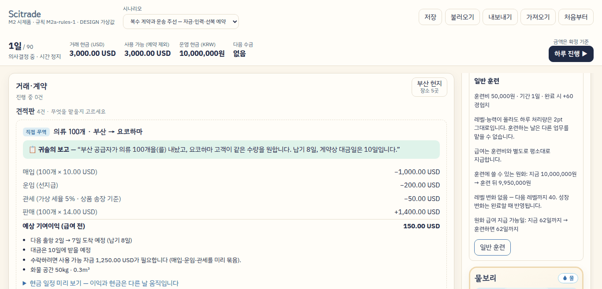 |

- A에서 막대의 ‘오늘 할 일 N건’을 누른 뒤: 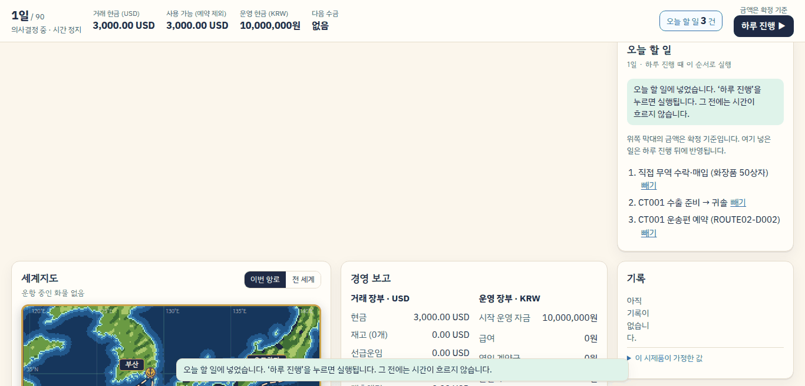
- B의 한 열(1000×700) T1 뒤 — 계약이 맨 위, ‘오늘 할 일’은 견적판 아래로 멀어짐: 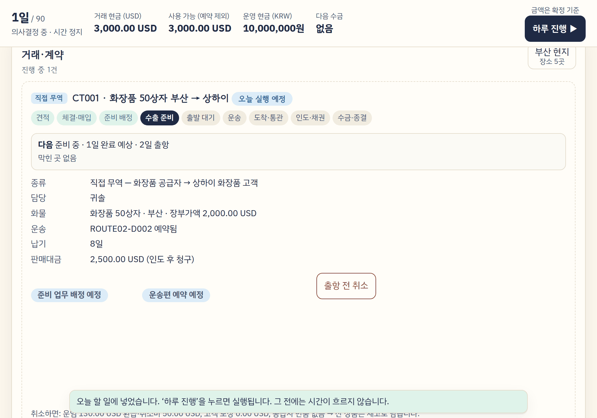
- C의 1일 첫 화면 — 페이지 맨 위에서는 창 아래 끝이 화면 밖: 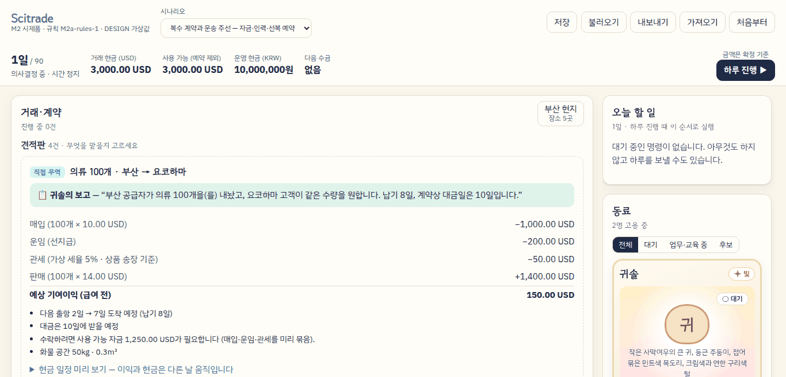

## 6. 장단점

### 공통 부분
- 좋은 점: 카드를 눌러도 카드가 제자리(−1~0px, 지금은 −124~−458px)이고 상세 단추가 바로 아래에 있다. 상세를 펼치면 ‘일반 훈련’ 제목부터 단추까지 띠 안에 오고, 훈련을 넣은 뒤 ‘일반 훈련 예정’도 알림에 가리지 않는다(7개 프로필). 카드를 띠 아래쪽에 두고 눌러도(시안 C의 1024×768 한 곳 제외, 4.4), 면담 단추를 띠 아래 끝에 두고 눌러도 실행 단추가 보인다.
- 대가: 상세의 길이(300px 칸에서 641px)는 그대로다. 훈련 칸을 보이면 카드와 ‘○○ 성장 기록’ 제목은 화면 위로 나가고, 누구의 훈련인지는 단추 이름(‘귀솔 일반 훈련’, 화면 읽기용)에만 남는다. Sol 지시서에서 ‘일반 훈련’ 제목에 이름을 붙일지 정한다. 운영표 줄로 고르면 상세가 운영표 아래에 있어 상세 자리가 둘이다.

### A — 제자리 고치기
- 좋은 점: 변경이 가장 작다(`main.ts`·`style.css`·`growth.ts` 한 줄). 격자·화면 코드 순서·거래 칸 순서가 그대로라 사용성 시험 절차서는 ‘가로 세 열에서 볼 것’의 ‘오늘 할 일’·T5 문단만 고치면 된다. ‘오늘 할 일 N건’은 7개 프로필 모두, 한 열에서도 하루 진행 바로 옆에 보이고, 고정 막대 높이는 그대로다. 오른쪽 칸을 누르거나 굴리며 읽었으면 하루 진행 뒤 그 제목이 0px.
- 대가: ‘오늘 할 일’ 칸 자체는 T1 뒤에도 화면 밖이다(1366×657에서 182~215px 아래). 단추를 누르면 읽던 계약을 떠난다. ‘마지막 조작 열’은 오른쪽 칸에서 누르거나 굴리거나 초점을 둔 적이 있어야 작동한다. 스크롤 막대만 끌거나, 주 열에 초점을 둔 채 키보드로 내려 오른쪽을 읽었으면 지금처럼 주 열 기준이다. 반대로 오래전 오른쪽 조작이 남아 있으면 주 열이 그만큼 움직인다(RQB에서 셋째 견적 +469px — 오른쪽을 지킨 만큼). 막대 HTML 전체를 고정한 TASK-0013 시험 1개를 고쳐야 한다.

### B — 순서 바꾸기
- 좋은 점: 세 열 6개 프로필에서 T1 뒤 ‘오늘 할 일’ 제목·항목이 보인다. 화면 코드 순서가 보이는 순서와 같아져 미룬 ‘Tab 순서’ 항목도 풀린다. 계약이 위라 견적이 만료돼도 계약이 움직이지 않는다.
- 대가: 새 계약 제목이 막대 아래 72px(TASK-0014 기준 0~60px 초과. 계약 제목을 막대 바로 아래에 두면 같은 높이의 ‘오늘 할 일’ 제목이 막대 밑으로 25px 가린다). 한 열(1000×700)에서는 T1 뒤 ‘오늘 할 일’이 2,280px 아래로 멀어진다(지금 133px) — 계약과 ‘오늘 할 일’ 사이에 견적판 전체가 끼기 때문이다. 거래 칸 순서가 바뀌어 사용성 시험 절차서의 T1·T3 안내와 ‘가로 세 열에서 볼 것’을 고쳐야 한다. 위쪽 ‘오늘 할 일’이 자라거나 줄면 오른쪽 칸 전체가 밀린다(주 열을 읽을 때 동료·자원이 −29~−85px).

### C — 오른쪽 창
- 좋은 점: 세 열에서 T1 뒤 ‘오늘 할 일’이 창 맨 위에 보인다. 오른쪽 칸을 읽던 자리는 조작을 추적하지 않아도 구조적으로 0px(스크롤 막대·키보드여도). 주 열 대조(MQ)도 그대로이고 주 열이 오른쪽 때문에 밀리지 않는다(RQB 주 열 0px). 화면 코드 순서가 보이는 순서와 같다.
- 대가: 굴러가는 칸이 둘이 된다. 오른쪽 위에서 휠·손가락을 쓰면 창만 굴러가고, 창 끝에 닿아도 페이지로 넘어가지 않는다(`overscroll-behavior: contain`, 바꿀 수 있음). 창을 내려 동료를 보면 ‘오늘 할 일’은 다시 가려진다. 페이지 맨 위에서는 창 아래 끝이 화면 밖이다(머리 막대가 고정되지 않으므로, 아래 표). 모든 다시 그리기에 창 위치 되살리기가 끼어들고, F1·띠 계산·하네스가 창을 알아야 한다. iPad Safari(WebKit)의 중첩 굴림·sticky는 재지 못했다.

### 세 시안 모두
- K1(−414~−421px)은 그대로다. 주 열 안의 문제(남는 ② 제목 아래 미리 보기가 하루 진행 때 사라짐)라 열 규칙으로는 풀리지 않는다.
- 한 열(1000×700)에서 ‘오른쪽 칸’은 없으므로 A·C는 지금과 같다.

## 7. 권고

**공통 + A를 권한다.**

1. **UX-05·PPL-11·P14-05는 공통 부분으로 7개 프로필 모두 풀린다.** 이것은 어느 시안을 고르든 같다.
2. **UX-04:** A는 ‘오늘 할 일’ 칸을 옮기지 않지만, 건수를 하루 진행 바로 옆에 늘 보여 준다. 사용성 시험에서 보려는 것은 ‘하루 진행 전에 오늘 할 일을 확인하는가’이고, 그 판단은 하루 진행 단추 앞에서 일어난다. 7개 프로필(한 열 포함)에서 같은 자리에 보이는 것은 A뿐이다. B·C는 세 열에서 칸을 보이지만, B는 한 열을 크게 나쁘게 하고 C는 창을 내리면 다시 가려진다.
3. **UX-23:** A의 ‘마지막 조작 열’ 규칙은 오른쪽 칸을 그 칸에서 굴리며 읽은 경우(RQ·RQB·RR) 세 열 6개 프로필에서 0px이고, 주 열 경우(MQ)는 지금과 같다. 구조적으로는 C가 더 단단하지만, 굴러가는 칸이 둘이 되는 비용과 WebKit 미측정 위험이 이번 사용성 시험 직전에 지기에는 크다.
4. **위험이 가장 작다.** 격자·거래 순서·화면 코드 순서·막대 높이·첫 화면·M1이 그대로이고, 기대값을 바꿀 시험은 1개다. TASK-0018(같은 파일을 고치는 Sol 작업)과도 겹침이 작다.

**다시 볼 조건:** 사용성 시험에서 참가자가 오른쪽 칸을 오래 굴려 읽거나, 스크롤 막대로 읽다 하루 진행 뒤 자리를 잃는 모습이 보이면 C를 다시 본다. A의 단추는 C와 함께 쓸 수도 있다(서로 다른 파일 영역).

**K1은 따로 다룬다.** 후보: (가) 마지막으로 굴린 손가락·포인터 높이에 가장 가까운 후보를 기준으로 고르기, (나) 하루 진행 뒤에도 미리 보기 자리를 남기기. (나)는 TASK-0012의 ‘하루 진행 때 고른 직원을 지운다’ 결정과 부딪히므로 사용자 결정이 필요하다.

## 8. Sol 지시서에 넣을 것 (권고안 = 공통 + A 기준)

**선행·충돌:** TASK-0018(Sol, 키보드·입력 안전)이 같은 `main.ts`·`style.css`를 고친다. 그 반영 뒤 그 위에서 시작한다. TASK-0015(평택)는 `recruitment.ts`의 문구를 고치지만 이 작업은 `recruitment.ts`를 고치지 않는다.

**고칠 파일:**
- `src/ui/main.ts`
  - 공통: 고른 출처 기억(`select-card`의 클릭·키보드 경로에서 카드/운영표 줄 구분), 카드 아래 상세(`inlineDetail`), 운영표 아래 자리는 줄로 골랐거나 필터로 카드가 숨었을 때만, `revealBelow`(대상 아래 끝 + 8px가 `min(innerHeight − 72, 알림 위 끝)` 안에 들도록 굴리되 칸 제목은 막대 + 8px 아래에 남김), `detail`·`interview` 처리 뒤 호출.
  - A: 고정 막대의 ‘오늘 할 일 N건’ 단추(M2만, 하루 진행 바로 앞, 줄바꿈 없이), `queue-jump` 처리(제목으로 `scrollIntoView({block:'start'})` + `focus({preventScroll:true})` + 500ms 막기).
  - A: `pointerdown`·`wheel`·`touchstart`·`focusin`(capture, passive)으로 마지막 조작 열 기억, `endDay`에서 M2·세 열·오른쪽이면 오른쪽 후보(제목·카드·운영표 줄·목록 줄, 열쇠는 id → data-emp → 칸·태그·글자 앞 24자)로 보정. 주 열이면 지금 코드 그대로.
- `src/ui/growth.ts`: 훈련 단추와 ‘일반 훈련 예정’ 표시를 `data-action-slot="train-{직원}"` 칸으로 감싼다(공통 F1). 판정·문구는 그대로.
- `src/ui/style.css`: `.crew-cards > .card-detail { grid-column: 1 / -1 }`, `.queue-chip`, 감싼 칸 안 예정 표시의 높이(`.training > [data-action-slot] > .pill`, 34px·터치 44px — 지금 `.training > .pill` 규칙과 같은 값). 격자 영역 문자열·`grid-template-rows`는 그대로.
- `src/ui/main-testkit.ts`: `app.querySelector`가 `.queue`·`.trade` 상자, `[data-action="train"][data-emp=…]`·`[data-action="hire"][data-candidate=…]`, `#growth-… .training h4`를 돌려주게 하고, `querySelectorAll(오른쪽 후보 선택자)`와 새 사건 종류(`pointerdown`·`wheel`·`touchstart`·`focusin`)를 보내는 도우미를 더한다. 지금 하네스는 사건 이름마다 수신기 하나를 저장한다(같은 이름을 다시 등록하면 덮어씀). `closest('[data-action-slot]')`가 `train` 단추에도 칸(`train-{직원}`)을 돌려주게 한다.
- `src/ui/main.test.ts`
  - 기대값을 바꿀 시험 1개: TASK-0013 ‘금액 기준 안내는 위쪽 막대에 한 번 나오고 …’는 막대 HTML 전체를 고정한다. 단추의 건수가 바뀌므로 금액 칸(`.stat`)만 비교하도록 고친다(시험의 의도 ‘대기 명령을 금액에 반영하지 않는다’는 그대로).
  - 새 시험: 카드로 고르면 상세가 그 카드 바로 뒤, 줄로 고르면 운영표 뒤, 필터로 숨으면 운영표 뒤 / 상세·면담 펼침의 굴림 양(72px 예약·제목 상한·필요 없으면 0) / 단추 건수와 누른 뒤 초점·굴림 / 오른쪽에서 조작한 뒤 하루 진행은 오른쪽 후보로 한 번 보정, 주 열이면 지금과 같은 값, 한 열이면 주 열 / M1에는 단추·`card-detail`이 없고 전체 HTML이 지금과 같다.
  - 변형 시험: 출처 구분 제거, 72px 예약 제거, 제목 상한 제거, 오른쪽 보정 제거, 세 열 판정 제거, M1에 단추 표시 — 각각 실패로 검출.

**완료 조건(실측, Claude가 Chromium 7개 프로필로 다시 잼):**
- 1일 첫 화면의 거래 제목·첫 견적 위치와 고정 막대 높이가 지금과 같다(1px 이내).
- T1 뒤 단추가 보이고, 한 번 누르면 ‘오늘 할 일’ 제목과 첫 항목이 띠 안에 온다.
- 카드를 누르면 카드가 2px 넘게 움직이지 않고 상세 단추가 띠 안에 있다. 카드를 띠 아래쪽에 두고 눌러도 상세 단추가 보인다.
- 상세를 펼치면 훈련 단추와 ‘일반 훈련’ 제목이 띠 안, 훈련을 넣은 뒤 ‘일반 훈련 예정’이 알림에 가리지 않는다(한 열 포함). 면담 단추를 띠 아래 끝에 두고 펼쳐도 고용 단추가 띠 안.
- 현지 패널을 연 채 오른쪽 칸(RQ·RQB·RR)을 그 칸에서 굴리며 읽다 하루 진행: 읽던 제목 이동 1px 이내(세 열 6개 프로필). 주 열 대조(MQ)와 K1은 지금과 같은 값.
- M1 1일·수락 뒤·2일의 화면 HTML과 패널 위치가 지금과 같다. 가로 넘침·칸 넘침 0.
- 자동 검사 8종(`tools/ai/review_checks.sh`) 통과.

**C를 고르면 더할 것:** 오른쪽 칸 묶음(`.sidecol`, 화면 코드 순서 변경), 창 CSS(1001px 이상만), 다시 그릴 때 창 굴림 위치 되살리기(`capturePane`·`restorePane`), F1·`revealBelow`의 창 분기, 하네스의 창 흉내(`getComputedStyle`·`scrollTop`), 지도 연결 시험의 `class="layout map-wide"` 고정은 `:has(> .sidecol)` 선택자를 써서 피했다. iPad Safari 실기기에서 창 굴림·sticky·`overscroll-behavior`를 확인해야 한다.

**B를 고르면 더할 것:** 계약을 견적판 위로(M2), 오른쪽 칸 묶음(`.sidecol`), 수락 뒤 굴림 대상(거래 칸 제목)과 TASK-0014 기준(새 계약 제목 0~60px) 재결정, 사용성 시험 절차서의 T1·T3 안내와 ‘가로 세 열 배치에서 볼 것’ 문단 고침, 한 열의 ‘오늘 할 일’ 거리 대책.

## 9. 재지 못한 것·한계

- **WebKit(iPad Safari)·실기기:** 이 환경에 없다. 특히 시안 C의 창(sticky + 안쪽 굴림 + `overscroll-behavior`)과 손가락 관성은 실기기 확인이 필요하다.
- **배율:** iPad 프로필은 Playwright 기기 흉내(배율 2)를 썼다. 위치는 CSS px라 영향이 없지만 그림 선명도는 보지 않았다.
- **터치 굴림:** CDP 합성 터치 끌기가 창 전체를 굴리지 않은 경우가 있어, 읽는 자리는 대부분 마지막에 프로그램으로 맞췄다. ‘마지막 조작 열’은 그 끌기의 터치 시작으로 정해졌다.
- **키보드·스크롤 막대만으로 읽는 경우:** A·B의 열 규칙은 이 경우 주 열로 돌아간다(설계대로). 이 경로의 이동 거리는 재지 않았다(지금 빌드와 같은 값이 될 것으로 본다).
- **늦은 날·긴 상태:** 1~5일 상태만 쟀다. 레벨업 알림이 붙어 ‘오늘 할 일’이 길어지는 날, 계약이 여러 건인 날의 B·C 오른쪽 칸은 재지 않았다.
- **B의 다른 과제:** 거래 칸 순서가 바뀐 상태의 T2(13일까지 읽던 계약)·T3(2일 주선 수락) 경로는 재지 않았다.
- **K1:** 해결 시안을 만들지 않았다(7절 후보).
- **사람:** 학생 반응·화면 읽기 프로그램은 보지 않았다. 시안은 시험 빌드에 넣지 않았다.

## 10. 이 폴더의 파일

| 파일 | 내용 |
|---|---|
| `README.md` | 이 문서 |
| `index.html` | 비교 페이지(도식·탭·표·스크린숏, 외부 자원 없음) |
| `proto-A.patch`, `proto-B.patch`, `proto-C.patch` | `3b60314` 위에 `git apply`로 얹는 시안 코드. 합치지 않는다 |
| `t1-1366-*.png`, `t1chip-1366-A.png`, `card-1366-*.png`, `detail-1366-*.png`, `t1-1000-B.png`, `day1-1366-C.png` | 스크린숏(팔레트 PNG) |

시안 코드는 로컬 브랜치 `claude/S1c-proto-A`·`-B`·`-C`에도 있다(푸시하지 않음). 측정 스크립트·원자료는 저장소 밖 `scratchpad/accept22/s1c/`에 있다.
