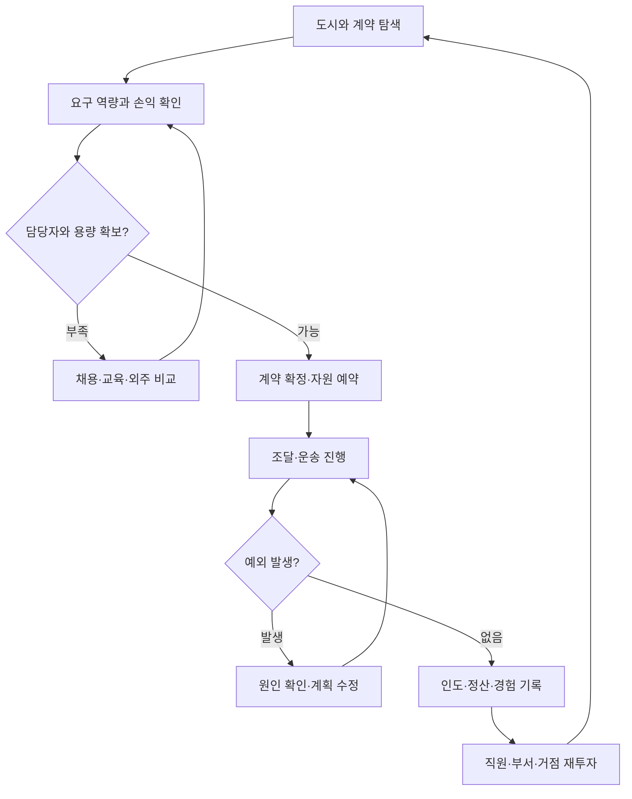

# Scitrade 플레이 영상 자막·공식 화면 비교 연구

2026-10-05 · 확장판 v2.0 · 플레이어·개발자·그래픽디자이너 관점

**게임별 플레이·공략 영상 5편씩 총 25편과 보충 리뷰 1편의 시간표시 자동자막에서 134개 구간을 분석했다. 그래픽·UI는 공식 정지 이미지 17장을 별도로 직접 확인했다.** 실제 영상 프레임과 음성을 재생 확인한 분석은 아니다. 긴 영상은 선정 구간의 자막을 읽었으며 원본 길이를 시청 시간으로 계산하지 않았다.

이 자료의 목적은 Scitrade에서 무엇을 만들고 어떻게 검증할지 구체화하는 것이다. 원작의 소스 코드, 최신판 전체 규칙, 실제 경영·학습 효과를 검증한 연구가 아니다. 관찰, 비교 해석, 신규 설계 제안을 구분한다.

## 1. 조사 범위와 읽는 순서

| 게임 | 플레이·공략 | 보충 리뷰 | 채널 / 제작자 | 분석 구간 | 공식 이미지 |
|---|---:|---:|---|---:|---:|
| 대항해시대 4 HD | 5 | 0 | 4 / 4 | 28 | 3 |
| The Guild 3 | 5 | 0 | 5 / 4 | 25 | 2 |
| Software Inc. | 5 | 0 | 4 / 4 | 25 | 6 |
| Two Point Hospital | 5 | 0 | 4 / 4 | 25 | 4 |
| 게임개발 스토리 | 5 | 1 | 6 / 6 | 31 | 2 |

길드 3의 Nivarias와 Nivarias Longplay는 같은 제작자다. 대항해시대·Software Inc.의 연속 에피소드와 Two Point Hospital의 같은 제작자 공략도 독립 실험이 아니다. 게임개발 스토리는 실황 3편·공략 2편을 본 표본으로 하고, 시연을 표방한 리뷰 1편을 보충 자료로 분리했다.

핵심 판단은 2–5절, 구현 흐름과 순서는 6–7절, 영상별 근거는 부록 A, 실제 정지 화면 관찰은 부록 B에서 확인한다. ZIP의 README는 코드 세션 인계 순서와 JSON 필드를 설명한다.

## 2. 세 관점으로 비교한 핵심

| 게임 | 플레이어 관점 | 개발자 관점 — Scitrade 제안 | 그래픽 관점 — 공식 정지 화면 기반 제안 |
|---|---|---|---|
| 대항해시대 4 | 방문·교역·동료 영입이 서로 다음 목표를 만든다. 사건이 너무 잦으면 교역 흐름은 끊긴다. | 도시 시설은 같은 계약·채용 명령의 다른 입구. 전문 자격과 위임 조건, 자금·용량 검사 연결. | 도시 풍경과 결산표를 분리하고 공통 자금·날짜를 유지. 작은 배치 캐릭터는 큰 상세 카드로 보완. |
| 길드 3 | 직원이 반복 생산·운반을 맡으면 플레이어가 사교와 확장에 시간을 쓴다. 자동화 결과를 이해하지 못하면 불만이 생긴다. | 원료→작업→보관→운송의 의존성과 중단 원인을 기록. 내부 이동과 외부 매출 구분. | 도시와 관리창의 맥락을 유지하되 긴 툴팁이 목록을 덮지 않게 상세 영역 확보. |
| Software Inc. | 강한 개인보다 현재 부족한 전문성을 채우는 직원이 필요하다. 회사 성장에 따라 선호 특성이 바뀐다. | 자격·주/보조 직무·가용 시간·팀 관계를 분리. 팀장 위임은 검증된 수동 명령 위에 추가. | 감상용 직원 카드와 운영 비교표를 함께 제공. 관계·만족·경력은 상세 단계에서 공개. |
| Two Point Hospital | 교육·휴식으로 생기는 공백을 고려해 인력을 준비한다. 증원만으로 모든 병목은 풀리지 않는다. | 교육생과 강사의 시간을 예약. 업무 자격과 허용 업무를 검사하고 단계별 대기열을 표시. | 둥근 실루엣·업무 소품·공간 기능을 이용해 직무를 전달. 교육·휴식·문제 상태에 이름과 아이콘 병기. |
| 게임개발 스토리 | 직원 영입·성장·외주·사업 확장이 같은 예산을 두고 경쟁한다. 육성한 동료가 교체 인재보다 비싸질 수 있다. | 경력·자격·성장 효과·급여를 분리. 프로젝트 단계별 배정과 장기 투자 기회비용 검사. | 귀여운 직원 작업 장면에 고정 경영 수치를 결합. 성장 버튼에는 비용·효과·급여 변화 미리보기. |

**수집 화면의 직원 카드, 부서의 운영표, 계약의 담당자 배치가 같은 직원을 가리키게 하는 것이 공통 설계 축이다.** 카드의 멋진 외형과 수치가 실제 업무의 자격·기여·비용·관계로 이어져야 한다. 반대로 경영 화면에서는 캐릭터 장식 때문에 중요한 비교 수치가 가려지지 않아야 한다.

## 3. 여러 영상을 비교하며 달라진 결론

### 동료 수집과 사건은 재미이지만, 흐름을 끊을 수도 있다

대항해시대에서는 새 동료와 지역 단서가 이동을 이끈다. 그러나 밀덕형 2화 19:29–20:21에서는 교역 중 잦은 사건을 불편해한다. Scitrade의 문화·신수 영입 사건은 긴급도와 보류 가능 여부를 나누고, 기존 거래 초안을 보존하는 편이 좋다. 이벤트 수를 많이 만드는 것 자체를 재미의 근거로 삼지 않는다. 근거: DK4-F02.

### 육성은 항상 신규 채용보다 유리하지 않다

DDRJake는 1:29:39–1:30:47에 훈련 대신 레벨업을 선택해 급여가 오른 일을 후회하고, 3:24:36–3:27:02에는 기존 직원의 경력 육성이 신규 인재보다 비싸졌다고 평가한다. 성장 버튼을 명확히 나누고, 육성·영입을 같은 기간의 비용과 얻는 자격으로 비교해야 한다. 장기 동료의 지역 경험·관계는 별도의 가치가 될 수 있으나, 이것이 재미를 보장한다는 증거는 아직 없다. 근거: GDS-V03-O03/O05.

### 최적 팀은 사업과 시나리오에 따라 바뀐다

Pinstar는 진단 간호사를 쓰지 않는 시설 구성을 설명하지만, Power Plays는 구급차 DLC에서 이전에 덜 선호하던 진단 기술이 중요해졌다고 말한다. Software Inc.에서도 단일 작업 특성과 스트레스 특성의 선호가 성장 단계·플레이어·모드에 따라 다르다. Scitrade의 속성·팀 시너지는 언제나 통하는 정답 조합보다 계약 유형에 따른 선택으로 검증할 필요가 있다. 근거: TPH-F03, SW-F02/F04.

### 자동화에는 설명이 필요하다

길드 3의 튜토리얼은 자동 생산을 소개하지만 장시간 플레이에는 과잉 채집·수익 저하에 대한 불만이 나온다. Software Inc.에서는 위임 설정 뒤 잘못 시작한 프로젝트를 취소한다. 설정 오류인지 원작 버그인지는 확인하지 못했다. Scitrade에서는 실행 예상, 예산, 담당자, 중단 이유, 결과 기록을 위임 기능과 함께 만들어야 한다. 근거: G3-F02, SW-V01-O03.

### 성장 보너스와 경제 규칙을 따로 검증하면 안 된다

Spiffing Brit의 편집된 악용 플레이는 흥정 보너스와 이동 부담이 작은 매매를 결합한다. 최신판에서 재현했거나 수익률을 측정한 결과는 아니다. 이 사례는 Scitrade의 성장·장비·시너지가 실제 재고·시간·용량 제약을 우회하는지 점검할 이유가 된다. 영상의 과장된 무한 수익 표현이나 수치를 그대로 사용하지 않는다. 근거: G3-V05-O04/O05.

## 4. 개발자 관점: 데이터와 상태를 먼저 연결하기

| 구분할 데이터 | 이유 | 구현 시 확인할 것 |
|---|---|---|
| 캐릭터 정의 / 실제 고용 직원 | 도감 발견, 외형 원안, 회사 소속은 다름 | 발견만으로 급여·업무 인원이 생기지 않음 |
| 능력 / 자격 / 가용 시간 | 능력이 높아도 자격이 없거나 교육 중이면 배정 불가 | 배치 불가 이유를 자격 부족·시간 충돌 등으로 표시 |
| 부서 소속 / 프로젝트 배정 | 영업팀 소속 직원도 특정 계약의 기간에 예약됨 | 같은 직원을 겹치는 계약의 여유 인력으로 중복 계산하지 않음 |
| 거래 초안 / 확정 예약 / 실제 결과 | 견적과 실행 사이 시세·자금·재고가 바뀔 수 있음 | 확정 시 재검사, 부분 예약 실패 시 전체 철회 |
| 인도 / 채권 / 수금 | 물건 전달과 현금 유입의 시점이 다를 수 있음 | 대금 상태가 저장·불러오기 뒤에도 유지됨 |
| 직원 상태 / 화면 표현 | 카드·본사 장면·비교표가 동일 상태를 보여야 함 | 연출 종료가 보상 지급의 근거가 되지 않음 |

기존 직원 ID·여섯 능력치·성장 규칙·시너지 적용 범위를 유지하는 방향의 제안이다. 다음 코드 세션에서 최신 저장소 지침과 실제 구현을 먼저 대조한다. 새 능력치나 경제 계수를 이 문서만으로 추가하지 않는다.

## 5. 그래픽디자이너 관점: 무엇을 같은 언어로 보여줄 것인가

| 화면 | 주인공이 되는 정보 | 필요한 시각 자산 | 근거 |
|---|---|---|---|
| 세계 지도·항로 | 거점, 운송 경로, 납기 위험, 다음 행동 | 거점 표지·경로 패턴·위험/선택 아이콘 | SOFTWARE-IMG06의 연결 표현을 참고한 신규 제안 |
| 도시 | 지역 분위기, 시설 접근, 문화 활동과 거래 기회 | 도시 배경·시설 표지·지역별 행사 요소 | DK4-IMG01 |
| 본사·부서 | 실제 업무, 교육·휴식, 빈자리와 병목 | 정해진 방 배경·직무 소품·상태 포즈 | DK4-IMG03, TPH-IMG03/06 |
| 직원 도감·카드 | 개성과 애착, 경력, 주요 강점 | 전신·초상·표정·속성 문양 | SOFTWARE-IMG05, GDS-IMG02 |
| 채용·배치 비교표 | 급여, 자격, 가용 여부, 업무 적합성 | 작은 초상·직무 배지·상태 라벨 | SOFTWARE-IMG04, GDS-IMG02 |
| 거래·성장 확인창 | 비용, 기간, 현재/완료 후 변화 | 정렬된 수치 영역·예상값 표식·확정/취소 | DK4-IMG02 |

종족은 귀·뿔·꼬리와 체형의 실루엣, 속성은 문양과 이름, 직무는 도구와 배지, 지역 숙련은 경력으로 표현한다. 희귀도 테두리 색 하나에 직무·속성·상태까지 동시에 담지 않는다. 문화 경험은 언어·현지 정보·관계 변화로 표현하고 출신 국가를 선천적인 직무 우열로 고정하지 않는 방향을 제안한다.

아트 방향 초안은 부드러운 형태의 동물·신수와 읽기 쉬운 경영 패널이다. 2–3등신, 제한된 명암, 고정 방 슬롯은 검토 후보이며 기존 확정 아트 사양으로 간주하지 않는다. 첫 검증에서는 정지 포즈로도 충분하다. 실제 목표 화면 크기에서 초상과 수치 가독성을 확인한 뒤 애니메이션·자유 건축을 확장한다.

직원 한 명의 제작 범위는 전신, 크기별 초상, 표정, 대표 업무·교육·휴식 표현, 소품 레이어, 성장 표현, 기준점·안전 영역, 공통 배지 참조로 나눈다. 캐릭터 이미지에 카드 프레임과 경영 수치를 구워 넣지 않는다. 원작 이미지는 제품 자산으로 사용하지 않는다.

## 6. Scitrade에서 검증할 플레이 흐름

아래는 이 분석에서 도출한 후보 흐름이다. 기존 시간 진행 방식과 단계별 개발 계획을 대체하지 않는다.

이 흐름에서 플레이어는 같은 비용으로 새 직원을 영입할지, 기존 동료를 교육할지, 이번 계약만 외주로 해결할지 비교한다. 개발자는 시간 예약과 자금 흐름을 보장하고, 디자이너는 빈자리·기대 효과·포기 비용을 한 화면에서 읽게 한다.

## 7. 단계별 구현과 완료 기준

| 순서 | 우선 구현 | 다음 단계로 넘어갈 기준 |
|---|---|---|
| 기존 M1과 연결 | 최소 화면으로 계약 한 건의 수주·조달·운송·인도·정산, 취소·지연 분기 | 확정 재전송에도 중복 결제·재고 감소 없음. 운송 중 저장 후 결과 동일 |
| 기존 M2와 연결 | 직원 카드/표, 채용, 부서, 자격, 교육·성장, 프로젝트 편성 | 교육과 실무 중복 불가. 카드와 표의 값 일치. 성장 전 비용·급여·효과 확인 |
| 위임 추가 | 반복 업무와 조건부 자동화, 실행 예상·예외 기록 | 수동과 자동이 같은 검사 사용. 부족 자원별 사유가 정확하고 규칙 수정 시 중복 실행 없음 |
| 후속 확장 | 복수 거점·계약, 문화 사건, 현실 정책·과학 이벤트, 기존 계획의 투자·상장 | 관련 연구·교육과정 근거와 게임 가정을 구분. 복수 계약의 자원 경합을 검증 |

이 표는 앞으로 수행할 검증 명세다. 실제 프로그램을 구현하거나 위 테스트를 통과한 보고가 아니다. 주식 투자 P1·자사 상장 P2 등 기존 확장 순서는 이 참고 조사만으로 앞당기지 않는다.

### 코드 세션용 제안 목록

| ID | 항목 | 단계 | 완료 조건 |
|---|---|---|---|
| REF-01 | 직원 상태의 단일 원본 | M1–M2 연결 | 카드·부서표·계약팀 화면에 같은 상태가 표시되고 복수 역할이 가용 인원을 중복 증가시키지 않는다. |
| REF-02 | 계약 확정 전 검사 | M1 | 겹치는 두 수주가 같은 직원·현금·재고를 동시에 소비하지 않는다. |
| REF-03 | 거래 원인과 장부 | M1 | 부서 사이 재고 이동만으로 회사 전체 외부 매출이 증가하지 않는다. |
| REF-04 | 비용과 결과 미리보기 | M1–M2 | 성장·투자·배치 확정 전에 일회 비용·지속 비용·업무 공백을 찾을 수 있다. |
| REF-05 | 수집 카드와 운영 비교표 | M2 | 수집 화면에서 고른 직원이 운영표에서도 같은 필터와 상태로 연결된다. |
| REF-06 | 교육과 업무의 시간 충돌 | M2 | 교육 중인 직원은 겹치는 업무에 투입되지 않고 교육 취소를 반복해도 환급이 중복되지 않는다. |
| REF-07 | 육성과 채용 비교 | M2 | 신규 영입과 기존 육성을 같은 기간의 비용·업무 자격으로 비교할 수 있다. |
| REF-08 | 성장·시너지 범위 검사 | 기존 성장 시스템 단계 | 허용된 실제 팀 조합으로 반복 거래·재배치·불러오기를 실행해 중복 보상이나 용량 초과가 없는지 검사한다. |
| REF-09 | 자동화 규칙과 중단 이유 | 반복 업무 위임 단계 | 부재·재고 부족·창고 포화가 서로 다른 사유로 표시되고 규칙 수정이 운송을 복제하지 않는다. |
| REF-10 | 공급망 병목 표시 | 복수 계약 확장 단계 | 인원을 늘려도 다음 단계가 막히는 사례에서 실제 중단 사유와 표시가 일치한다. |
| REF-11 | 사건 보류와 문화 활동 | 도시·문화 이벤트 단계 | 거래 초안을 잃지 않고 문화 활동 후 어떤 지식·관계가 바뀌었는지 확인한다. |
| REF-12 | 시각적 의미 분리 | 화면 공통 규칙 | 색상 없이도 직무·근무 상태를 구분하고 희귀도·경고색을 혼동하지 않는다. |
| REF-13 | 연출과 계산 분리 | M1부터 유지 | 연출을 끄거나 화면을 바꾸고 저장·불러와도 같은 경제 결과를 얻는다. |
| REF-14 | 투자와 본업의 자금 연결 | 기존 주식 P1·상장 P2 유지 | 본업 준비 자금이 부족해지는 투자는 확정 전에 설명한다. 투자의 수익률 계수는 영상에서 가져오지 않는다. |

## 8. 실제 연구·교육과정과 연결할 때의 경계

플레이 영상은 사람들이 어디서 선택하고 혼란을 겪는지 찾아내는 설계 참고 자료다. 인력 교육의 생산성 효과, 문화 이해의 거래 성과, 기후 위험의 운송 지연 계수를 추정한 논문 자료는 아니다. 영상에서 얻은 수치는 실증 계수로 등록하지 않았다.

| 모델 후보 | 이번 조사에서 얻은 질문 | 별도로 필요한 근거 |
|---|---|---|
| 인력 교육·경력 | 교육생·강사 부재와 장기 비용을 어떻게 보여줄까? | 대상 직무·표본·기간·불확실성이 확인된 생산성/훈련 연구 |
| 문화 이해·신뢰 | 현지 지식·개인 친밀도·회사 거래 신뢰를 어떻게 구분할까? | 문화·정보 장벽·거래 관계 연구와 실제 행사·지역 자료 |
| 기후·물류 | 계약의 어느 단계에 위험을 표시할까? | 관측 기후·운송·항만 자료와 시나리오 가정 |
| 정책·통상·과학기술 | 제도·기술 변화가 어떤 자격·비용·선택을 바꿀까? | 적용 지역·시점이 명확한 공식 정책과 검증 가능한 과학 자료 |
| 2022 교육과정 | 사건 선택이 어떤 개념을 활용하게 할까? | 기존 과목·내용 요소·성취기준의 공식 원문 대조, 별도의 학습 효과 검증 |

데이터에는 출처 URL·발행 시점·지역/표본·단위·측정/추정 구분·불확실성·게임값 변환·규칙 버전을 함께 기록한다. 현실 자료와 게임 재미를 위한 조정값은 다른 필드로 둔다.

## 부록 A. 영상별 분석 기록

시간 링크는 확인한 자동자막 구간의 시작점으로 연결한다. “관찰”은 진행자가 말한 행동·해설을 요약한 표현이며 화면 직접 관찰이 아니다. 원본 영상 길이와 검토 범위는 따로 적었다.

### 대항해시대 4 HD

여러 영상 비교:

- **DK4-F01** 전문 동료의 배치가 자동 이동과 신규 업무 접근을 매개한다. 한계: 진행자의 튜토리얼 낭독·조작 결과 보고에 근거하며 빌드별 수치를 검증하지 않았다.

- **DK4-F02** 동료와 사건은 이동 동기지만 반복 교역을 끊는 부담도 발생한다. 한계: 서로 다른 진행자의 선호이며 이벤트 최적 빈도를 계산한 결과는 아니다.

- **DK4-F03** 작은 능력 숫자만으로 직무 조건·상품 등급·투자 결과를 판단하기 어려운 사례가 반복된다. 한계: 영상 화면을 보지 않아 특정 서체·배치가 원인이라고 단정하지 않는다.

- **DK4-F04** 선박 확대·거점 투자·인재 확보가 같은 현금을 두고 경쟁하며 반복 교역 시세도 달라진다. 한계: 가격 형성 공식이나 최적 투자 비율을 추정하지 않았다.

- **DK4-F05** 선호 동료 유지와 위임에 따른 핵심 인력 이탈은 능력 최댓값만으로 설명하기 어려운 선택이다. 한계: 표본 발화의 해석이며 모든 플레이어의 성향을 대표하지 않는다.

#### DK4-V01 · 밀덕형

[대항해시대4 HD리마스터 해보기(닌텐도스위치) -1화-](https://www.youtube.com/watch?v=7SwS3OAFOLw) · 원본 51:24 · 플레이 실황 자막

검토 범위: 자동 생성 자막 전체 검토. 한국어 영상의 영어 제공 자막으로 번역·인식 오류 가능.

| 자막 구간 | 발화·행동 보고의 요약 | Scitrade 제안 |
|---|---|---|
| [04:48–06:19](https://www.youtube.com/watch?v=7SwS3OAFOLw&t=288) | 교역소·술집에서 구매와 선원 모집을 설명하고, 목적별 자동배치를 선택한다고 말한다. | 도시 시설을 계약·채용·출항 준비의 행동 공간으로 연결한다. |
| [07:26–08:42](https://www.youtube.com/watch?v=7SwS3OAFOLw&t=446) | 매입가를 찾지 못해 이익 판단을 여러 번 되짚는다. | 매입 원가·운송비·예상 이익을 같은 거래 화면에서 비교한다. |
| [08:54–10:38](https://www.youtube.com/watch?v=7SwS3OAFOLw&t=534) | 측량사와 장비를 통한 자동이동을 설명한다. | 직원 성장으로 반복 업무의 위임 범위를 넓힌다. |
| [10:54–12:06](https://www.youtube.com/watch?v=7SwS3OAFOLw&t=654) | 효율적인 교역보다 동료 수집과 이야기를 우선하겠다고 말한다. | 여행 보상에 수익·현지 정보·동료 영입·문화 경험을 함께 둔다. |
| [25:51–27:20](https://www.youtube.com/watch?v=7SwS3OAFOLw&t=1551) | 새 동료의 정보 해설 기능과 능력치를 살피며 배치를 검토한다. | 영입 직후 새 정보나 업무 선택지를 체험하게 한다. |
| [44:40–46:54](https://www.youtube.com/watch?v=7SwS3OAFOLw&t=2680) | 모집 조작 실수 뒤 자금 부족으로 계약하지 못해 귀항 판매한다고 말한다. | 확정 전에 비용·거래 후 잔액·필수 운영비를 보여준다. |

#### DK4-V02 · 함크TV

[[대항해시대4 PK HD(리마스터)] 호드람 일대기 #1](https://www.youtube.com/watch?v=hA_dNUMdnBE) · 원본 52:30 · 플레이 실황 자막

검토 범위: 제공된 자막 전체 독해. 프레임·음성은 확인하지 않음.

맥락·한계: 초보 진행자의 조작과 추측을 구분한다. 자동자막의 선박명·수치는 사양으로 사용하지 않는다.

| 자막 구간 | 발화·행동 보고의 요약 | Scitrade 제안 |
|---|---|---|
| [09:15–10:22](https://www.youtube.com/watch?v=hA_dNUMdnBE&t=555) | 선박을 개조해 화물칸을 늘리고 무역 물량을 확보하려 한다. | 회사의 운송 용량 증설은 적재 공간·고정비·필요 인력을 함께 비교하게 한다. |
| [12:18–13:27](https://www.youtube.com/watch?v=hA_dNUMdnBE&t=738) | 술집에서 선원을 모집하며 짧은 항로에서는 최소한의 인원과 보급으로 운영하려 한다. | 인력 규모를 성공 확률 보너스 하나로 처리하지 않고 운항·급여·보급 수요와 연결한다. |
| [14:30–16:42](https://www.youtube.com/watch?v=hA_dNUMdnBE&t=870) | 방향 조작·바람·항구 위치에 혼란을 겪으며 이동 목표를 바꾼다. | 물류 경로의 제약과 도착 전망을 먼저 보여주고, 반복 이동의 직접 조작 부담을 검증한다. |
| [30:25–30:39](https://www.youtube.com/watch?v=hA_dNUMdnBE&t=1825) | 새 인재를 찾을 도시의 단서를 받고 앞으로의 방문 경로를 고민한다. | 직원 영입 단서는 문화 탐방과 신규 거점 진출의 동기가 될 수 있다. |
| [40:10–41:32](https://www.youtube.com/watch?v=hA_dNUMdnBE&t=2410) | 무역 규모가 작은데 선박을 다섯 척 보유할 필요가 있는지 질문하고 정박·매각과 선원 재배치를 검토한다. | 수집한 자산을 모두 가동할 필요는 없게 하되 휴업·매각·재배치의 비용을 비교한다. |
| [41:42–42:26](https://www.youtube.com/watch?v=hA_dNUMdnBE&t=2502) | 새 동료에게 일을 맡기려 하지만 표시된 수치가 현재 능력 보너스인지 직무에 필요한 조건인지 헷갈려 한다. | 현재 능력·필요 자격·배치 후 변화량을 서로 다른 이름과 열로 표시한다. |

#### DK4-V03 · おついちTube

[#1【いざ大海原へ】おついちの「大航海時代IV 」【2BRO.】](https://www.youtube.com/watch?v=NM7kSHMeQT4) · 원본 4:22:18 · 플레이 실황 자막

검토 범위: 자막 전체에서 교역·계약·동료·배치·항로·자동 이동·보급·투자 관련 단어를 검색하고, 선정한 여섯 구간과 인접 문맥을 읽어 분석했다. 영상 프레임과 오디오는 확인하지 않았다.

맥락·한계: 진행자는 초반에 대항해시대 2를 과거에 플레이했지만 4는 처음 시작한다고 설명한다. 따라서 조작 혼란과 가격 해석은 숙련자의 검증된 공략이 아니라 초보자의 학습 과정으로 다룬다.

| 자막 구간 | 발화·행동 보고의 요약 | Scitrade 제안 |
|---|---|---|
| [21:32–28:59](https://www.youtube.com/watch?v=NM7kSHMeQT4&t=1292) | 21:32부터 읽는 튜토리얼은 선장·조범수·조타수·부관·측량사 등 직무마다 서로 다른 기능이 있다고 설명하고, 진행자는 소수의 동료를 어느 자리에 둘지 여러 번 바꾸면서 측량 담당자가 없다는 점을 알아차린다. 26:45 이후에는 일반 선원을 모집·배치하며, 인원을 늘리면 보급 소모 때문에 항해 가능 일수가 줄어든다는 안내를 듣고 모든 지원자를 배치하지는 않는다. | 직원 카드에는 능력치뿐 아니라 담당 가능한 업무와 그 업무가 해금하는 기능을 표시한다. 고유 동료를 통한 전문 직무와 일반 인력을 통한 처리량을 구분하고, 채용 확인창에 급여·유지비·운영 가능 기간의 변화를 함께 보여준다. |
| [39:56–41:25](https://www.youtube.com/watch?v=NM7kSHMeQT4&t=2396) | 39:56부터 읽는 설명에서는 인접 도시와의 계약으로 항로가 연결되고, 선장과 측량 담당자가 있으면 연결된 항로에서 자동 이동을 쓸 수 있다고 안내한다. 측량 담당자가 없는 현재 상황을 해결하기 위해 도구를 사서 동료에게 장비하라는 제안이 이어지며, 진행자는 자동 이동을 확보해야 할 당장의 목표로 받아들인다. | 자동 물류 운용에는 확보한 노선과 담당 직원이라는 두 조건을 제시한다. 부족한 자격을 새 직원 채용, 기존 직원 교육, 업무 도구 지원 중 어떤 방식으로 충족할지 선택할 수 있게 설계하되, 초반 핵심 기능의 해금까지 지나치게 오래 반복 조작을 강요하지 않는다. |
| [1:00:31–1:05:35](https://www.youtube.com/watch?v=NM7kSHMeQT4&t=3631) | 1:00:31부터 진행자는 보유 도구의 장비와 측량 담당 배치를 시도한 다음 자동 이동 목적지를 선택하며, 한동안 도달 가능한 도시와 클릭 위치를 혼동한다. 이후 목적지 선택이 되었다고 말하고, 1:05:30에는 자동 항해를 쓰자 이동이 한결 편해졌다고 평가한다. | 반복 업무의 위임은 직원 성장의 체감 보상으로 연결할 수 있다. 자동화가 실행되지 않을 때는 미충족 자격·노선 미연결·목적지 선택 문제를 구별해 알려주고, 선택 가능한 목적지와 실행 결과를 즉시 확인하게 한다. |
| [1:58:03–2:03:34](https://www.youtube.com/watch?v=NM7kSHMeQT4&t=7083) | 1:58:03부터 새 인물을 동료로 받아들이는 대화가 이어지며, 새 동료는 기존 지역의 높은 계약·투자 비용과 성장 여지의 제약을 설명하고 다른 지역 진출을 권한다. 진행자는 이 설명을 현재의 자금 문제와 연결한 뒤 신규 동료의 능력과 기존 동료의 레벨·장비 효과를 비교하며 배치를 다시 검토한다. | 신규 동료는 능력치 상승 외에 시장 정보, 현지 인맥, 새 계약의 단서를 제공하게 한다. 다만 대항해시대의 지역 발전 서사를 현대 국가의 고정된 우열로 옮기지 않고, 상품별 수요·기업 경쟁·물류 접근성 등 시나리오 조건으로 시장 진출 판단을 구성한다. |
| [3:12:27–3:24:43](https://www.youtube.com/watch?v=NM7kSHMeQT4&t=11547) | 3:12:27부터 진행자는 보유 화물과 도시별 시세를 대조하며, 품목 분류와 가격 지수의 뜻을 확인하고 매입지와 판매지를 정하는 방법을 스스로 정리한다. 이후 특정 도시 사이의 거래를 시험해 이익이 났다고 보고하고, 반복 거래 후 시세 변화와 돌아오는 길에 팔 화물까지 확인하려 하며, 수요가 차면 가격이 하락할 것이라는 말은 이 시점에서 진행자의 가설이다. | 시세 지수만 제시하지 말고 실제 매입 원가·예상 판매액·운송비·왕복 소요일을 한 화면에서 비교하게 한다. 시험 거래의 예상과 결과를 나란히 기록하면 플레이어가 수요 변화와 왕복 노선의 수익성을 학습할 수 있으며, 원작 자막으로 확인하지 못한 가격 공식은 별도 모델로 명시한다. |
| [3:51:12–3:58:15](https://www.youtube.com/watch?v=NM7kSHMeQT4&t=13872) | 3:51:12부터 선박 관리에 관심이 많은 인물을 동료로 영입하는 대화를 읽은 뒤, 담당실과 전문 인력의 조합이 장거리 항해에 어떤 도움을 주는지 설명을 듣는다. 진행자는 이후 선실 개조와 배치를 검토하며 목재실·조리실에 담당자를 둘 생각을 말하고, 인력과 자금이 한정된 상황에서 다른 보직과의 우선순위를 고민한다. | 부서 시설을 짓는 것과 적임자를 배치하는 것을 함께 요구하면 직원 수집과 회사 확장이 연결된다. 예를 들어 법무팀 공간만으로 모든 통관 문제가 해결되지 않고, 관련 전문성을 가진 직원과 업무 도구가 갖춰져야 해당 계약을 처리하도록 구성한다. |

#### DK4-V04 · 옥냥이 RoofTopCAT

[[대항해시대4] 세계 7대양을 제패하는 무역 상단이 되어보자!](https://www.youtube.com/watch?v=7tZ7qNukwKo) · 원본 11:52:58 · 플레이 실황 자막

검토 범위: 내보낸 자막을 키워드 탐색하고 아래 구간의 인접 문맥을 독해. 전편 시청이나 전체 자막 정독 아님.

맥락·한계: 원본 길이 11:52:58이나 자막은 7:33:17에서 잘림. 이후 내용은 분석하지 않았다. 선택 구간 모두 잘림 이전이다.

| 자막 구간 | 발화·행동 보고의 요약 | Scitrade 제안 |
|---|---|---|
| [13:40–14:53](https://www.youtube.com/watch?v=7tZ7qNukwKo&t=820) | 상품 등급 숫자의 방향을 혼동하고, 투자 확정 전 점유율이 얼마나 늘어나는지 알기 어렵다고 말한다. | 등급에는 의미 라벨을 붙이고 투자 확인창에서 예상 변화와 불확실성을 구분해 보여준다. |
| [36:42–37:09](https://www.youtube.com/watch?v=7tZ7qNukwKo&t=2202) | 도시에 투자할 시점이 고민되지만 우선 선박부터 갖추고 초기 점유율은 작게 유지하기로 한다. | 거점 투자와 운송 능력 증설이 경쟁하는 자본 배분을 비용·매출 전망으로 비교한다. |
| [2:48:39–2:49:20](https://www.youtube.com/watch?v=7tZ7qNukwKo&t=10119) | 반복 거래 중 일괄 매각은 있는데 일괄 매입은 왜 없는지 질문한다. | 반복 주문 템플릿을 제공하되 일괄 실행 전 총액·재고·적재량을 다시 검증한다. |
| [6:17:31–6:21:55](https://www.youtube.com/watch?v=7tZ7qNukwKo&t=22651) | 월이 바뀌는 시점에 재고를 노려 거래하고, 나중에 가격이 떨어지자 유행이 지났기 때문이라고 해석한다. | 시세와 이벤트 효과에 관측 시각·만료 여부를 표시한다. 진행자의 해석을 검증된 가격 공식으로 사용하지 않는다. |
| [6:28:36–6:29:44](https://www.youtube.com/watch?v=7tZ7qNukwKo&t=23316) | 지방 함대를 편성하면서 핵심 동료가 본대에서 빠지는 점을 걱정하고, 해역 위임 뒤 알아서 교역하는지 묻는다. | 부서장 위임에는 본대의 업무 공백과 위임 범위를 미리 보여주고 실행 기록을 제공한다. 이 구간만으로 자동 교역 성공을 확정하지 않는다. |

#### DK4-V05 · 밀덕형

[대항해시대4 HD리마스터 해보기(닌텐도스위치) -2화-](https://www.youtube.com/watch?v=56IwBEKHtoA) · 원본 58:53 · 플레이 실황 자막

검토 범위: 초반부터 약 33분, 49–52분 및 55–58분 구간의 제공 자막 독해. 전편 재생 아님.

맥락·한계: 한국어 영상에 영어 제공 자막이므로 번역·인식 오류 가능. 명확한 선택과 발화를 중심으로 요약.

| 자막 구간 | 발화·행동 보고의 요약 | Scitrade 제안 |
|---|---|---|
| [02:52–03:18](https://www.youtube.com/watch?v=56IwBEKHtoA&t=172) | 유적과 신뢰에 관련된 대화를 따라가며 지역 탐색을 진행한다. | 문화 활동이 지역 정보·개인 관계·회사 거래 신뢰 중 무엇을 바꾸는지 구분해서 보여준다. |
| [19:29–20:21](https://www.youtube.com/watch?v=56IwBEKHtoA&t=1169) | 교역하려는 중 사건이 연이어 나오자 왜 이벤트가 이렇게 많은지 불평하면서도 목적지 단서를 따른다. | 서사 이벤트는 수집·탐방의 동기가 되지만 거래 흐름을 자주 끊을 수 있다. 긴급도가 낮은 사건에는 보류와 기록 기능을 검토한다. |
| [31:48–32:26](https://www.youtube.com/watch?v=56IwBEKHtoA&t=1908) | 장비의 수혜가 큰 인물을 확인한 뒤에도 능력이 더 낮은 선호 동료를 믿고 장비를 준다. | 좋아하는 동료를 계속 쓰는 선택이 성립하도록 경험·직무 변경·도구 지원을 제공하고 교체와 육성을 함께 비교한다. |
| [49:48–51:46](https://www.youtube.com/watch?v=56IwBEKHtoA&t=2988) | 반복 구매 품목의 가격이 올라 기다리면 나아질지 시험하지만 가격이 더 올랐다고 말한다. | 한 번 발견한 경로를 영구적인 고정 이익으로 표시하지 않는다. 현재 시세와 과거 거래 결과를 나란히 보여준다. |
| [57:25–58:44](https://www.youtube.com/watch?v=56IwBEKHtoA&t=3445) | 선박 개량에 현금을 전부 쓰지 않고 일부는 점유율 투자에 남기기로 한다. | 설비 투자 확인창에 운영비·다음 계약 자금·남는 현금을 표시해 투자 후 자금 부족을 예상하게 한다. |

### The Guild 3

여러 영상 비교:

- **G3-F01** 인력을 더 고용하는 것보다 생산·조달·운송의 빈 역할을 채우는 것이 초기 확장의 핵심이다. 한계: 서로 다른 시기·직종의 사례이며 보편적 최적 인원 수는 도출하지 않았다.

- **G3-F02** 운송 자동화는 반복 조작을 줄이지만 생산 자동화의 결과를 플레이어가 항상 신뢰하지는 않는다. 한계: 튜토리얼의 낙관적 설명과 장시간 플레이의 불만이 다르다. 후자의 이상 동작은 설정 오류인지 게임 버그인지 확인되지 않았다.

- **G3-F03** 직원 투자는 시설 슬롯·급여·시간 확보·개인 성장이라는 여러 층의 선택을 만든다. 한계: 급여액과 레벨 효과를 Scitrade의 현실 근거 계수로 복제하지 않는다.

- **G3-F04** 정상 교역과 과도한 흥정 중첩을 비교하면 캐릭터 성장과 경제 규칙의 결합이 주요 밸런스 위험임을 알 수 있다. 한계: 게임 내부 악용의 설계적 해석이다. 최신 버전에 같은 문제가 남았다는 주장이나 경제학 실증 근거가 아니다.

- **G3-F05** 장부와 평판의 원인이 불명확하면 플레이어가 별도 실험이나 추측으로 규칙을 복원한다. 한계: UI 프레임을 직접 보지 못해 특정 레이아웃이 원인이라고 판단하지 않는다.

#### G3-V01 · StrategyJoe

[The Guild 3 Basic Tutorial Last Version](https://www.youtube.com/watch?v=dzp919i7Y3o) · 원본 36:54 · 플레이·공략 해설 자막

검토 범위: YouTube 영어 자동생성 자막 직접 독해

맥락·한계: 이전 조사에서는 전체 자막을 읽었으며 이번 확장에서는 위 5개 구간을 재검토했다. 영상은 정식 출시 전 튜토리얼이며 제목의 Last Version을 현행 버전 보증으로 해석하지 않는다.

| 자막 구간 | 발화·행동 보고의 요약 | Scitrade 제안 |
|---|---|---|
| [12:36–14:45](https://www.youtube.com/watch?v=dzp919i7Y3o&t=756) | 생산 직원과 운송 직원을 고용하고 수동·목록 반복·자동 생산을 구분한다. 시설 확장으로 고용 한도를 늘린다. | 직무 슬롯, 반복 작업, 시설 수용력을 별도 규칙으로 둔다. |
| [19:00–20:21](https://www.youtube.com/watch?v=dzp919i7Y3o&t=1140) | 채집→사업장 보관→시장 판매의 흐름과 건설·채용·임금·매출 장부를 설명한다. | 초기 투자와 반복 운영비를 구분해 다음 투자를 판단하게 한다. |
| [24:31–26:26](https://www.youtube.com/watch?v=dzp919i7Y3o&t=1471) | 제분업으로 확장한다. 자사 농장 재고가 부족하므로 시장에서 원료를 조달하게 둔다. | 내부 조달 실패 시 외부 구매라는 대안과 비용을 표시한다. |
| [26:29–29:25](https://www.youtube.com/watch?v=dzp919i7Y3o&t=1589) | 이동·운송량을 높이는 말을 구입하고 시장별 가격과 재고를 살펴 직접 거래한다. | 자동 경영 뒤에도 직접 찾는 거래 기회를 남긴다. |
| [31:02–32:53](https://www.youtube.com/watch?v=dzp919i7Y3o&t=1862) | 시민 지위와 공직 신청을 거쳐 접객업을 연다. 행인에게 생산품을 서비스와 함께 판매한다고 설명한다. | 규모 확대 외에 새 사업 방식과 사회적 접근권을 성장 보상으로 둔다. |

#### G3-V02 · Nivarias

[The Guild 3 EXTREME - Fresh Start In Medieval Life Simulator - London HARDMODE Longplay](https://www.youtube.com/watch?v=FHDHmEN5oCA) · 원본 5:54:08 · 플레이 실황 자막

검토 범위: YouTube 영어 자동생성 자막 직접 독해

맥락·한계: 5시간 54분 전체를 시청하지 않았다. 핵심 구간 자막 표본을 읽었다. 장부 수익 귀속과 최저가 선택은 진행자의 추론이 포함되어 내부 알고리즘 사실로 단정하지 않는다.

| 자막 구간 | 발화·행동 보고의 요약 | Scitrade 제안 |
|---|---|---|
| [26:00–28:00](https://www.youtube.com/watch?v=FHDHmEN5oCA&t=1560) | 물을 공급하는 직원과 곡물을 만드는 인물을 나누고 직원 레벨 상승에 능력치를 배분한다. | 직원 성장 효과를 실제 맡은 업무와 연결한다. |
| [47:00–51:00](https://www.youtube.com/watch?v=FHDHmEN5oCA&t=2820) | 반복 운반이 번거롭다고 말한 뒤 운송자를 고용해 두 농장 사이 수동 경로를 만든다. 저빈도 판매는 직접 남긴다. | 반복 빈도가 높고 판단이 적은 업무부터 자동화한다. |
| [55:40–1:00:00](https://www.youtube.com/watch?v=FHDHmEN5oCA&t=3340) | 보유 사업장 한도 때문에 작위를 올린 뒤 추가 농장과 제분소 진출을 검토한다. | 확장 한도를 명확히 표시하고 동일 업종 증설과 가치사슬 확장을 비교하게 한다. |
| [2:16:00–2:21:00](https://www.youtube.com/watch?v=FHDHmEN5oCA&t=8160) | 장부에서 농장 수익이 보이지 않자 임금과 판매 귀속을 의심한다. 전용 운송자를 두고 수익 변화를 확인한다. | 부서 손익과 회사 전체 손익을 연결하며 내부 이동·외부 매출의 귀속을 추적 가능하게 한다. |
| [3:54:00–3:59:00](https://www.youtube.com/watch?v=FHDHmEN5oCA&t=14040) | 선술집 원료의 최소 재고와 판매대를 설정하고 운송자에게 재고 규칙을 따른 조달을 맡긴다. 경로 미지정 상태도 점검한다. | 자동화 목표·실행 상태·중단 사유를 함께 보여 준다. |

#### G3-V03 · Nivarias Longplay

[The Guild 3 - Medieval LIFE BUSINESS SIMULATOR Longplay HARDMODE | Strategy Playthrough](https://www.youtube.com/watch?v=uYioZlbwjmY) · 원본 6:20:52 · 플레이 실황 자막

검토 범위: YouTube 영어 자동생성 자막 직접 독해

맥락·한계: 6시간 20분 전체 시청이 아닌 핵심 자막 표본이다. Nivarias 본채널과 같은 제작자의 다른 플레이이며 독립된 제작자 두 명으로 세지 않는다. 생산 중단 원인 및 수익 비교는 통제실험이 아니다.

| 자막 구간 | 발화·행동 보고의 요약 | Scitrade 제안 |
|---|---|---|
| [08:40–10:20](https://www.youtube.com/watch?v=uYioZlbwjmY&t=520) | 경쟁 이발소를 의식하며 직원과 가족을 배치한다. 고객이 오면 생산을 멈추고 응대한다고 설명한다. | 생산과 고객 응대가 같은 인력을 쓰면 우선순위·기회비용이 드러나게 한다. |
| [35:40–37:20](https://www.youtube.com/watch?v=uYioZlbwjmY&t=2140) | 고용 슬롯을 확장하되 임금 지급 시점 때문에 채용을 다음 날까지 미룬다. | 급여 계산 시점이 시간 조작 이득을 만들지 않는지 점검한다. |
| [1:48:00–1:52:00](https://www.youtube.com/watch?v=uYioZlbwjmY&t=6480) | 운송자를 고용한 뒤 원료 판매를 막고 필수 재고와 잉여 판매를 설정한다. 처리량과 임금을 비교한다. | 매출보다 처리량·재고·임금을 함께 보고 고용의 가치를 판단하게 한다. |
| [2:45:00–2:48:00](https://www.youtube.com/watch?v=uYioZlbwjmY&t=9900) | 원료를 소량 구매해 신제품을 시험한다. 다른 사업장에서는 재고가 가득 차도 채집을 계속한다며 자동 생산에 불만을 보인다. | 작업 큐에 창고 용량·원료 필요량·중단 사유를 명시하고 오류를 재현할 기록을 남긴다. |
| [3:26:00–3:34:00](https://www.youtube.com/watch?v=uYioZlbwjmY&t=12360) | 내부 원료 공급을 확장하고 장부를 점검한다. 자동 생산에서 수동 반복으로 바꾼 뒤 이익이 늘었다고 보고한다. | 자동화와 수동 운영의 성과를 동일 기간·조건으로 비교할 도구를 둔다. |

#### G3-V04 · The Geek Cupboard

[From Rags to Riches - A Farmer's Dynasty is Born! | The Guild 3 - Part 1 (Medieval Life Sim)](https://www.youtube.com/watch?v=umEN1hHLhJc) · 원본 50:53 · 플레이 실황 자막

검토 범위: YouTube 영어 자동생성 자막 직접 독해

맥락·한계: 2019년 얼리 액세스 플레이. 현행 규칙과 수치를 대표하지 않는다. 자막의 인명·품명 오인식 때문에 금액과 고유 명칭을 핵심 관찰에서 제외했다.

| 자막 구간 | 발화·행동 보고의 요약 | Scitrade 제안 |
|---|---|---|
| [24:20–26:00](https://www.youtube.com/watch?v=umEN1hHLhJc&t=1460) | 첫 고용 비용을 확인하고 밀 생산을 지시하지만 물이 없어 작업을 시작하지 못한다. 운반 슬롯도 확인한다. | 고용·지시 전에 선행 자원과 적재 제약을 알려 준다. |
| [29:50–32:40](https://www.youtube.com/watch?v=umEN1hHLhJc&t=1790) | 직접 판매대와 시장 운송을 비교하고 운송자를 고용한다. 적재·하역 수량이 불일치하면 표시가 난다고 설명한다. | 운송 계획을 저장하기 전에 수량과 경로 연결을 검증한다. |
| [37:35–39:30](https://www.youtube.com/watch?v=umEN1hHLhJc&t=2255) | 물 부족이 재발한다. 주인공을 사교 활동에 쓰기 위해 시설을 확장하고 전담 채집자를 추가한다. | 고용의 보상이 생산 증가뿐 아니라 플레이어의 활동 시간 확보가 되게 한다. |
| [43:20–44:30](https://www.youtube.com/watch?v=umEN1hHLhJc&t=2600) | 운송 수입을 확인하는 동안 평판 상승 이벤트를 받지만 자신이 어떻게 일으켰는지 모르겠다고 말한다. | 평판 변화에 원인 행동과 영향 지역을 연결한 기록을 제공한다. |
| [45:35–46:50](https://www.youtube.com/watch?v=umEN1hHLhJc&t=2735) | 운송자와 생산자의 레벨 상승을 반기며 힘을 올리고 주인공은 사교를 위해 매력을 선택한다. | 직원별 이름·성장·역할을 결합해 애착과 전문화 선택을 만든다. |

#### G3-V05 · The Spiffing Brit

[Breaking The Guild 3 With Illegal Trade Deals - Guild 3 Is Perfectly Balanced Game With No Exploits](https://www.youtube.com/watch?v=Lv6OwlAGNiQ) · 원본 24:09 · 편집된 악용 플레이 해설

검토 범위: YouTube 영어 자동생성 자막 직접 독해

맥락·한계: 자동자막 전체 00:00–24:07 독해. 편집된 악용 플레이의 해설이며 정상 플레이의 대표 표본이나 현행 버전 재현 검증은 아니다. 해설의 과장된 무한 수익 표현을 검증된 수치로 사용하지 않았다.

| 자막 구간 | 발화·행동 보고의 요약 | Scitrade 제안 |
|---|---|---|
| [02:01–04:18](https://www.youtube.com/watch?v=Lv6OwlAGNiQ&t=121) | 높은 난도에서 자금이 많은 경쟁 가문에게 동맹을 대가로 돈을 받아 초기 사업 단계를 건너뛴다. 동맹 파기 후 재거래는 거절당한다. | 난도 보너스가 플레이어에게 이전되는 허점과 관계 이력을 점검한다. |
| [04:55–07:23](https://www.youtube.com/watch?v=Lv6OwlAGNiQ&t=295) | 자원 시설 임차권을 확보하고 시설의 AI 운영에서 수입을 얻는 방식을 택한다. | 직접 사업과 투자 수익이 함께 있어도 자금·운영 책임의 차이를 남긴다. |
| [11:03–15:41](https://www.youtube.com/watch?v=Lv6OwlAGNiQ&t=663) | 임차한 시설 직원에게 비생산 행동을 지시하고 임차 종료로 책임을 피하는 방법을 설명한다. | 권한과 행위 책임을 고용 상태와 별도로 기록한다. 실제 법칙을 모델링한 설명은 아니다. |
| [17:58–19:29](https://www.youtube.com/watch?v=Lv6OwlAGNiQ&t=1078) | 같은 항구에서 다른 도시의 거래 메뉴를 전환해 사고팔며 이동 부담이 거의 없는 차익을 반복한다. 재입고 뒤 다시 거래한다. | 지역 간 거래에 실제 운송·재고·체결 시간을 반영하고 반복 매매의 현금 보존을 검증한다. |
| [19:34–20:43](https://www.youtube.com/watch?v=Lv6OwlAGNiQ&t=1174) | 장비로 매력·흥정 보너스를 중첩해 원래 이익이 없던 거래도 흑자로 바뀐다고 설명한다. | 직원·장비·시너지 보너스를 합성할 때 상한과 감소 효과, 매수·매도 가격 역전을 점검한다. |

### Software Inc.

여러 영상 비교:

- **SW-F01** 공통점: 채용 기준은 개인 총점보다 현재 제품·계약의 부족 전문성과 기존 팀에 대한 적합성에서 출발한다. 한계: 영상은 서로 다른 설정·버전이다. 특정 전문성 조합이 언제나 최적이라는 뜻은 아니다.

- **SW-F02** 공통점과 변화: 주·보조 직무는 유휴 시간을 줄이지만, 집중형 특성이나 낮은 숙련도 때문에 무조건 많은 일을 맡기는 운영이 유리하지 않다. Zemalf는 회사 성장 뒤 선호 특성을 바꾼다. 한계: 배율과 품질 영향은 발화이며 해당 빌드의 수치·실험으로 검증하지 않았다.

- **SW-F03** 성장에 따른 관리 전환: 초반에는 한 명씩 선별·배치하고, 커진 회사에서는 팀 설정 복제·리더의 인사·교육·제품 관리 위임이 중심이 된다. 한계: 세 영상이 동일 회사의 연속 실험은 아니다. 중후반 영상에는 자동화 원인을 이해하지 못하는 상황도 있어 자동화가 항상 편리하다고 단정할 수 없다.

- **SW-F04** 차이: Charlie Pryor는 스트레스 관련 특성을 적극 제외하지만 Zemalf는 운영으로 관리 가능하다고 받아들인다. 같은 특성의 평가는 플레이어 전략과 환경에 따라 다르다. 한계: Charlie 영상은 모드 사용이며 난도·회사 조건도 다르다. 한쪽 발화를 보편적 정답으로 삼지 않는다.

- **SW-F05** 차이: 초기 운영자금 확보법은 계약 병행, 투자 자산 처분, 계약 전담팀으로 자체 제품 개발 지원 등으로 갈린다. 사업 수익 구조와 인력 계획이 함께 움직인다. 한계: Zemalf의 대출·계약 금지는 자율 도전 조건이고 ClosetYeti의 여러 창업자는 급여 부담을 낮춘다. 그 결과를 일반적인 난도나 수익성 비교로 해석하면 안 된다.

#### SW-V01 · ConflictNerd

[Hiring Night Shift Teams to Develop More Software! — Software Inc. (#9)](https://www.youtube.com/watch?v=wecm-YcecSA) · 원본 53:32 · 플레이 실황 자막

검토 범위: 팀 복제·리더 채용, 인력별 사업 범위, 자동화 설정, 연구·법무, 운영 마찰을 표본 독해

맥락·한계: 중후반 회사 확장. 정확한 빌드는 확인하지 못했다. 제작자가 새 프로젝트 관리 방식에 익숙하지 않다고 말한다.

| 자막 구간 | 발화·행동 보고의 요약 | Scitrade 제안 |
|---|---|---|
| [01:25–06:48](https://www.youtube.com/watch?v=wecm-YcecSA&t=85) | 기존 팀 설정을 복사하고 직무·인원·예산·야간 근무를 바꾼다. 팀장은 전문성 외에 인사·자동화·팀 호환성을 비교하며, 실제 채용에는 시간이 걸린다고 설명한다. | 부서 템플릿 복사와 직원 확보를 분리한다. 팀장 능력으로 위임 범위를 정하되 신규 지점이 즉시 완성되지는 않게 한다. |
| [21:48–23:10](https://www.youtube.com/watch?v=wecm-YcecSA&t=1308) | 시장 관심을 높일 기능을 고르다가 예술가가 필요한 기능은 제외한다. 여러 역할을 가진 직원이 표시되어 인원 여유를 잘못 판단할 뻔했다고 말한다. | 계약의 요구 역량과 실제 가용 시간을 함께 표시한다. 복수 자격 한 명을 여러 명의 작업 용량으로 중복 계산하지 않는다. |
| [30:26–33:42](https://www.youtube.com/watch?v=wecm-YcecSA&t=1826) | 개발·지원·마케팅·업데이트 담당 팀과 자동 제작·업데이트 간격을 설정한다. 자동화 후 잘못 시작된 제품을 취소하며 설정을 익히는 중이라고 말한다. | 자동화 설정 전에 실행 예정 작업을 미리 보여 주고, 승인 범위·취소·예외 보고를 제공한다. |
| [43:18–49:58](https://www.youtube.com/watch?v=wecm-YcecSA&t=2598) | 연구와 법무 팀을 신설하고 필요한 전문 인력을 찾는다. 연구팀 충원 지연과 늦은 착수 때문에 경쟁 연구보다 뒤처질 가능성을 걱정한다. | 친환경 물류 연구와 인증·계약 업무를 다른 부서가 맡게 한다. 채용, 교육, 연구 성과가 나오는 지연을 일정에 표시한다. |
| [50:51–52:03](https://www.youtube.com/watch?v=wecm-YcecSA&t=3051) | 홍보 실수 이후 관리 효율을 회복하는 방법을 모르겠다고 말한다. 후반에는 층을 오가며 결과를 기다리는 시간이 많다고 지적한다. | 관리 효율 하락 원인과 회복 행동을 설명한다. 사건별 알림과 다음 중요 사건 이동으로 대기 부담을 줄인다. |

#### SW-V02 · ClosetYeti

[Software Inc Gameplay and Tutorial ish part 1 - It's Krug (Beta 1.7 2023)](https://www.youtube.com/watch?v=UhH8iiFRHIk) · 원본 33:53 · 플레이 실황 자막

검토 범위: 제공된 전체 자막을 처음부터 끝까지 독해. 마지막 자막 시작 33:39; 영상 길이는 33:53.

맥락·한계: 제목에 Beta 1.7 2023 명시. 중간 난도·1980년 시작·여러 창업자·2일/월 설정. 외형 슬라이더 해제를 언급하므로 순수 무수정 기본판으로 단정하지 않는다.

| 자막 구간 | 발화·행동 보고의 요약 | Scitrade 제안 |
|---|---|---|
| [00:50–03:34](https://www.youtube.com/watch?v=UhH8iiFRHIk&t=50) | 창업자의 창의성·보상·개발 능력 상한을 비교하고, 다른 창업자에게 디자인·아트·서비스·개발 역할을 나눠 부족 역량을 보완한다. | 희귀 직원은 모든 능력의 상위호환보다 전문 강점과 운영 조건을 갖게 한다. 동료 구성이 약점을 메우도록 설계한다. |
| [07:54–10:05](https://www.youtube.com/watch?v=UhH8iiFRHIk&t=474) | 주 업무와 보조 업무를 구분한다. 아티스트가 아트 작업이 없을 때 디자인을 돕게 하는 등 단계별 유휴 시간을 줄이려 한다. | 주 직무·보조 직무·실제 가용 시간을 분리한다. 법무 검토가 없는 기간에 직원이 문화 조사나 교육을 수행하게 할 수 있다. |
| [13:30–14:28](https://www.youtube.com/watch?v=UhH8iiFRHIk&t=810) | 단일 작업에 강한 특성의 직원이 여러 과제에서 비효율적이자 일부 과제를 멈춘다. 아트만 필요한 일은 아티스트에게 따로 맡긴다. | 속성·특성을 무조건적인 생산력 보너스로 두지 않는다. 집중형과 다중 업무형이 서로 다른 계약 구성에서 유리하게 한다. |
| [15:27–16:15](https://www.youtube.com/watch?v=UhH8iiFRHIk&t=927) | 계약 완료로 얻은 평판이 채용 후보의 품질과 폭, 더 큰 계약 접근에 연결된다고 설명한다. 총 고용 인원 제한과 후보 풀 규모는 다르다고 정정한다. | 무역 실적과 현지 신뢰가 전문가 후보·소개 계약을 열게 한다. 후보 접근권과 실제 채용 정원은 별도 지표로 보여 준다. |
| [27:00–33:09](https://www.youtube.com/watch?v=UhH8iiFRHIk&t=1620) | 시장 수요와 팀이 가진 전문성에 맞춰 기능 범위를 줄인다. 자체 마케팅 역량 부족을 이유로 퍼블리셔를 선택하며 수수료와 납기를 받아들인다. | 계약 범위를 줄이거나 인력을 추가하거나 외주를 쓰는 선택을 같은 화면에서 비교한다. 외주는 비용뿐 아니라 납기·수익 배분 조건을 가진다. |

#### SW-V03 · ClosetYeti

[Software Inc Gameplay and Tutorial ish part 2 - Our First Release (Beta 1.7 2023)](https://www.youtube.com/watch?v=XqSQaMBzm2k) · 원본 30:09 · 플레이 실황 자막

검토 범위: 제공된 전체 자막을 처음부터 끝까지 독해. 첫 제품 개발·출시·지원과 재고 운영을 확인.

맥락·한계: 앞 영상과 같은 회사·연속 플레이. 창업자 여러 명이 급여를 받지 않는 시작 설정이며, 일반 고용 직원 비용과 동일하게 볼 수 없다.

| 자막 구간 | 발화·행동 보고의 요약 | Scitrade 제안 |
|---|---|---|
| [00:02–01:22](https://www.youtube.com/watch?v=XqSQaMBzm2k&t=2) | 직무 배정만으로 모든 작업이 가능하지 않으며 전문성 조건이 있다고 설명한다. 미래의 새 기술을 쓰려면 교육 비용·시간과 학습 가능 상태를 고려해야 한다고 말한다. | 직무 선택과 자격 보유를 분리한다. 새 운송 기술이 나와도 기존 직원 전원이 즉시 전문가가 되지 않도록 재교육 경로를 만든다. |
| [07:28–09:00](https://www.youtube.com/watch?v=XqSQaMBzm2k&t=448) | 계약을 받은 뒤 필요한 전문 인력이 없음을 알게 되는 문제를 지적한다. 자신의 팀에 필요한 수준의 오디오 담당자가 없는 계약을 비교한다. | 수주 전 부족 직무·자격과 해소 방법을 경고한다. 이미 계약한 뒤에야 불가능함을 알게 하는 정보 지연을 피한다. |
| [11:39–12:45](https://www.youtube.com/watch?v=XqSQaMBzm2k&t=699) | 직원이 형식적으로 업무를 맡을 수 있어도 숙련도가 낮으면 품질에 불리할 수 있다고 말하며 보조 업무를 줄일지 검토한다. | 배치 가능과 배치 권장을 구분한다. 낮은 숙련도에는 처리 시간·오류 위험을 표시하고, 멘토 동반 배치로 성장 경로를 제공한다. |
| [14:30–15:39](https://www.youtube.com/watch?v=XqSQaMBzm2k&t=870) | 청소 직원을 정기 고용하고 출근 전후에 일하도록 시간을 잡는다. 휴가도 한 시기에 몰리지 않게 조정한다. | 지원 직원과 휴가를 부수 장식으로 두지 않는다. 최소 인력을 유지하는 휴가·교육 일정으로 계약 수행 능력과 연결한다. |
| [21:09–24:15](https://www.youtube.com/watch?v=XqSQaMBzm2k&t=1269) | 출시 후 제품 재고를 주문하고 지원 문의·버그 수정·기술 업데이트를 계속 처리한다. 판매 증가를 보고 재고를 추가 주문한다. | 납품 이후에도 클레임·품질 보증·재주문이 이어지게 한다. 성장으로 늘어난 후속 업무를 서비스팀 규모 결정에 반영한다. |

#### SW-V04 · Zemalf

[Let's begin - Software Inc. | Day 1 | From 0 to 1 Billion+ on Impossible Mode](https://www.youtube.com/watch?v=i_wlyYwi2Bs) · 원본 4:09:04 · 플레이 실황 자막

검토 범위: 자막의 hire·compatibility·leader·specialization 검색 후 연속 문맥을 독해. 전체 영상 시청/전체 자막 독해가 아니다.

맥락·한계: Impossible 난도. 설명란에 대출·계약·딜 금지 자율 도전 조건 명시. 4시간 9분 중 채용·조직화 구간만 독해. 정확한 빌드 미확인.

| 자막 구간 | 발화·행동 보고의 요약 | Scitrade 제안 |
|---|---|---|
| [1:29:01–1:33:54](https://www.youtube.com/watch?v=i_wlyYwi2Bs&t=5341) | 첫 제품에 필요한 시스템·2D 개발자와 초기 지원 능력을 찾는다. 단일 작업 특성, 팀 호환성, 후보 검색 비용을 비교하며 조건을 일부 양보한다. | 채용은 최고 등급 검색보다 현재 계약의 부족 역량에서 시작하게 한다. 탐색 비용과 후보 부족 때문에 조건을 조정하는 선택을 제공한다. |
| [1:38:02–1:41:11](https://www.youtube.com/watch?v=i_wlyYwi2Bs&t=5882) | 채용비 마련을 위해 보유 주식을 일부 매도한다고 말한다. 새 직원 배치 뒤 지원 인력이 적음을 확인하고 출시 수익으로 팀을 늘릴 계획을 세운다. | 투자 자산과 운영 현금을 구분해 채용의 자금 영향을 보여 준다. 부족 인력과 후속 충원 계획을 함께 기록한다. |
| [2:47:27–2:53:15](https://www.youtube.com/watch?v=i_wlyYwi2Bs&t=10047) | 팀이 커지자 단일 작업 특성을 더는 선호하지 않는다고 말한다. 초기에는 엄격했던 일부 부정 특성을 수용하면서 호환성과 성장 가능성을 중시한다. | 회사 단계와 업무 폭에 따라 유용한 직원 조합이 바뀌게 한다. 초반에 강한 직원만 계속 정답이 되는 구조를 피한다. |
| [3:39:07–3:41:55](https://www.youtube.com/watch?v=i_wlyYwi2Bs&t=13147) | 지원팀 리더가 없음을 알아차리고 재검색한다. 이 팀에는 인사 능력보다 다중 업무와 팀 운영에 맞는 리더를 우선하려 한다. | 리더는 총 능력치 순위가 아니라 해당 부서의 병목과 위임 목적에 맞춰 고르게 한다. |
| [3:45:14–3:50:04](https://www.youtube.com/watch?v=i_wlyYwi2Bs&t=13514) | 회계팀 첫 인물을 고른 뒤 그 인물에 맞는 동료를 찾는다. 고숙련자와 성장 가능한 저비용 인력을 섞고 회계를 주 업무로 설정한다. | 핵심 전문가와 신입을 섞는 조직 구성을 지원한다. 팀 시너지가 개별 카드 점수 합계와 다른 이유를 설명한다. |

#### SW-V05 · Charlie Pryor

[Our Core Team Assembles For Our First Project - Software Inc. Gameplay - 02](https://www.youtube.com/watch?v=bkL1SwbIWCU) · 원본 1:19:52 · 플레이 실황 자막

검토 범위: 초반 후보 선별, 교육·인사 설정, 추가 채용 검색 비용, 외주 계약팀 분리를 연속 문맥으로 독해

맥락·한계: 영상 설명에 2026 플레이·오버홀 및 기타 모드 사용 명시. 플레이리스트는 Modded Very Hard 2026. 특성·업무·검색 비용 등 수치를 기본판 규칙으로 옮기지 않는다.

| 자막 구간 | 발화·행동 보고의 요약 | Scitrade 제안 |
|---|---|---|
| [00:00–01:58](https://www.youtube.com/watch?v=bkL1SwbIWCU&t=0) | 창업자의 강점과 부족 전문성을 확인하고, 적은 수의 우수 인력을 고용하려 한다. 전문성과 팀 호환성을 좁힐수록 검색 비용이 늘어난다고 설명한다. | 부서 역량 공백에서 채용 검색으로 이어지게 한다. 후보 탐색 정밀도는 비용·기간과 교환하게 할 수 있다. |
| [02:26–07:58](https://www.youtube.com/watch?v=bkL1SwbIWCU&t=146) | 특성·개인 요구·주도권 조건으로 후보를 제외한다. 처음 계획한 두 명으로 역할이 채워지지 않아 아티스트를 추가해 세 명을 고용한다. | 직원별 요구와 직무 조합을 함께 평가하게 한다. 희귀 카드 한 장보다 계약 수행에 필요한 역할 묶음을 먼저 보여 준다. |
| [09:31–11:49](https://www.youtube.com/watch?v=bkL1SwbIWCU&t=571) | 리더에게 급여·불만 처리를 맡기고 주·보조 업무 판정 기준을 조절한다. 교육 분야를 지정하되 한 번에 교육받는 인원을 제한한다. | 자동화에는 예산과 가용 인력 하한을 둔다. 교육 목표와 동시 교육 인원은 서로 다른 설정으로 제공한다. |
| [20:31–22:45](https://www.youtube.com/watch?v=bkL1SwbIWCU&t=1231) | 정밀한 특성 필터는 비싸고 현재 후보가 적다며, 초기에는 넓게 검색한 뒤 직접 고르는 편을 택한다. 규모가 커지면 정밀 검색으로 시간을 절약하려 한다. | 초반의 개인 면접과 후반의 채용 기준 위임을 다른 조작 단계로 설계한다. 필터를 쓰지 않으면 불합리하게 반복 클릭하게 만들지는 않는다. |
| [1:00:00–1:07:38](https://www.youtube.com/watch?v=bkL1SwbIWCU&t=3600) | 휴가를 분산하고 계약 수행 전담팀을 꾸린다. 이 팀의 수입으로 자체 제품팀 비용을 감당하고, 계약팀에서 경험을 쌓은 직원을 핵심팀으로 옮길 계획을 말한다. | 안정적인 일반 물류 부서가 신규 해외 사업을 지원하게 한다. 계약팀 근무 이력이 육성·전보·새 사업 책임자 선발로 이어지도록 한다. |

### Two Point Hospital

여러 영상 비교:

- **TPH-F01** 교육의 비용은 수강료뿐 아니라 교육생·강사 부재와 예비 인력 급여까지 포함한다. 한계: 인력 한 명 추가 같은 규칙은 플레이어의 상황별 전략이며 실제 조직 연구의 계수가 아니다.

- **TPH-F02** 전문화는 업무 제한·교육·시설 선택과 묶여야 실제 활용으로 이어진다. 한계: 기술 조합의 효율은 해당 시설·버전·수요에 따라 달라진다.

- **TPH-F03** 해당 제작자가 이전 운영에서 덜 선호하던 직원 기술도 새 시설·DLC·운영 방식에서는 중요해진다. 한계: 서로 다른 시나리오다. 진단 간호사나 진단 기술이 항상 불필요하다는 결론을 내릴 수 없다.

- **TPH-F04** 인원과 시설을 늘려도 이동·배정·진단 같은 다음 단계에서 병목이 남는다. 한계: 프레임·게임 내부 기록을 확인하지 않아 실제 지연 원인과 크기는 제작자 해설 범위만 확인했다.

- **TPH-F05** 수집형 직원 성장의 성과는 단순 능력 총합보다 새 업무 가능 여부와 처리 흐름으로 보여 주는 편이 Scitrade에 적합하다. 한계: 분석자의 Scitrade 설계 제안이다. 영상이 덱 시너지나 신수 수집의 재미를 입증하지 않는다.

#### TPH-V01 · Adekyn

[Two Point Hospital Fundamentals Training](https://www.youtube.com/watch?v=nZb5ZgCrYDs) · 원본 17:49 · 플레이·공략 해설 자막

검토 범위: 기존 조사 자막을 재독해. 기록한 분석 구간 01:31–02:47, 03:00–05:49, 07:44–09:25, 09:25–10:47, 14:14–16:26. 전편 재생이 아니다.

| 자막 구간 | 발화·행동 보고의 요약 | Scitrade 제안 |
|---|---|---|
| [01:31–02:47](https://www.youtube.com/watch?v=nZb5ZgCrYDs&t=91) | 승진·경험과 교육 가능 슬롯을 구분하며, 해당 교육병원은 신입만 채용하는 특수 조건이라고 설명한다. | 레벨과 직무 자격을 분리하고, 신입만 채용하는 제약은 시나리오 규칙으로 둔다. |
| [03:00–05:49](https://www.youtube.com/watch?v=nZb5ZgCrYDs&t=180) | 교육 속도 보너스만 큰 중앙 교육실보다 왕복 거리가 짧은 여러 교육실을 선호한다. | 교육비뿐 아니라 이동·부재 기간을 포함한 총비용을 보여 준다. |
| [07:44–09:25](https://www.youtube.com/watch?v=nZb5ZgCrYDs&t=464) | 부족한 직무를 생각한 뒤 교육 가능한 직원, 과정, 동시 수강자, 강사 순서로 좁힌다. | 부족 역량에서 교육 계획을 시작하고 가능한 후보를 자동으로 추린다. |
| [09:25–10:47](https://www.youtube.com/watch?v=nZb5ZgCrYDs&t=565) | 자금이 부족하면 내부 강사, 인력이 부족하고 돈이 있으면 외부 강사를 선택한다고 설명한다. | 멘토링의 선임 업무 공백과 외부 교육비를 비교하는 선택을 만든다. |
| [14:14–16:26](https://www.youtube.com/watch?v=nZb5ZgCrYDs&t=854) | 시설 담당 교육을 강조하며, 교육 효율 기술도 한정된 기술 슬롯을 차지한다고 설명한다. | 지원 부서의 성장도 납기·설비 가동에 기여하게 하고 범용 기술의 기회비용을 제시한다. |

#### TPH-V02 · Pinstar

[Two Point Hospital Strategy & Tactics Quick Tip: Staffing 101](https://www.youtube.com/watch?v=TRpWkuqk3oc) · 원본 10:52 · 플레이·공략 해설 자막

검토 범위: 00:03–10:50 자막을 읽고 5개 구간을 기록했다. 전편 영상 시청이 아니다.

| 자막 구간 | 발화·행동 보고의 요약 | Scitrade 제안 |
|---|---|---|
| [00:59–02:11](https://www.youtube.com/watch?v=TRpWkuqk3oc&t=59) | 직무 전문화를 권하지만 채용 풀이 제한적이므로 이상적이지 않은 보조 기술도 수용한다. | 완벽한 인재를 기다릴지 지금 가능한 인재를 고용할지 선택하게 한다. |
| [02:50–04:06](https://www.youtube.com/watch?v=TRpWkuqk3oc&t=170) | 필요한 작업 자리보다 한 명 많은 인원을 자신의 기본 원칙으로 삼고 신입의 교육 방향을 정한다. | 정원 합계와 실제 가동 가능 인원을 구분하고 예비 인력의 역할을 보여 준다. |
| [04:10–05:15](https://www.youtube.com/watch?v=TRpWkuqk3oc&t=250) | 한 업무에서 함께 활용되지 않는 기술 조합을 비효율적이라고 평가한다. | 합산 능력치보다 해당 계약에서 실제 쓰는 기술을 표시한다. 재교육 경로도 둔다. |
| [06:42–07:59](https://www.youtube.com/watch?v=TRpWkuqk3oc&t=402) | 예비 인력이 휴식·교육 중 빈자리를 메우며 추가 급여에도 가치가 있다고 판단한다. | 추가 급여와 결원·납기 위험 감소를 함께 비교하게 한다. |
| [08:49–09:47](https://www.youtube.com/watch?v=TRpWkuqk3oc&t=529) | 시설 개선 전문가와 일상 유지관리 담당을 서로 다른 인력 유형으로 분리한다. | 기술개발·설비 투자와 일상 운영을 다른 업무로 모델링한다. |

#### TPH-V03 · Pinstar

[Two Point Hospital Strategy & Tactics Quick Tip: Staffing 201: The Nurse Dichotomy](https://www.youtube.com/watch?v=GIpg676bebA) · 원본 09:59 · 플레이·공략 해설 자막

검토 범위: 00:04–09:57 자막을 읽고 5개 구간을 기록했다. 전편 영상 시청이 아니다.

| 자막 구간 | 발화·행동 보고의 요약 | Scitrade 제안 |
|---|---|---|
| [01:05–02:59](https://www.youtube.com/watch?v=GIpg676bebA&t=65) | 신입 간호사의 허용 업무를 기술에 맞춰 제한하며 병동·치료 담당으로 나눈다. | 자동 배정에 허용·금지 업무와 전문 분야를 설정한다. |
| [03:00–03:40](https://www.youtube.com/watch?v=GIpg676bebA&t=180) | 직무별 복장을 달리해 구분한다. 복장 자체의 능력 보너스는 없다고 설명한다. | 직무 표식과 수집용 외형을 능력 효과와 분리해 표시한다. |
| [03:46–05:21](https://www.youtube.com/watch?v=GIpg676bebA&t=226) | 수술 보조의 성과에 직접 쓰이지 않는 기술과 긴 휴식 전환 시간을 구분하며 체력을 선호한다. | 지원 직원은 직접 성과 외에도 준비·전환 시간을 줄이는 방식으로 기여하게 한다. |
| [05:21–06:50](https://www.youtube.com/watch?v=GIpg676bebA&t=321) | 수술 수요가 많은 현재 병원에 맞춰 병동 담당을 수술 보조와 공유하고 교육을 바꾼다. | 고정된 최강 덱보다 수주 구성에 맞춰 팀 역할을 바꾸는 재미를 만든다. |
| [07:52–09:26](https://www.youtube.com/watch?v=GIpg676bebA&t=472) | 자신은 간호사 진단 시설을 쓰지 않고 의사 진단 시설을 선택하므로 진단 간호사를 두지 않는다고 설명한다. | 시설·기술 선택에 따라 필요한 인력이 달라지게 한다. 제작자의 선택을 보편 규칙으로 고정하지 않는다. |

#### TPH-V04 · Power Plays

[Speedy Recovery DLC - Ailing - Two Point Hospital Walkthrough - All Hospitals - All 3 Stars - Star 1](https://www.youtube.com/watch?v=Uk2EseTn4hA) · 원본 1:00:45 · 플레이·공략 해설 자막

검토 범위: 00:08–18:58 및 35:02–59:57 자막 구간을 읽고 아래 5개 사례를 기록했다. 18:59–35:01을 포함한 전편 분석이나 연속 시청이 아니다.

| 자막 구간 | 발화·행동 보고의 요약 | Scitrade 제안 |
|---|---|---|
| [04:49–05:30](https://www.youtube.com/watch?v=Uk2EseTn4hA&t=289) | 평소 선호하지 않던 진단 기술이 구급차 운전에서는 중요해졌다고 설명한다. 차량 개선에는 시설 담당이 필요하다. | 새 운송 방식이 기존 직원의 가치를 바꾸게 한다. 인력·차량 성능을 연결한다. |
| [09:53–10:44](https://www.youtube.com/watch?v=Uk2EseTn4hA&t=593) | 새 치료실에 맞는 의사를 찾고, 교육실을 지을 예정이므로 무기술 신입도 미리 채용한다. | 즉시 투입형과 미래 육성형 채용을 구분하고 교육 전 업무 공백을 알린다. |
| [12:55–14:14](https://www.youtube.com/watch?v=Uk2EseTn4hA&t=775) | 환자 유입을 늘리면 감당하기 어렵다고 보고 추가 차량 구매를 미룬다. 원하는 전문의가 없어 다른 진단실을 택한다. | 수송량 확대 전에 처리 역량을 확인하고, 채용 부족을 설비·외주로 해결할 수 있게 한다. |
| [43:47–44:53](https://www.youtube.com/watch?v=Uk2EseTn4hA&t=2627) | 계속 사용 중인 장비의 개선 시점을 고민하며 일시적 운영 손실을 받아들인다. 사용 목적에 맞춰 교육도 고른다. | 설비 강화와 직원 교육의 중단 시간을 일정에 반영한다. |
| [47:34–49:19](https://www.youtube.com/watch?v=Uk2EseTn4hA&t=2854) | 과도한 대기열을 인정하고 별 획득 목표에 해당하는 환자를 우선하며 다른 환자를 돌려보낸다. | 단일 목표가 편법을 유도할 수 있다. 납기·고객 신뢰·장기 수익을 함께 평가한다. |

#### TPH-V05 · Jackdoor

[Mistakes to Avoid in Two Point Hospital! (Close Encounters DLC)](https://www.youtube.com/watch?v=aba_ChvHoDY) · 원본 27:10 · 플레이·공략 해설 자막

검토 범위: 00:00–20:29 및 21:39–26:59 자막 구간을 읽고 아래 5개 사례를 기록했다. 영상 프레임·타임랩스는 미확인이다.

| 자막 구간 | 발화·행동 보고의 요약 | Scitrade 제안 |
|---|---|---|
| [00:20–03:00](https://www.youtube.com/watch?v=aba_ChvHoDY&t=20) | 웨이브 목표에 맞춰 채용·교육을 시작하고, 부족한 자격을 확인해 교육 과정을 바꾼다. | 이벤트 목표가 채용·교육 선택에 연결되게 하되 인원 수만 채우는 과제를 줄인다. |
| [10:26–11:56](https://www.youtube.com/watch?v=aba_ChvHoDY&t=626) | 사기 목표를 달성하려 급여가 불만족스러운 직원을 찾아 임금을 조정한다. | 직원 만족의 원인을 보여 주고 급여·휴식·업무 부담별 대응을 제공한다. |
| [12:00–13:38](https://www.youtube.com/watch?v=aba_ChvHoDY&t=720) | 간호사가 교육 중인지 먼저 확인한 뒤 실제 부족으로 판단해 채용하고 허용 업무를 일일이 설정한다. | 영구 결원과 일시적 부재를 구분한다. 직무별 배정 템플릿으로 반복 설정을 줄인다. |
| [17:26–20:29](https://www.youtube.com/watch?v=aba_ChvHoDY&t=1046) | 진료 공간을 복제·확장한 뒤 의사 수를 다시 세고, 일부가 교육 중이라는 점을 확인한다. | 시설을 복사할 때 필요한 직원·현재 가용 인원·교육 종료 시점을 함께 예고한다. |
| [21:39–22:29](https://www.youtube.com/watch?v=aba_ChvHoDY&t=1299) | 분산한 진료 공간 사이로 환자가 이동해 예상과 다른 대기열이 생겼다고 말한다. | 자동 배정의 이동 비용과 대기 시간을 설명하고 지역·거점 우선 배정 규칙을 제공한다. |

### 게임개발 스토리

여러 영상 비교:

- **GDS-F01** 채용·기존 직원 성장·사업 진출이 한정된 자금을 두고 경쟁한다는 판단이 여러 채널에서 반복된다. 한계: 정량적 난이도나 최적 비율을 검증한 비교 실험은 아니다.

- **GDS-F02** 직원 성장과 전직은 새 개발 범위와 회사 사업 해금의 매개로 설명된다. 한계: 세부 전직 선행 조건은 해설마다 표현이 달라 그대로 규칙으로 옮기지 않는다.

- **GDS-F03** 프로젝트 전체를 직원 한 명의 능력치로 환산하기보다 단계별 내부 담당자·외주 선택으로 나누는 흐름이 확인된다. 한계: 화면 전환·클릭 수·실제 UI 가독성은 검증하지 않았다.

- **GDS-F04** 신규 채용이 장기 육성 직원보다 싸고 강해지는 사례는 동료 애착 중심 게임에서 점검할 설계 위험이다. 한계: 직접적인 비용 역전 발화는 DDRJake 사례이며, 옥냥이는 고급 인재 영입 선호를 보조한다. 전체 게임의 보편 법칙이라는 뜻은 아니다.

- **GDS-F05** 신규 대형 사업은 기존 생산 중단과 수요 이탈의 기회비용을 함께 다룬다. 한계: 공략자의 판단이며 실제 수요 감소 계수는 확인하지 않았다.

#### GDS-V01 · 옥냥이 RoofTopCAT

[Game Dev Story Full Gameplay](https://www.youtube.com/watch?v=hnTua-TOSVE) · 원본 6:31:13 · 장시간 플레이 실황

검토 범위: 전체 자막 키워드 탐색 후 아래 여섯 구간 주변 정독. 전체 자막 정독·영상 시청 아님.

맥락·한계: 플랫폼·빌드 미확인; 한국어 해설, UI 언어 미확인

| 자막 구간 | 발화·행동 보고의 요약 | Scitrade 제안 |
|---|---|---|
| [00:43–02:09](https://www.youtube.com/watch?v=hnTua-TOSVE&t=43) | 초기 모집비가 부족해 지인 소개를 고르고 직업과 능력에 맞춰 직원 구성을 고민한다. | 영입 경로별 비용·지원자 범위와 현재 직무 공백을 함께 보여준다. |
| [05:58–06:26](https://www.youtube.com/watch?v=hnTua-TOSVE&t=358) | 그래픽 제작에 사내 직원과 유료 외주를 비교한 뒤 내부 인력을 선택한다. | 채용이 어려운 초반에는 계약별 외주로 전문성 부족을 메우게 한다. |
| [11:00–11:54](https://www.youtube.com/watch?v=hnTua-TOSVE&t=660) | 연구자료로 직원을 성장시키며 새 장르 해금과 연봉 증가 안내를 확인한다. | 레벨업 결과에 능력·해금 업무·급여 변화의 세 항목을 표시한다. |
| [25:44–26:13](https://www.youtube.com/watch?v=hnTua-TOSVE&t=1544) | 신규 채용과 플랫폼 라이선스 취득 사이에서 예산 배분을 고민한다. | 직원 투자와 신규 국가 진출을 같은 운영자금에서 선택하게 한다. |
| [46:23–51:16](https://www.youtube.com/watch?v=hnTua-TOSVE&t=2783) | 고급 인재 영입을 위해 외주 수주를 늘리고 후보의 직업·급여와 남은 개발비를 비교한다. | 희귀 동료 영입 화면에 계약 후 운영 가능 기간을 표시한다. |
| [5:09:49–5:10:41](https://www.youtube.com/watch?v=hnTua-TOSVE&t=18589) | 후반에는 급여를 감당할 수 있다고 판단하며 전직과 기초 직업 성장을 검토한다. | 후반 전문화는 회사의 현금창출력과 연결된 장기 투자로 둔다. |

#### GDS-V02 · Da' Vane

[Let's Play... Game Dev Story Ep. 1](https://www.youtube.com/watch?v=8ZTzQKNbGHw) · 원본 35:19 · 플레이 실황·초반 튜토리얼

검토 범위: 10:32–34:39 자막을 연속 정독. 도입부에는 게임 도움말 낭독이 포함되어 독립 플레이 행동과 구분.

맥락·한계: Steam; 설명란 확인, 빌드 미확인

| 자막 구간 | 발화·행동 보고의 요약 | Scitrade 제안 |
|---|---|---|
| [10:37–12:35](https://www.youtube.com/watch?v=8ZTzQKNbGHw&t=637) | 소개로 디자이너와 작가를 고용하고 초기 자금 마련을 위해 납기가 있는 계약을 고른다. | 첫 계약에 직무 배치와 납기 판단을 묶는다. |
| [14:25–15:19](https://www.youtube.com/watch?v=8ZTzQKNbGHw&t=865) | 계약으로 얻은 연구자료를 직원 레벨업에 쓰며 급여 상승 안내를 확인한다. | 작은 수주가 직원 육성과 더 큰 계약으로 이어지게 한다. |
| [18:28–22:20](https://www.youtube.com/watch?v=8ZTzQKNbGHw&t=1108) | 기획과 그래픽은 사내 직원에게 맡기고 음악은 외주로 해결한다. | 계약 단계별 담당자 지정과 외부 전문가 사용을 허용한다. |
| [25:07–26:47](https://www.youtube.com/watch?v=8ZTzQKNbGHw&t=1507) | 보유 자금으로 새 플랫폼 라이선스를 사지만 검증되지 않은 조합에는 예산을 크게 늘리지 않는다. | 신시장 개척은 소규모 시험 계약으로 적합성을 먼저 배우게 한다. |
| [28:21–32:37](https://www.youtube.com/watch?v=8ZTzQKNbGHw&t=1701) | 직원의 개선 제안을 승인했다가 버그가 늘어난다. 수정 과정에서 연구자료를 얻는다. | 실패한 개선도 조사·회고를 거치면 다음 계약의 학습 자료가 되게 한다. |

#### GDS-V03 · DDRJake

[Game Dev Story](https://www.youtube.com/watch?v=He_a4LEOIeY) · 원본 3:51:05 · 장시간 플레이 실황

검토 범위: 전체 자막 키워드 검색 후 다섯 구간 정독. 전체 시청·전체 자막 정독 아님.

맥락·한계: Steam; 00:19 발화 기준, 빌드 미확인

| 자막 구간 | 발화·행동 보고의 요약 | Scitrade 제안 |
|---|---|---|
| [02:35–04:15](https://www.youtube.com/watch?v=He_a4LEOIeY&t=155) | 제한된 직원 자리에 맞춰 후보의 전문 능력과 체력을 비교하고 기존 직원을 교체한다. | 현재 업무 능력뿐 아니라 가용 시간과 장기 성장도 후보 비교에 넣는다. |
| [17:43–19:43](https://www.youtube.com/watch?v=He_a4LEOIeY&t=1063) | 성장으로 능력이 늘지만 급여도 오르는 것을 따져 보고, 체력을 쓰는 별도 훈련도 검토한다. | 레벨·훈련·휴식의 효과와 비용을 구분해 설명한다. |
| [1:29:39–1:30:47](https://www.youtube.com/watch?v=He_a4LEOIeY&t=5379) | 훈련을 누르려다 레벨업을 선택해 급여가 오른 것을 후회한 뒤 교육으로 새 소재를 얻는다. | 장기 비용을 바꾸는 성장 조작은 급여 변화 미리보기와 취소 단계를 둔다. |
| [2:07:24–2:09:38](https://www.youtube.com/watch?v=He_a4LEOIeY&t=7644) | 후보의 현재 능력과 직업 레벨을 비교하고 신규 인재가 기존 육성 직원보다 싸고 강한 상황을 지적한다. | 오랜 동료의 지역 신뢰·협업 경험이 유지되도록 교체 비용과 숙련 가치를 설계한다. |
| [3:24:36–3:27:02](https://www.youtube.com/watch?v=He_a4LEOIeY&t=12276) | 직원을 여러 직업으로 성장시키지만 높은 급여 때문에 신규 영입보다 효율이 나쁘다고 평가한다. | 강화가 누적 급여만 폭증시키지 않도록 비용 상한과 직무 전문화 경로를 검토한다. |

#### GDS-V04 · MrChristovix

[Game Dev Story Guide 8 of 8.wmv](https://www.youtube.com/watch?v=t2t2JcC9yCE) · 원본 09:08 · 후반 플레이 공략 해설

검토 범위: 00:00–09:03 자막 전체 정독. 단계별 선택을 설명하나 프레임은 확인하지 않음.

맥락·한계: 2012년 게시 영상; 플랫폼·빌드 미확인

| 자막 구간 | 발화·행동 보고의 요약 | Scitrade 제안 |
|---|---|---|
| [00:00–01:25](https://www.youtube.com/watch?v=t2t2JcC9yCE&t=0) | 이미 여러 직업을 거친 직원을 추가 전직시키며 하드웨어 엔지니어와 콘솔 개발 해금을 설명한다. | 직원 경력과 회사 사업 해금을 연결한다. |
| [01:25–03:45](https://www.youtube.com/watch?v=t2t2JcC9yCE&t=85) | 콘솔 사양을 고르며 당시 시장 수준과 개발비를 비교한다. | 기술 투자는 최고 사양 선택보다 시장 요구와 비용의 적합성 판단으로 만든다. |
| [03:45–04:45](https://www.youtube.com/watch?v=t2t2JcC9yCE&t=225) | 장기 개발 중 고객이 줄어드는 것을 언급하고 직전 제품 출시와 다음 개발 사이 간격을 줄인다. | 대형 설비 투자 중에도 유지해야 하는 고객 계약과 현금흐름을 보여준다. |
| [04:45–05:57](https://www.youtube.com/watch?v=t2t2JcC9yCE&t=285) | 자체 플랫폼 선택을 놓친 경험을 말하며 기존 성공작의 후속작을 개발한다. | 신사업 해금 후 목적 시장 선택 누락을 검출하고 과거 계약 자산을 재활용하게 한다. |
| [06:01–06:29](https://www.youtube.com/watch?v=t2t2JcC9yCE&t=361) | 유사 경쟁작 등장과 후속작의 성과가 다음 후속작 가능성에 미치는 영향을 설명한다. | 반복 거래도 경쟁 변화와 납품 품질에 따라 갱신 조건이 달라지게 한다. |

#### GDS-V05 · What's It Like?

[How to Develop Your Own Console in Game Dev Story](https://www.youtube.com/watch?v=VtWiKKhZfic) · 원본 05:33 · 직원 경력·사업 확장 공략 해설

검토 범위: 00:00–05:28 자막 전체 정독. 실제 시연 장면 포함 여부는 프레임 미확인으로 확정하지 않음.

맥락·한계: 게시일·플랫폼·빌드 미확인; Nintendo 중심 채널

| 자막 구간 | 발화·행동 보고의 요약 | Scitrade 제안 |
|---|---|---|
| [00:40–01:23](https://www.youtube.com/watch?v=VtWiKKhZfic&t=40) | 기존 직원의 직업 경로와 전직 자원, 성장에 따른 급여 준비를 설명한다. | 직원 육성 계획에 필요한 교육·자격·예산을 미리 펼쳐 보여준다. |
| [01:54–02:30](https://www.youtube.com/watch?v=VtWiKKhZfic&t=114) | 장기 신규 사업 전 자금 여력과 숙련 팀 확보를 권한다. | 사업 확장 조건을 보유 현금 하나가 아니라 인력 준비와 운전자금으로 구성한다. |
| [02:33–03:29](https://www.youtube.com/watch?v=VtWiKKhZfic&t=153) | 콘솔 개발 중 기존 게임 출시가 멈추고 팬이 감소할 수 있다고 설명한다. | 큰 프로젝트가 다른 계약 처리 능력을 잠식하는 기회비용을 보여준다. |
| [03:36–04:19](https://www.youtube.com/watch?v=VtWiKKhZfic&t=216) | 성공작 후속편과 자체 플랫폼을 묶어 초기 수요를 확보하는 전략을 제안한다. | 새 물류 거점의 개장은 확보한 고객 계약과 연결하게 한다. |
| [04:19–04:37](https://www.youtube.com/watch?v=VtWiKKhZfic&t=259) | 첫 콘솔은 낮은 사양으로 경험을 쌓은 뒤 더 큰 투자를 하라고 권한다. | 첫 해외 지사는 작은 규모의 실험으로 설계하고 성과에 따라 확장한다. |

#### GDS-V06 · SlimothyTV

[Game Dev Story iPhone App Review](https://www.youtube.com/watch?v=GVnhFR053Tw) · 원본 06:35 · 플레이 시연을 표방한 리뷰의 단계별 해설 · **보충 리뷰**

검토 범위: 00:01–06:34 자막 전체 정독. 설명란은 시연+리뷰라고 명시하지만 영상 프레임은 확인하지 않음.

맥락·한계: iPhone/iPod touch; 2010년 게시, 빌드 미확인

| 자막 구간 | 발화·행동 보고의 요약 | Scitrade 제안 |
|---|---|---|
| [00:23–01:29](https://www.youtube.com/watch?v=GVnhFR053Tw&t=23) | 저장한 경영 상태를 불러오고 시간 진행, 메뉴 중 정지, 판매와 연간 이익을 설명한다. | 계약 판단 중 시간 정지와 기간별 재무 상태를 명확히 한다. |
| [01:35–02:50](https://www.youtube.com/watch?v=GVnhFR053Tw&t=95) | 플랫폼·장르·소재를 선택하고 품질 중심 개발과 비용을 비교한다. | 국가·상품·납기·품질 조건을 한 계약 설계 흐름으로 묶는다. |
| [02:50–03:38](https://www.youtube.com/watch?v=GVnhFR053Tw&t=170) | 제안서 담당자를 고르며 동일 인물의 연속 투입에 따른 부담을 언급한다. | 고성과 직원에게 모든 계약이 몰리는 문제를 피로와 대체 인력으로 조정한다. |
| [03:56–04:48](https://www.youtube.com/watch?v=GVnhFR053Tw&t=236) | 직원의 개선 제안에 자원과 비용을 투입하고 성공 결과를 확인한다. | 직원은 수치 보너스 외에도 비용과 가능성을 갖춘 개선안을 제시하게 한다. |
| [04:52–05:40](https://www.youtube.com/watch?v=GVnhFR053Tw&t=292) | 새 플랫폼이 나와도 비용과 보급 규모를 따져 기존 플랫폼에 남고 다음 단계 담당자를 고른다. | 모든 신규 시장 진입이 정답이 되지 않게 수요와 전환 비용을 비교시킨다. |

## 부록 B. 공식 정지 이미지 직접 관찰

다음 17장은 실제로 확인한 공식 게시 이미지다. 영상 프레임과 별도 표본이며 버전·촬영 시점은 미확인이다. 매뉴얼 주석이나 홍보 구성은 게임의 상시 UI로 간주하지 않았다.

| ID · 게임 | 직접 확인한 시각 요소 | Scitrade 제안 |
|---|---|---|
| [DK4-IMG01](https://www.gamecity.ne.jp/manual/dk4HeN38/jp/img/2000/2201.png) · 대항해시대 IV HD | 넓은 항구 배경에 시설을 뜻하는 그림 표지가 놓여 있고, 우측 약 3분의 1에 도시·세력 점유율·특산품 패널이 있다. 날짜와 자금은 우상단, 공통 명령은 하단에 있다. 회화풍 배경과 금속 장식 틀이 시대 분위기를 함께 만든다. | Scitrade 도시 화면은 지역 풍경을 보여주되 시설 이름을 함께 적고, 현지 시장·물류 위험·문화 활동을 우측 요약 패널에서 바로 찾게 한다. 현대 화면에는 원작의 금빛 장식을 옮기기보다 종이·크림색 패널, 네이비 글자, 제한된 강조색을 사용한다. |
| [DK4-IMG02](https://www.gamecity.ne.jp/manual/dk4HeN38/jp/img/2000/2301.png) · 대항해시대 IV HD | 거래창은 선박 선택, 보유 화물, 매각 예정 화물, 특산품을 공간적으로 구분한다. 우하단 결산 영역에 총수입·총지출·잔금과 결정·취소가 모이고 결정 버튼은 주황색으로 강조된다. | 현대 견적창은 매입·운송·관세·보험을 한 비용명세에 모으고, 확정 버튼 옆에 잔여 현금과 납기 위험을 표시한다. 일러스트 상품 카드는 도입과 발견에 쓰되 대량 비교 시 수량·단위·원가가 정렬된 표를 제공한다. |
| [DK4-IMG03](https://www.gamecity.ne.jp/manual/dk4HeN38/jp/img/3000/3104.png) · 대항해시대 IV HD | 선박 단면의 여러 방에 작은 인물 스프라이트를 놓아 직무와 공간을 연결한다. 하단에 교역·전투·탐험의 목적별 버튼과 등록·결정이 있다. 작은 인물의 얼굴이나 업무 수치를 이 화면만으로 자세히 읽기는 어렵다. | 부서실에 동물 직원을 배치하는 회사 단면도를 제공하되 선택 직원의 큰 초상화·직무 적합성·교육 상태를 별도 카드로 함께 보여준다. |
| [G3-IMG02](https://guild3.thqnordic.com/game-sites/guild3/content/screenshots/screenshot-02.jpg) · The Guild 3 | 높은 사선 시점의 도시 위에 큰 기술트리 창이 겹쳐 있다. 좌상단 가문 자원과 우상단 날짜·속도, 좌하단 인물 초상은 남아 있다. 중앙은 계층 목록과 연결된 해금 노드로 구성되며 잠긴 노드가 자물쇠 아이콘으로 반복 표시된다. | 모든 관리창에서 자금·날짜·미처리 사건을 같은 위치에 유지한다. 해금창은 다음 목표와 가까운 후보를 우선 보여준다. |
| [G3-IMG13](https://guild3.thqnordic.com/game-sites/guild3/content/screenshots/screenshot-13.jpg) · The Guild 3 | 시장 패널에 상품 분류·검색·시장/가격추이/수요 탭이 있다. 상품 툴팁에는 생산 조건·불법 여부·시장 매입/매도 가격·수량·원료가 구분된다. 검은 패널 위 밝은 글자가 주를 이루며, 길게 열린 툴팁이 상품 목록 일부를 가린다. | 지역 간 시장 비교와 통관 조건은 서로 인접하게 배치한다. 긴 상세 내용은 상품표를 덮는 툴팁보다 고정 우측 패널에 넣는다. |
| [SOFTWARE-IMG01](https://shared.fastly.steamstatic.com/store_item_assets/steam/apps/362620/ss_6949cb0d8e6428424c5466b866b7293002fde71f.1920x1080.jpg?t=1763102408) · Software Inc. | 지붕을 제거한 작은 사무실의 작업 책상·회의 공간·휴게 공간이 한눈에 보인다. 건물은 단순한 면과 색 덩어리로 구성된다. HUD가 없는 장면이며 인물보다 사무실 배치와 조명이 주된 시선을 차지한다. | 초기 본사는 작은 한 층으로 시작해 부서 확장을 공간 변화로 보여준다. 동물 직원의 수집 가치는 확대 초상과 방 안 스프라이트를 연동해 전달한다. |
| [SOFTWARE-IMG02](https://shared.fastly.steamstatic.com/store_item_assets/steam/apps/362620/ss_5683ee45fd1627b7ed405361be2eee07a0395a88.1920x1080.jpg?t=1763102408) · Software Inc. | 다층 본사 외관과 주차장·도로가 조감 시점으로 보이고 반복 창문과 건물 규모가 성장의 시각적 표식이 된다. 멀리 있는 인물은 매우 작으며 회사 전체의 규모가 개별 인물보다 먼저 읽힌다. | 회사 단계별 외관 변형은 장기 성장 보상으로 쓰되, 직원 수집 화면에서는 캐릭터가 충분히 크게 보여야 한다. |
| [SOFTWARE-IMG03](https://shared.fastly.steamstatic.com/store_item_assets/steam/apps/362620/ss_ed2ed5c00cf6e6feb75faa3e27107c93eaab7aa6.1920x1080.jpg?t=1763102408) · Software Inc. | 건축 모드에서 우측 스타일 목록·하단 부품 팔레트·격자와 치수·가격이 공간 위에 함께 표시된다. 건축 도구는 흰 타일형 아이콘이며 선택 대상과 배치 비용이 같은 화면에 있다. | 장소 편집 모드에서는 평상시 계약 메뉴를 접고 배치비·유지비·효과만 남긴다. 사무실 꾸미기와 성능 투자를 구분해 장식 구매 시 직원 능력이 오르는지 명확히 안내한다. |
| [SOFTWARE-IMG04](https://shared.fastly.steamstatic.com/store_item_assets/steam/apps/362620/ss_a3008f0189f7ee81f9c9fbf6cb8edccaf42c3223.1920x1080.jpg?t=1763102408) · Software Inc. | 공식 게시 이미지에 시장 타기팅·인물 특성/관계·제품 외형·회사 지분·제조 공정 패널이 여러 겹으로 배치되어 있다. 직원 창은 초상, 특성 아이콘, 관계 호환성, 만족 원인 목록을 함께 보여주며 작은 숫자와 상태 막대가 많이 사용된다. | 직원 기본 카드에는 이름·직무·핵심 강점·근무 상태를 우선 두고 관계·만족·교육은 상세 탭으로 나눈다. 경영 기능의 깊이가 늘어도 모든 창을 동시에 띄우기보다 현재 의사결정에 필요한 비교 정보만 유지한다. |
| [SOFTWARE-IMG05](https://shared.fastly.steamstatic.com/store_item_assets/steam/apps/362620/ss_af63b804af54dcf0edeb90cc1171cf62b88a920f.1920x1080.jpg?t=1763102408) · Software Inc. | 창업자 전신은 중앙에 크게, 의상 선택은 좌측, 능력·전문성은 하단, 시작 조건은 우측에 배치된다. 지도 선택 창에 비용·인재 공급·효용비·소음 등 지역 조건이 표로 보인다. | 캐릭터 수집 화면과 회사 운영 화면의 정보 밀도를 다르게 설계한다. 직원 소개는 큰 표정과 실루엣을, 채용 확정은 급여·필요 직무·비교표를 우선한다. |
| [SOFTWARE-IMG06](https://shared.fastly.steamstatic.com/store_item_assets/steam/apps/362620/ss_1d47fba62ef9deebdc531ca05560934e5a19f0bd.1920x1080.jpg?t=1763102408) · Software Inc. | 서버 구역별 색 선과 Main/Source Control/Backup Server 라벨이 있으며, 아래에는 서로 연결된 제조 설비와 컨베이어가 있다. 원경의 복잡한 장비 위에 밝은 연결선과 큰 텍스트가 기능 구분을 보조한다. | 공급망 보기에서는 평소 배경을 약하게 하고 조달·통관·운송·창고의 연결선을 강조한다. 색상과 함께 단계 이름·아이콘·선 패턴을 사용한다. |
| [TPH-IMG01](https://shared.fastly.steamstatic.com/store_item_assets/steam/apps/535930/ss_513fe00a570aae8aa17f0c7c34441d900ecea67d.1920x1080.jpg?t=1763648286) · Two Point Hospital | 지붕과 앞벽을 낮춘 여러 병실이 사선 시점으로 보이고, 넓은 복도와 실내 장비가 구분된다. 차분한 청록·회색 환경 위의 불꽃·연기·흰 유령이 강한 명도와 색 차이로 시선을 끈다. | 평상시 회사 배경은 낮은 채도, 납기 지연·사고·완료는 제한된 강조색과 아이콘으로 표시한다. |
| [TPH-IMG02](https://shared.fastly.steamstatic.com/store_item_assets/steam/apps/535930/ss_239c16a6a0faf1463d043503a828a1e443bd8d70.1920x1080.jpg?t=1763648286) · Two Point Hospital | 머리·손이 강조된 둥근 인물과 간단한 재질 표현이 보인다. 유령과 미라 같은 비현실적 인물을 일상 병원 공간에 넣는다. 캐릭터는 복장·머리 모양·소품과 실루엣으로 구별된다. | 동물·신수 직원은 몸의 종 차이와 업무 소품을 함께 사용한다. 의상 색만 바꾼 인물보다 축소 화면에서 읽히는 귀·뿔·꼬리의 차이가 필요하다. |
| [TPH-IMG03](https://shared.fastly.steamstatic.com/store_item_assets/steam/apps/535930/ss_37b485ac8c86b35d0d28afbb9d2f8370db45c87c.1920x1080.jpg?t=1763648286) · Two Point Hospital | 갈색 목재·적색 의자·상담 자세가 방의 성격을 설명하며, 두 인물과 가구를 중심으로 소품이 제한된다. 다른 진료실과 색·가구 조합이 달라 공간의 기능을 구별할 단서가 있다. | 영업팀은 상담 테이블·견본, 법무팀은 문서·계약판, 물류팀은 적재·운송 도구처럼 부서의 하는 일을 공간 소품으로 보여준다. |
| [TPH-IMG06](https://shared.fastly.steamstatic.com/store_item_assets/steam/apps/535930/ss_0ce23e37ac9871bad50afbd3766e1a4c00361aad.1920x1080.jpg?t=1763648286) · Two Point Hospital | 병상·강의실·상담실·장비실이 벽과 바닥 재질로 구분되며 일부 직원은 책상에 앉아 교육받는 모습으로 표현된다. 장비 종류와 인물의 위치를 동시에 보여주지만 HUD 숫자는 없다. | 교육·휴식·실무 상태를 본사 공간에서도 구분하되 인력표에서 해당 상태와 남은 시간을 읽을 수 있게 한다. |
| [GDS-IMG01](https://shared.fastly.steamstatic.com/store_item_assets/steam/apps/1847240/ss_0d8784879a94d8e05aac1566be1fca73250c02e1.1920x1080.jpg?t=1743067346) · 게임개발 스토리 | 픽셀 사무실에 개성이 다른 작은 직원들이 배치되고 머리 위 말풍선·아이콘·+숫자가 보인다. 상단은 시간·자금, 하단은 진행률과 제품 관련 수치이며 중앙은 직원들의 작업 장면을 넓게 남긴다. | 직원별 작업 결과를 짧은 아이콘과 작은 수치로 보여주고, 선택 시 상세 원인에 연결한다. 현재 계약 진행률과 현금은 고정 위치에 유지하고 신수의 업무 포즈가 그 사이에서 역할을 드러내게 한다. |
| [GDS-IMG02](https://shared.fastly.steamstatic.com/store_item_assets/steam/apps/1847240/ss_814b7a80669870806018b21728fda12d3730964f.1920x1080.jpg?t=1743067346) · 게임개발 스토리 | 후보 선택 팝업에 이름·직업·레벨·작은 캐릭터 그림·4개 능력 수치·비용·확인 버튼이 모여 있다. 표시 인물은 Grizzly Bearington이라는 곰 모습이며, 귀여운 비인간 직원도 경영 선택창 안에서 능력과 비용으로 비교된다. | 동물·신수 카드의 아름다움과 채용 판단을 한 화면에서 연결한다. 직무 적합성·급여·훈련 가능성·현재 필요한 자격을 한눈에 보이게 한다. |

특히 GDS-IMG02의 곰 인물은 **Game Proposal 업무 담당 후보 선택창**에서 관찰됐다. 일반 채용창이라고 단정하지 않는다. SOFTWARE-IMG04는 기능 소개용 합성 구성일 수 있고, SOFTWARE-IMG06의 연결선은 상시 HUD인지 주석인지 미확인이다. DK4 매뉴얼의 붉은 번호는 설명용 주석이다.

## 부록 C. 공식 문서와 후속 확인

| 출처 | 이번 자료에서 보완하는 범위 |
|---|---|
| [대항해시대4 HD 공식 매뉴얼 — 도시](https://www.gamecity.ne.jp/manual/dk4HeN38/jp/2200.html) | 시설·도시 상태·발전·점유율 |
| [대항해시대4 HD 공식 매뉴얼 — 교역](https://www.gamecity.ne.jp/manual/dk4HeN38/jp/2300.html) | 적재품 매매·재고·품질·주계장 배치 시 매입가 표시 |
| [The Guild 3 개발자 EA 0.9.13 패치노트, 2021-03-04](https://steamcommunity.com/app/311260/discussions/0/3109144584152358218/) | 해당 패치의 개별 업무 지정·중간재 지원·재고 규칙·장부. 현행 버전 전체 검증 아님. |
| [Software Inc. 개발사 press kit](https://coredumping.com/presskit/sheet.php?p=software_inc) | 팀별 업무·전문성·호환성·결속·리더 위임 |
| [Two Point Hospital 공식 Steam 소개](https://store.steampowered.com/app/535930/Two_Point_Hospital/) | 직원 고용·교육·레벨·특성·운영 통계 |
| [Game Dev Story 공식 Steam 소개](https://store.steampowered.com/app/1847240/Game_Dev_Story/) | 고용·훈련·전직·경험에 따른 장르와 콘텐츠 해금 |

남은 확인은 실제 영상 프레임·음성, 조작 순서와 반복 횟수, 현행 빌드의 세부 규칙, Scitrade 구현 화면의 가독성과 플레이테스트다. 이 한계는 현재 분석의 출처와 설계 제안을 사용할 때 함께 유지한다.
